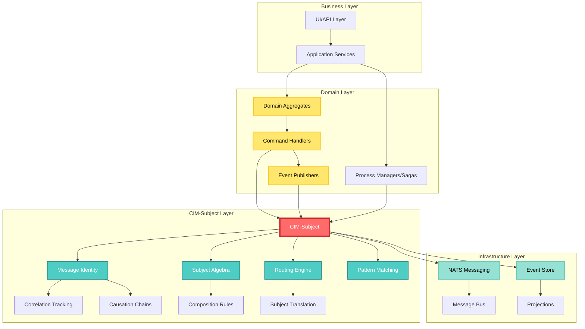
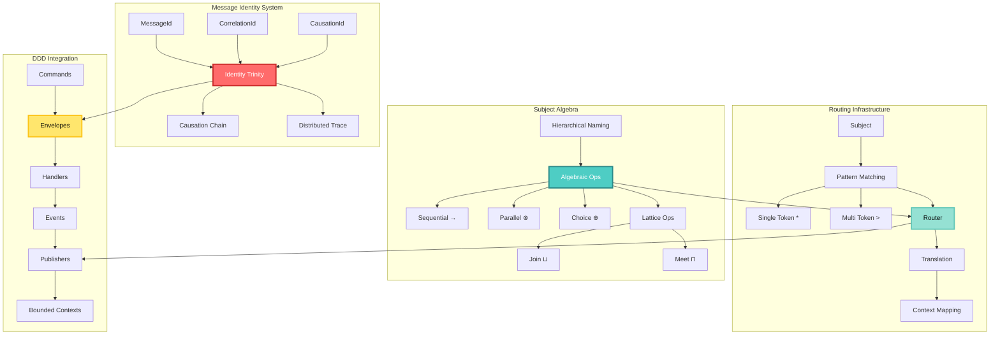
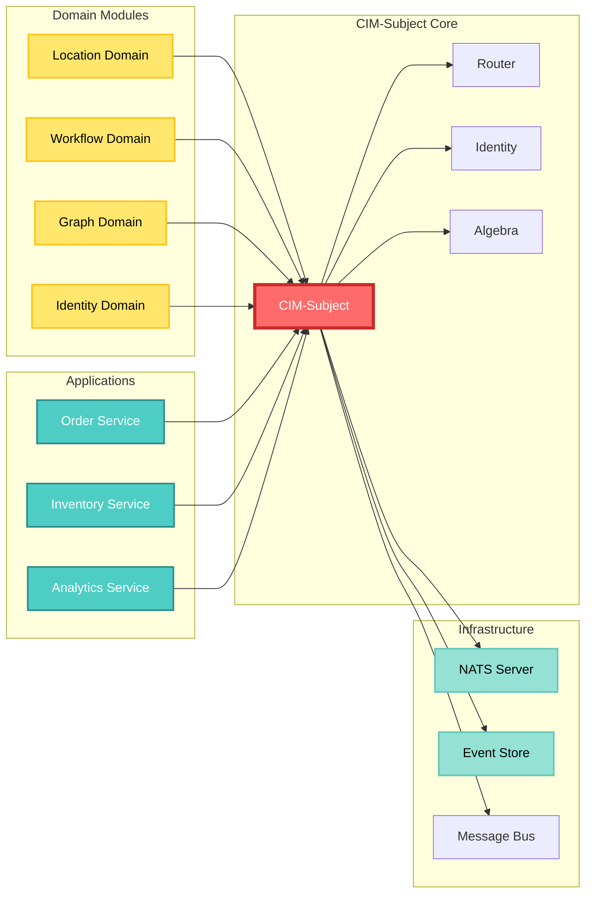

<!-- Copyright (c) 2025 Cowboy AI, LLC. -->
# CIM-Subject: Overview and Architecture

## Introduction

CIM-Subject is a foundational module within the Composable Information Machine (CIM) ecosystem that provides the algebraic and routing infrastructure for message-based communication in distributed domain-driven systems. It serves as the mathematical backbone for NATS-based message routing, correlation tracking, and event-driven architectures.

## Core Purpose

The module addresses several critical challenges in distributed systems:

1. **Message Routing Complexity**: Provides a hierarchical subject naming system with algebraic operations
2. **Distributed Tracing**: Enables correlation and causation tracking across service boundaries
3. **Domain Isolation**: Maintains clear boundaries between bounded contexts while enabling communication
4. **Event Ordering**: Preserves causal relationships in distributed event streams
5. **Flexible Composition**: Supports complex routing patterns through algebraic operations

## High-Level System Architecture



## Core Component Flow

```mermaid
graph LR
    subgraph "Message Creation"
        UC[User Command] --> MI1[Message Identity]
        MI1 --> ENV[Command Envelope]
    end
    
    subgraph "Processing"
        ENV --> VAL[Validation]
        VAL --> AGG[Aggregate]
        AGG --> EVT[Domain Events]
    end
    
    subgraph "Publishing"
        EVT --> MI2[Derived Identity]
        MI2 --> PUB[Event Publisher]
        PUB --> SUBJ[Subject Builder]
        SUBJ --> NATS[NATS]
    end
    
    subgraph "Routing"
        NATS --> PAT[Pattern Matcher]
        PAT --> HND[Handlers]
        HND --> PROJ[Projections]
        HND --> SAGA[Sagas]
    end
    
    style MI1 fill:#FF6B6B,stroke:#C92A2A,stroke-width:3px,color:#FFF
    style MI2 fill:#FF6B6B,stroke:#C92A2A,stroke-width:3px,color:#FFF
    style SUBJ fill:#4ECDC4,stroke:#2B8A89,stroke-width:3px,color:#FFF
    style PAT fill:#4ECDC4,stroke:#2B8A89,stroke-width:3px,color:#FFF
    style AGG fill:#FFE66D,stroke:#FCC419,stroke-width:2px,color:#000
    style NATS fill:#95E1D3,stroke:#63C7B8,stroke-width:2px,color:#000
```



## Architectural Position

CIM-Subject sits at the intersection of three architectural layers:

```
┌─────────────────────────────────────────────────┐
│           Application Layer                      │
│  (Domain Aggregates, Command Handlers, etc.)    │
└─────────────────────────────────────────────────┘
                    │
                    │ Uses
                    ▼
┌─────────────────────────────────────────────────┐
│            CIM-Subject Layer                     │
│  • Message Identity & Correlation               │
│  • Subject Algebra & Routing                    │
│  • Pattern Matching & Translation               │
└─────────────────────────────────────────────────┘
                    │
                    │ Integrates with
                    ▼
┌─────────────────────────────────────────────────┐
│         Infrastructure Layer                     │
│  (NATS, Event Store, Message Bus)              │
└─────────────────────────────────────────────────┘
```

## Key Components

### Component Interaction Diagram



### 1. Message Identity System
- **MessageId**: Unique identifier for each message
- **CorrelationId**: Groups related messages in a workflow
- **CausationId**: Links messages in cause-effect chains

### 2. Subject Algebra
- **Hierarchical Naming**: Domain-first subject organization
- **Algebraic Operations**: Sequential, parallel, and choice composition
- **Lattice Structure**: Join and meet operations on subject hierarchies

### 3. Routing Infrastructure
- **Pattern Matching**: NATS-compatible wildcard support
- **Subject Translation**: Context mapping and version migration
- **Route Optimization**: Efficient subject-based message delivery

### 4. DDD Integration
- **Command Envelopes**: Wraps commands with identity information
- **Event Publishing**: Maintains correlation through event chains
- **Aggregate Support**: Enables proper bounded context communication

## Design Principles

### 1. Mathematical Rigor
The module is built on solid mathematical foundations:
- Category theory for composition laws
- Lattice theory for subject hierarchies
- Algebraic structures for routing operations

### 2. Domain-Driven Design
Aligns with DDD principles:
- Respects bounded contexts
- Supports aggregate patterns
- Enables event sourcing

### 3. Distributed Systems First
Designed for distributed environments:
- No single point of failure
- Supports eventual consistency
- Enables distributed tracing

### 4. Performance Conscious
Optimized for high-throughput systems:
- Efficient pattern matching
- Minimal allocation overhead
- Cache-friendly data structures

## Integration Points

### Integration Architecture



### With Domain Modules
Every CIM domain module (location, workflow, graph, etc.) uses cim-subject for:
- Publishing domain events
- Handling commands
- Cross-domain communication

### With Infrastructure
The cim-infrastructure module relies on cim-subject for:
- NATS message headers
- Event store organization
- Message routing tables

### With Applications
Applications use cim-subject to:
- Track business transactions
- Debug distributed flows
- Implement sagas and workflows

## Benefits

1. **Unified Communication Model**: Consistent patterns across all domains
2. **Complete Audit Trail**: Full traceability through correlation/causation
3. **Flexible Architecture**: Supports various messaging patterns
4. **Scalable Design**: Grows with system complexity
5. **Developer Experience**: Clear, predictable APIs

## Next Steps

The following documentation sections provide detailed information on:

1. [Core Concepts](./02-core-concepts.md) - Deep dive into the fundamental ideas
2. [Subject Algebra](./03-subject-algebra.md) - Mathematical operations and theory
3. [Message Identity](./04-message-identity.md) - Correlation and causation patterns
4. [Routing Patterns](./05-routing-patterns.md) - Subject naming and matching
5. [DDD Integration](./06-ddd-integration.md) - Domain-driven design patterns
6. [Implementation Guide](./07-implementation-guide.md) - Practical usage examples
7. [API Reference](./08-api-reference.md) - Complete API documentation
8. [Best Practices](./09-best-practices.md) - Guidelines and recommendations
9. [Troubleshooting](./10-troubleshooting.md) - Common issues and solutions