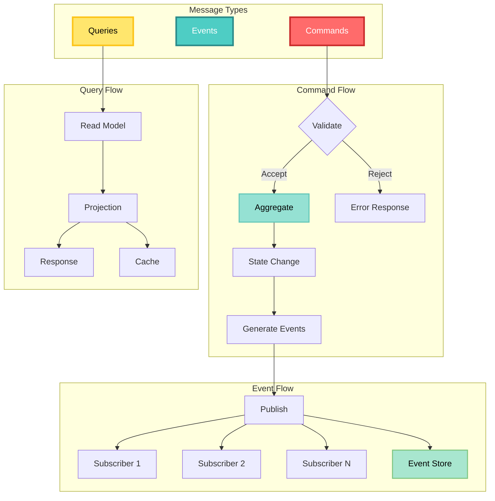
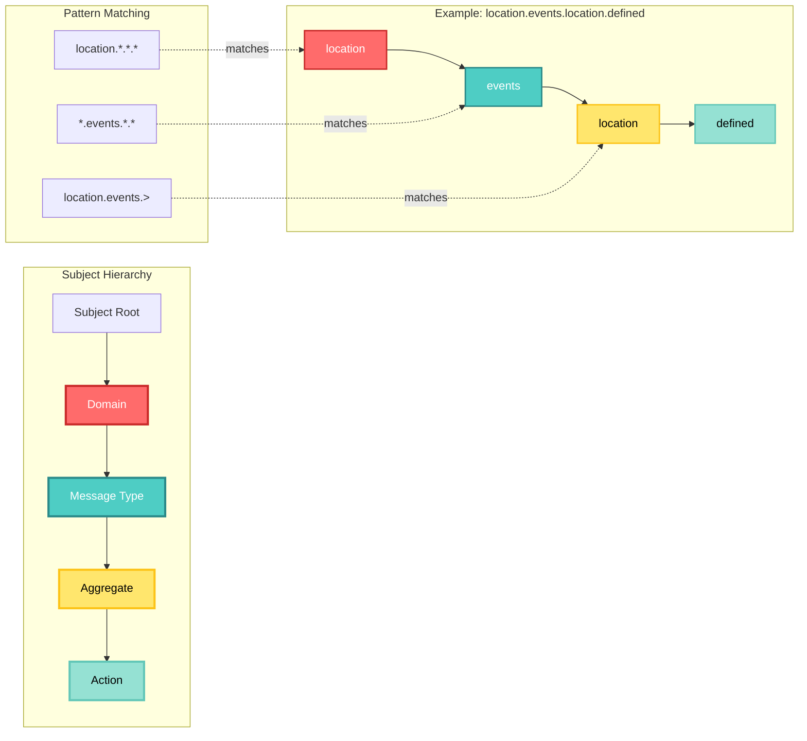
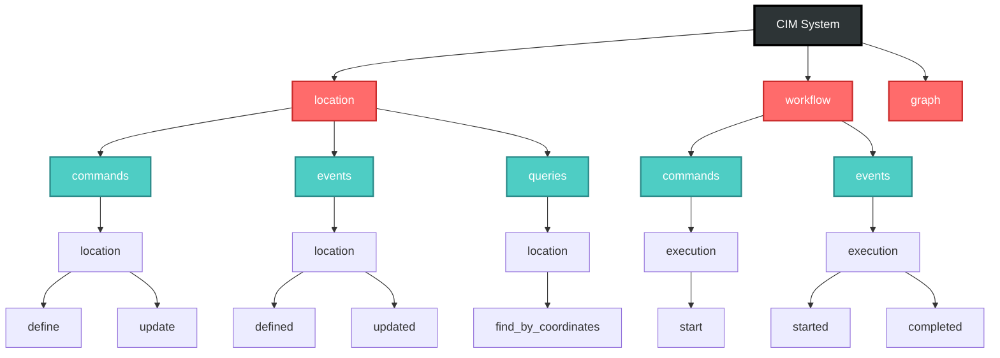
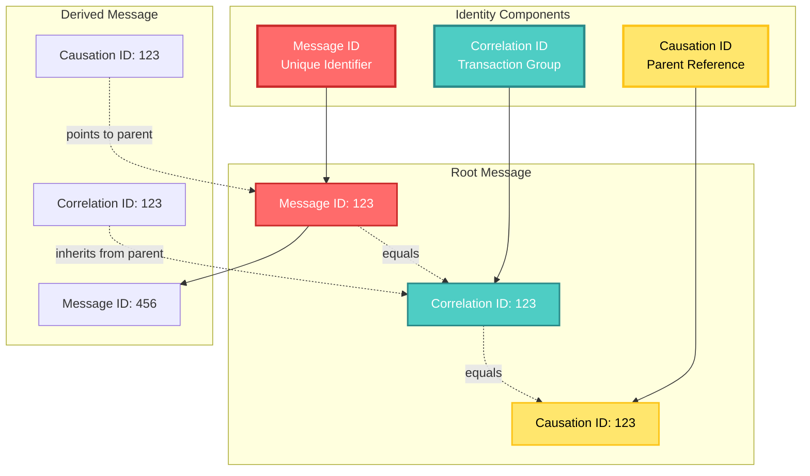
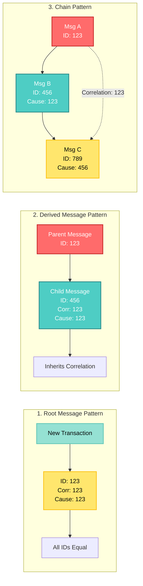
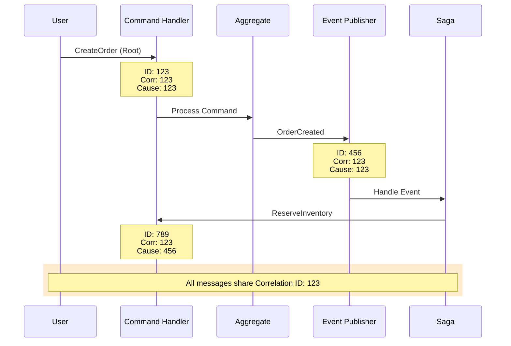
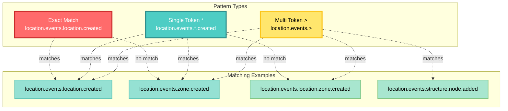
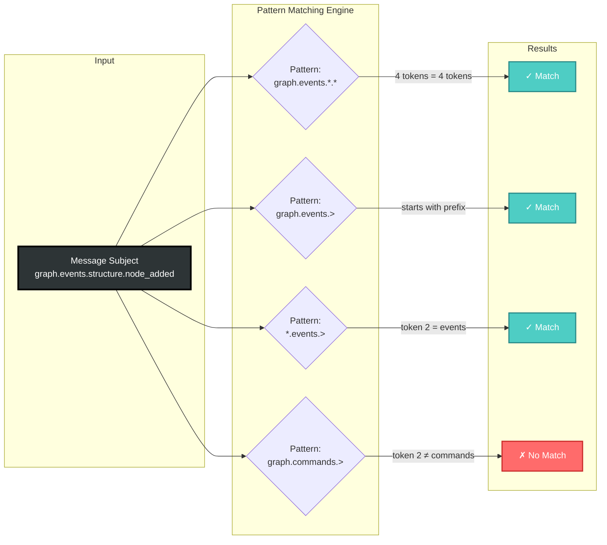

<!-- Copyright (c) 2025 Cowboy AI, LLC. -->
# Core Concepts

## Message Types in CIM

The CIM architecture recognizes three fundamental message types, each serving a specific purpose in the system:

### Message Type Flow Diagram



### 1. Commands
- **Purpose**: Express intent to change system state
- **Naming Pattern**: `{domain}.commands.{aggregate}.{action}`
- **Characteristics**:
  - Imperative mood (e.g., `CreateUser`, `UpdateLocation`)
  - Can be accepted or rejected
  - Processed by exactly one handler
  - May produce zero or more events

### 2. Events
- **Purpose**: Record facts about state changes
- **Naming Pattern**: `{domain}.events.{aggregate}.{event}`
- **Characteristics**:
  - Past tense (e.g., `UserCreated`, `LocationUpdated`)
  - Immutable once published
  - Can have multiple subscribers
  - Form the event stream for event sourcing

### 3. Queries
- **Purpose**: Request information without changing state
- **Naming Pattern**: `{domain}.queries.{aggregate}.{query}`
- **Characteristics**:
  - Question form (e.g., `GetUserById`, `FindNearbyLocations`)
  - Read-only operations
  - Return data projections
  - Can be cached

## Subject Hierarchy

CIM-Subject uses a hierarchical naming convention that provides semantic meaning and enables flexible routing:

### Subject Structure Visualization



```
{domain}.{message_type}.{aggregate}.{action}
    │         │            │          │
    │         │            │          └─> Specific action/event/query
    │         │            └─> Aggregate root or entity
    │         └─> Type: commands, events, or queries
    └─> Bounded context or domain
```

### Subject Tree Example



### Examples

```
# Location domain
location.commands.location.define
location.events.location.defined
location.queries.location.find_by_coordinates

# Workflow domain
workflow.commands.execution.start
workflow.events.execution.started
workflow.events.execution.completed

# Graph domain
graph.commands.structure.add_node
graph.events.structure.node_added
graph.queries.structure.find_shortest_path
```

### Benefits of Hierarchical Structure

1. **Semantic Clarity**: Subject names convey meaning
2. **Flexible Subscription**: Use wildcards for pattern-based subscriptions
3. **Domain Isolation**: Clear boundaries between contexts
4. **Evolutionary Design**: Easy to extend without breaking existing patterns

## Message Identity

Every message in the CIM system carries a unique identity that enables tracking and correlation:

### Message Identity Trinity



### MessageIdentity Structure

```rust
pub struct MessageIdentity {
    pub message_id: IdType,
    pub correlation_id: CorrelationId,
    pub causation_id: CausationId,
}
```

### Identity Rules Visualization



### Transaction Flow Example



### Identity Rules

#### 1. Root Messages (Transaction Start)
When a new business transaction begins:
```
message_id = correlation_id = causation_id
```
This self-referential pattern identifies transaction boundaries.

#### 2. Derived Messages (Within Transaction)
When a message causes another message:
```
new_message.correlation_id = parent.correlation_id  // Inherit correlation
new_message.causation_id = parent.message_id       // Parent caused this
new_message.message_id = <new unique id>           // Fresh identity
```

#### 3. Independent Messages
For messages not part of a transaction:
```
message_id = correlation_id = causation_id
```
Each message forms its own single-message transaction.

## Subject Patterns and Wildcards

CIM-Subject supports NATS-style wildcards for flexible message routing:

### Wildcard Pattern Visualization



### Pattern Matching Flow



### Single Token Wildcard (`*`)
Matches exactly one token in the subject hierarchy.

Examples:
```
location.events.*.created     → Matches: location.events.location.created
                             → Matches: location.events.zone.created
                             → NOT: location.events.location.zone.created

*.commands.user.*            → Matches: auth.commands.user.create
                             → Matches: profile.commands.user.update
```

### Multi-Token Wildcard (`>`)
Matches one or more tokens at the end of the subject.

Examples:
```
graph.events.>               → Matches: graph.events.structure.node_added
                             → Matches: graph.events.workflow.execution.started
                             → Matches: graph.events.lifecycle.created

persistence.>                → Matches: persistence.events.stored
                             → Matches: persistence.commands.backup.start
```

### Pattern Matching Rules

1. Wildcards can appear at any position
2. `*` matches exactly one token
3. `>` can only appear at the end
4. Literal tokens match exactly
5. Case-sensitive matching

## Event Routing Formula

The complete routing key for any message combines subject and identity:

```
EventRoutingKey = Subject + CorrelationId + CausationId
```

This enables sophisticated routing strategies:

1. **Subject-Only Routing**: Traditional pub/sub
2. **Correlation-Based Routing**: All messages in a transaction
3. **Causation-Based Routing**: Follow cause-effect chains
4. **Combined Routing**: Complex patterns using all three

## Domain Boundaries

CIM-Subject helps maintain clear domain boundaries while enabling controlled communication:

### Intra-Domain Communication
Within a single bounded context:
```
location.commands.location.update
    ↓
location.events.location.updated
    ↓
location.projections.location.refresh
```

### Inter-Domain Communication
Between bounded contexts:
```
order.events.order.created
    ↓
inventory.commands.stock.reserve  ← Cross-domain
    ↓
inventory.events.stock.reserved
    ↓
order.commands.order.confirm     ← Back to order domain
```

### Anti-Corruption Layer
Subject translation at domain boundaries:
```
Internal: inventory.events.internal.stock_updated
    ↓ Translation
External: inventory.events.public.inventory_changed
```

## Performance Considerations

### Subject Design for Performance

1. **Keep subjects short**: Reduces parsing overhead
2. **Front-load discrimination**: Put varying parts early
3. **Avoid deep nesting**: Limit to 4-5 levels
4. **Use consistent patterns**: Enables optimization

### Caching Strategies

1. **Pattern Compilation**: Pre-compile wildcard patterns
2. **Route Tables**: Cache subject-to-handler mappings
3. **Identity Indexing**: Index by correlation for fast lookup

### Scalability Patterns

1. **Subject Sharding**: Distribute by subject prefix
2. **Correlation Partitioning**: Group by correlation ID
3. **Temporal Windowing**: Archive old correlations

## Security Implications

### Subject-Based Authorization

Control access at the subject level:
```rust
pub trait SubjectAuthorizer {
    fn can_publish(&self, subject: &str, user: &User) -> bool;
    fn can_subscribe(&self, pattern: &str, user: &User) -> bool;
}
```

### Correlation Isolation

Prevent correlation ID spoofing:
1. Validate correlation chain integrity
2. Restrict correlation ID generation
3. Audit correlation boundaries

### Subject Encryption

For sensitive domains:
1. Encrypt message payloads
2. Use opaque subject names
3. Implement subject-level access control