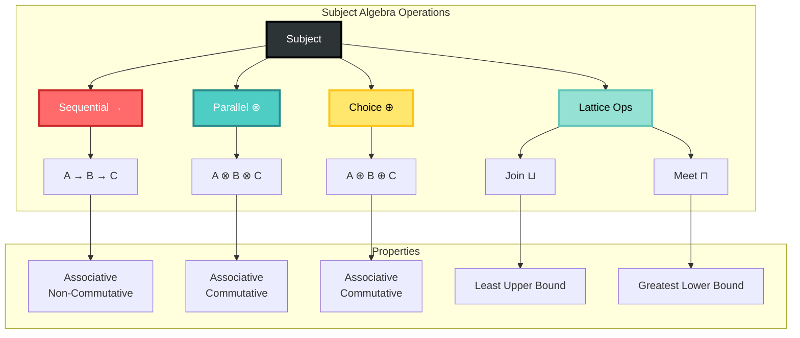
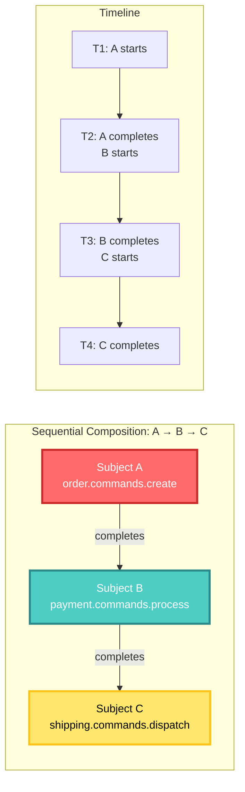
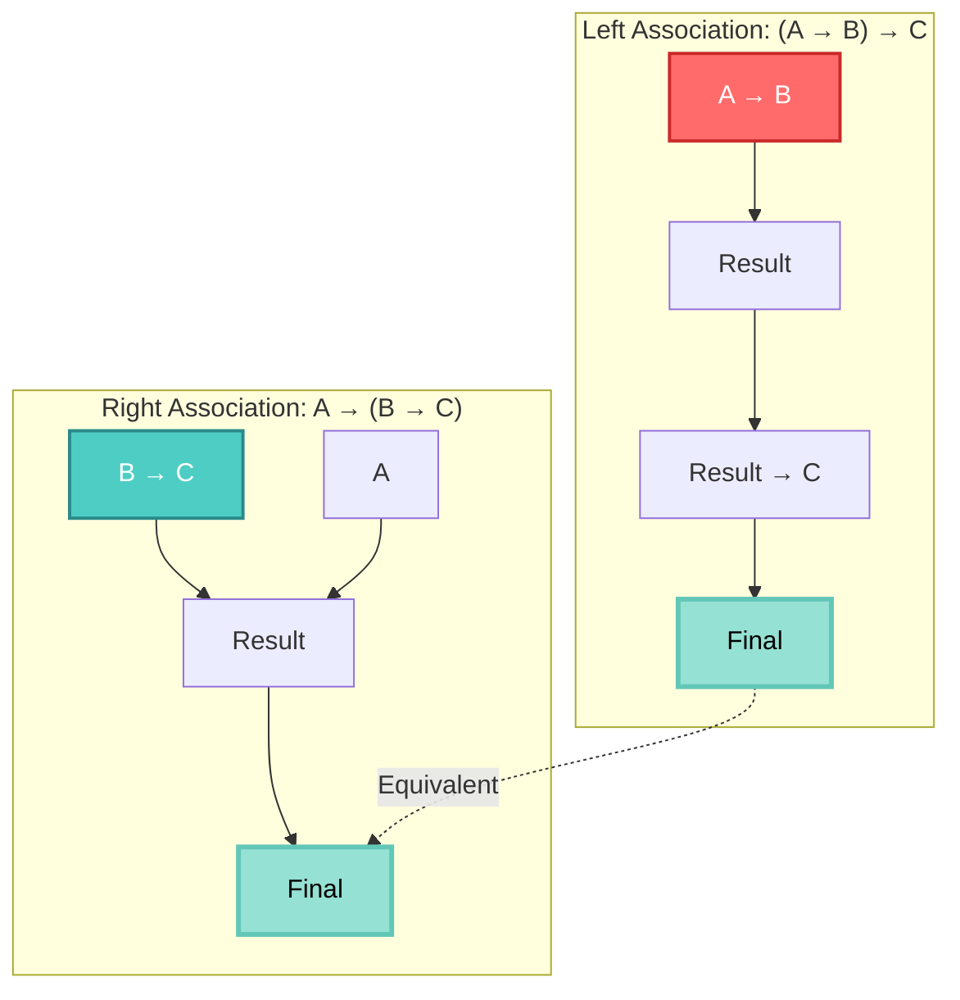
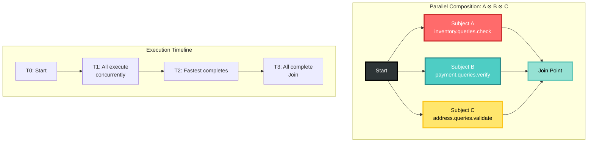
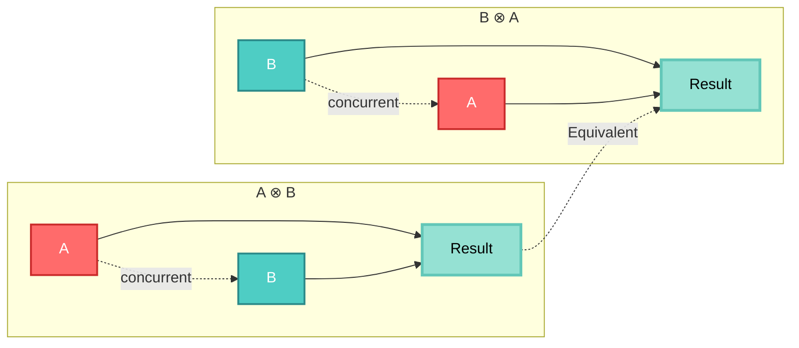
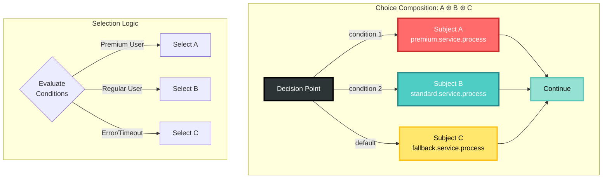
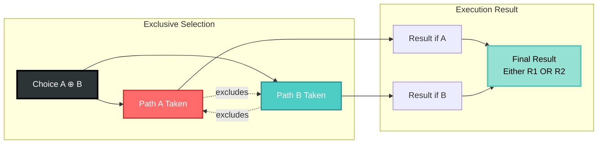
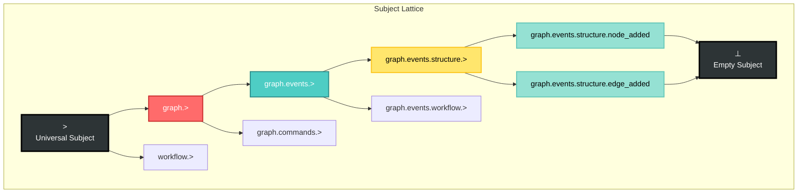
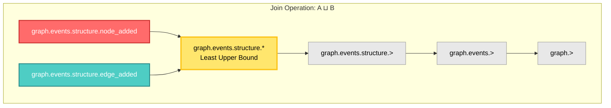
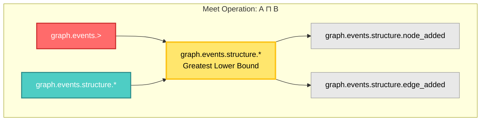

<!-- Copyright (c) 2025 Cowboy AI, LLC. -->
# Subject Algebra

## Introduction

The Subject Algebra in CIM provides a mathematical framework for composing and manipulating message subjects. This algebra enables sophisticated routing patterns, workflow orchestration, and system composition while maintaining formal properties that ensure correctness and predictability.

## Algebraic Operations Overview



## Foundational Concepts

### Subject as Algebraic Structure

A subject in CIM forms an algebraic structure with the following properties:

```rust
pub trait SubjectAlgebra {
    type Subject;
    
    // Identity element
    fn identity() -> Self::Subject;
    
    // Binary operations
    fn compose(&self, other: &Self::Subject) -> Self::Subject;
    fn parallel(&self, other: &Self::Subject) -> Self::Subject;
    fn choice(&self, other: &Self::Subject) -> Self::Subject;
    
    // Properties verification
    fn is_associative(&self) -> bool;
    fn is_commutative(&self) -> bool;
    fn has_identity(&self) -> bool;
}
```

## Core Operations

### 1. Sequential Composition (→)

Sequential composition represents ordered execution where one operation must complete before the next begins.

#### Sequential Flow Visualization



#### Associativity Property



#### Definition
```
A → B means "A then B"
```

#### Properties
- **Associative**: `(A → B) → C = A → (B → C)`
- **Non-commutative**: `A → B ≠ B → A`
- **Identity**: `ε → A = A → ε = A`

#### Implementation
```rust
impl SubjectSequence {
    pub fn then(self, next: Subject) -> SubjectSequence {
        SubjectSequence {
            subjects: self.subjects.into_iter()
                .chain(std::iter::once(next))
                .collect(),
        }
    }
}
```

#### Use Cases
1. **Workflow Steps**: Order processing → Payment → Shipping
2. **Saga Orchestration**: Each compensation step in sequence
3. **Data Pipeline**: Extract → Transform → Load

### 2. Parallel Composition (⊗)

Parallel composition represents concurrent execution where operations can proceed simultaneously.

#### Parallel Execution Visualization



#### Commutativity Property



#### Definition
```
A ⊗ B means "A and B concurrently"
```

#### Properties
- **Associative**: `(A ⊗ B) ⊗ C = A ⊗ (B ⊗ C)`
- **Commutative**: `A ⊗ B = B ⊗ A`
- **Identity**: `ε ⊗ A = A ⊗ ε = A`

#### Implementation
```rust
impl SubjectParallel {
    pub fn parallel(self, other: Subject) -> SubjectParallel {
        SubjectParallel {
            subjects: self.subjects.into_iter()
                .chain(std::iter::once(other))
                .collect(),
            join_strategy: JoinStrategy::All,
        }
    }
}
```

#### Use Cases
1. **Fan-out Processing**: Notify multiple services simultaneously
2. **Parallel Validation**: Check inventory ⊗ Verify payment ⊗ Validate address
3. **Scatter-Gather**: Query multiple sources in parallel

### 3. Choice Composition (⊕)

Choice composition represents exclusive alternatives where exactly one path is taken.

#### Choice Flow Visualization



#### Exclusive Choice Property



#### Definition
```
A ⊕ B means "either A or B (but not both)"
```

#### Properties
- **Associative**: `(A ⊕ B) ⊕ C = A ⊕ (B ⊕ C)`
- **Commutative**: `A ⊕ B = B ⊕ A`
- **Identity**: `⊥ ⊕ A = A ⊕ ⊥ = A` (where ⊥ is the zero element)

#### Implementation
```rust
impl SubjectChoice {
    pub fn or(self, alternative: Subject) -> SubjectChoice {
        SubjectChoice {
            alternatives: self.alternatives.into_iter()
                .chain(std::iter::once(alternative))
                .collect(),
            selection_strategy: SelectionStrategy::First,
        }
    }
}
```

#### Use Cases
1. **Conditional Routing**: Premium processing ⊕ Standard processing
2. **Fallback Patterns**: Primary service ⊕ Backup service
3. **A/B Testing**: Route A ⊕ Route B

## Lattice Operations

Subjects form a lattice structure enabling powerful set-theoretic operations.

### Lattice Structure Visualization



### Join Operation (⊔)

The join finds the least upper bound (supremum) of two subjects.

#### Join Operation Visualization



```rust
pub fn join(a: &Subject, b: &Subject) -> Subject {
    // Find the most specific common ancestor
    let common_prefix = find_common_prefix(a, b);
    Subject::from_tokens(common_prefix)
}
```

Example:
```
graph.events.structure.node_added ⊔ graph.events.structure.edge_added
= graph.events.structure.*
```

### Meet Operation (⊓)

The meet finds the greatest lower bound (infimum) of two subjects.

#### Meet Operation Visualization



```rust
pub fn meet(a: &Subject, b: &Subject) -> Option<Subject> {
    // Find the most general common descendant
    if a.is_parent_of(b) {
        Some(b.clone())
    } else if b.is_parent_of(a) {
        Some(a.clone())
    } else {
        None // No common descendant
    }
}
```

Example:
```
graph.events.> ⊓ graph.events.structure.*
= graph.events.structure.*
```

## Advanced Compositions

### Kleene Star (*)

Represents zero or more repetitions of a subject pattern.

```rust
pub struct KleeneStar {
    base: Subject,
    min_repetitions: usize,
    max_repetitions: Option<usize>,
}

impl KleeneStar {
    pub fn repeat(subject: Subject) -> Self {
        KleeneStar {
            base: subject,
            min_repetitions: 0,
            max_repetitions: None,
        }
    }
}
```

Use case: Retry patterns, recursive workflows

### Subject Transformation

Transform subjects while preserving algebraic properties.

```rust
pub trait SubjectTransform {
    fn map<F>(&self, f: F) -> Subject 
    where 
        F: Fn(&str) -> String;
    
    fn filter<P>(&self, predicate: P) -> Option<Subject>
    where
        P: Fn(&Subject) -> bool;
    
    fn fold<B, F>(&self, init: B, f: F) -> B
    where
        F: Fn(B, &str) -> B;
}
```

## Composition Laws

### Associativity Laws

For sequential composition:
```
(A → B) → C = A → (B → C)
```

For parallel composition:
```
(A ⊗ B) ⊗ C = A ⊗ (B ⊗ C)
```

For choice composition:
```
(A ⊕ B) ⊕ C = A ⊕ (B ⊕ C)
```

### Distribution Laws

Sequential over parallel:
```
A → (B ⊗ C) = (A → B) ⊗ (A → C)  // Only with copying
(A ⊗ B) → C ≠ (A → C) ⊗ (B → C)  // Generally not equal
```

Sequential over choice:
```
A → (B ⊕ C) = (A → B) ⊕ (A → C)
(A ⊕ B) → C = (A → C) ⊕ (B → C)
```

### Identity Laws

For all operations:
```
ε → A = A → ε = A     // Sequential identity
ε ⊗ A = A ⊗ ε = A     // Parallel identity
⊥ ⊕ A = A ⊕ ⊥ = A     // Choice identity (zero element)
```

## Practical Applications

### 1. Workflow Composition

```rust
// Order processing workflow
let workflow = 
    validate_order()
        .then(
            check_inventory()
                .parallel(verify_payment())
                .parallel(validate_shipping_address())
        )
        .then(
            express_shipping()
                .or(standard_shipping())
        )
        .then(send_confirmation());
```

### 2. Event Stream Processing

```rust
// Complex event pattern
let pattern = SubjectPattern::new()
    .starts_with("order.events")
    .then(
        Pattern::any_of(vec![
            "order.events.created",
            "order.events.updated"
        ])
    )
    .within_window(Duration::minutes(5));
```

### 3. Service Mesh Routing

```rust
// Routing with fallbacks
let route = primary_service()
    .or(secondary_service())
    .or(fallback_service())
    .with_timeout(Duration::seconds(30));
```

## Category Theory Connection

### Subjects as a Category

The subject algebra forms a category where:
- **Objects**: Individual subjects
- **Morphisms**: Transformations between subjects
- **Composition**: Sequential composition (→)
- **Identity**: The empty subject transformation

### Functors

Subject patterns can be viewed as functors:
```rust
pub trait SubjectFunctor<F> {
    fn fmap<A, B>(&self, f: F) -> Self
    where 
        F: Fn(A) -> B;
}
```

### Monoid Structure

Subjects under concatenation form a monoid:
- **Binary Operation**: Concatenation
- **Identity Element**: Empty subject
- **Associativity**: `(a · b) · c = a · (b · c)`

## Performance Optimization

### Algebraic Rewriting

Use algebraic laws to optimize subject patterns:

```rust
// Original
(A → B) → (C → D)

// Optimized (associativity)
A → B → C → D

// Original  
A ⊗ A ⊗ B

// Optimized (idempotence for certain operations)
A ⊗ B
```

### Lazy Evaluation

Defer composition until needed:
```rust
pub struct LazySubjectComposition {
    thunk: Box<dyn Fn() -> Subject>,
}

impl LazySubjectComposition {
    pub fn evaluate(&self) -> Subject {
        (self.thunk)()
    }
}
```

### Memoization

Cache frequently used compositions:
```rust
pub struct SubjectCache {
    cache: HashMap<(Subject, Subject, Operation), Subject>,
}
```

## Validation and Verification

### Algebraic Property Testing

```rust
#[cfg(test)]
mod tests {
    use quickcheck::{quickcheck, TestResult};
    
    quickcheck! {
        fn test_sequential_associativity(a: Subject, b: Subject, c: Subject) -> bool {
            (a.then(b)).then(c) == a.then(b.then(c))
        }
        
        fn test_parallel_commutativity(a: Subject, b: Subject) -> bool {
            a.parallel(b) == b.parallel(a)
        }
    }
}
```

### Composition Validation

Ensure valid compositions:
```rust
pub fn validate_composition(comp: &SubjectComposition) -> Result<(), ValidationError> {
    match comp {
        Sequential(a, b) => {
            ensure!(a.can_precede(b), "Invalid sequence");
        }
        Parallel(subjects) => {
            ensure!(!has_conflicts(&subjects), "Conflicting parallel ops");
        }
        Choice(alternatives) => {
            ensure!(alternatives.len() > 1, "Choice needs alternatives");
        }
    }
    Ok(())
}
```

## Future Directions

### Probabilistic Composition

Add weighted choice for A/B testing:
```rust
A ⊕[0.8] B ⊕[0.2] C  // 80% A, 20% B, 0% C
```

### Temporal Composition

Add time constraints:
```rust
A →[≤5s] B  // B must start within 5 seconds of A completing
```

### Conditional Composition

Add guards to compositions:
```rust
A →[if valid] B →[else] C
```