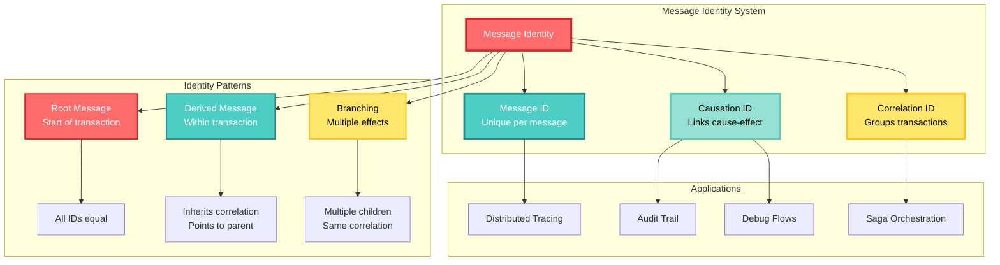
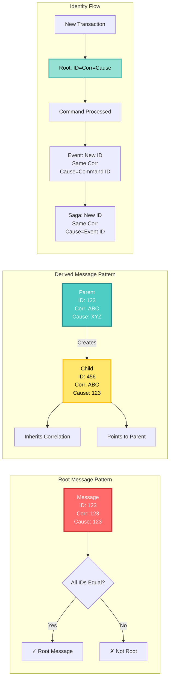
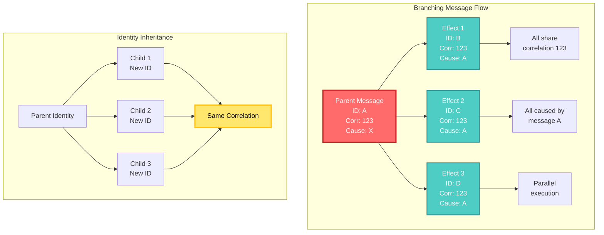
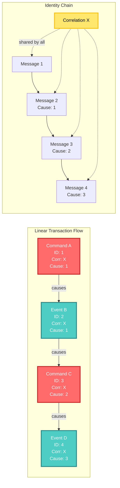
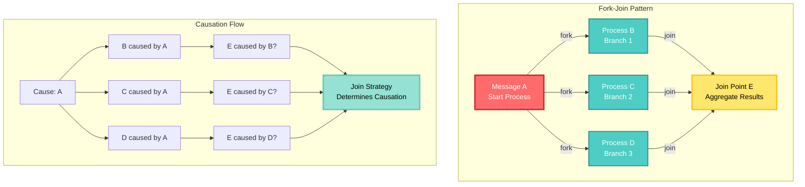
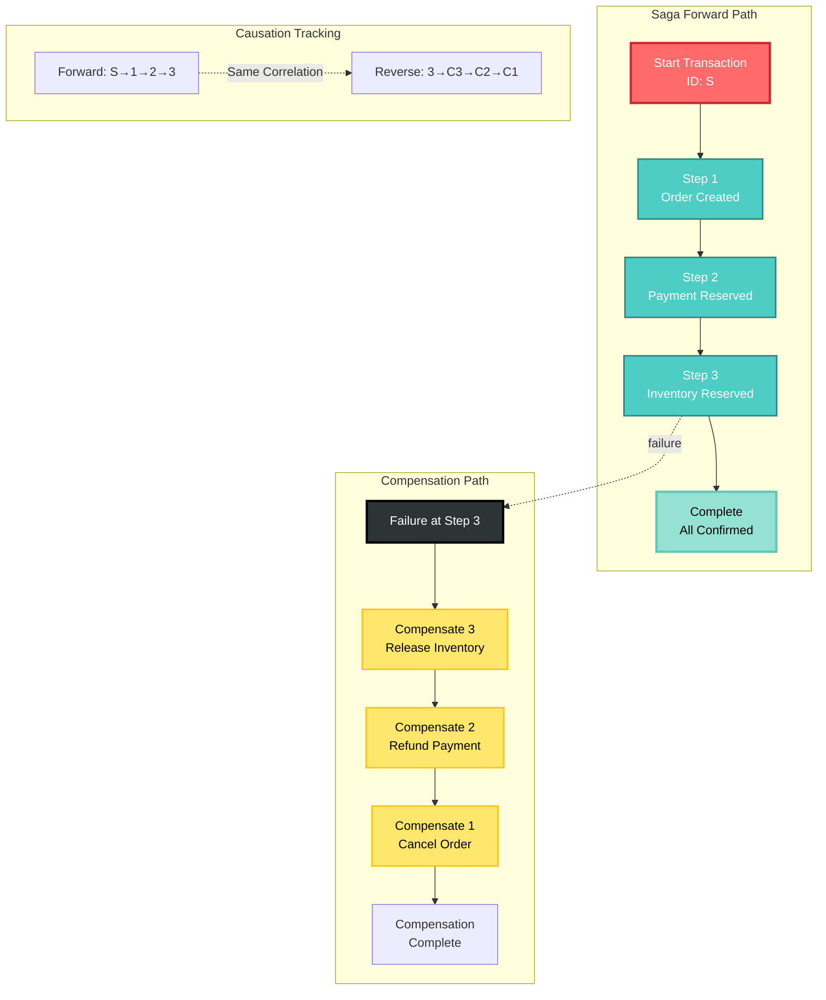
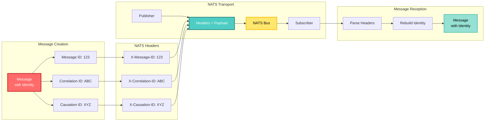
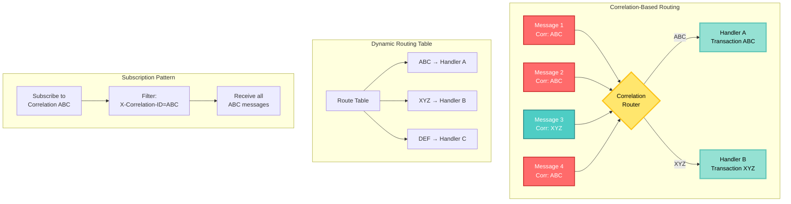
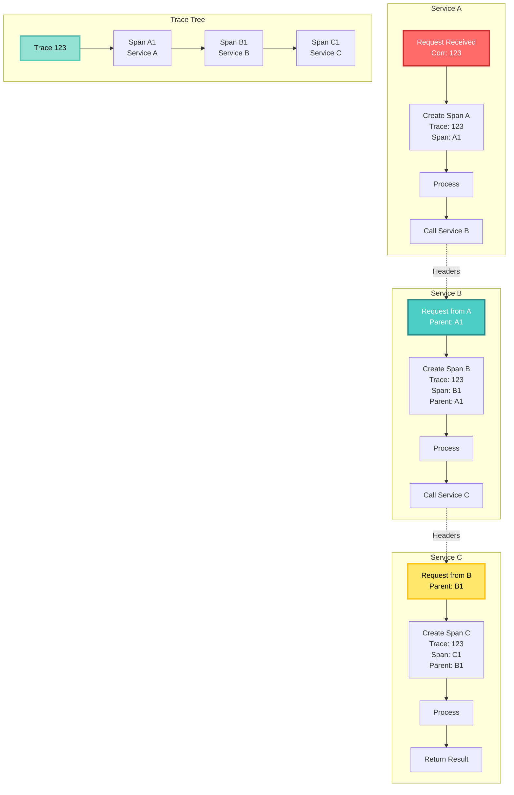
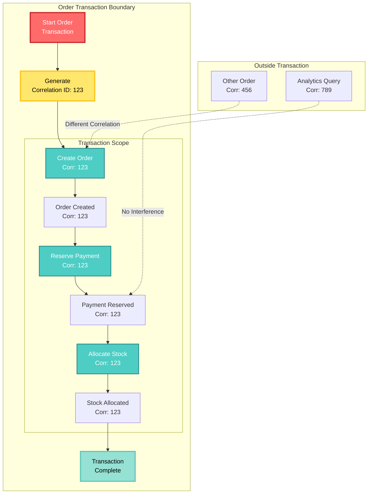

<!-- Copyright (c) 2025 Cowboy AI, LLC. -->
# Message Identity and Correlation

## Overview

Message identity in CIM-Subject provides a robust mechanism for tracking messages through distributed systems. By maintaining correlation and causation relationships, the system enables complete traceability, distributed debugging, and complex workflow orchestration.

## Identity Architecture Overview



## The Identity Trinity

Every message in CIM carries three essential identifiers that together form its complete identity:

### 1. Message ID
- **Purpose**: Uniquely identifies this specific message
- **Scope**: Global uniqueness across the entire system
- **Lifetime**: Immutable from creation
- **Format**: UUID v4 or similar globally unique identifier

### 2. Correlation ID
- **Purpose**: Groups related messages within a business transaction
- **Scope**: Shared across all messages in a transaction
- **Lifetime**: Propagated throughout the transaction lifecycle
- **Format**: Same as Message ID format

### 3. Causation ID
- **Purpose**: Identifies which message directly caused this one
- **Scope**: Points to a specific Message ID within the same correlation
- **Lifetime**: Set at message creation based on triggering message
- **Format**: Same as Message ID format

## Identity Relationships Visualization



## Identity Patterns

### Pattern 1: Root Message (Transaction Initiation)

When starting a new business transaction:

```rust
pub fn create_root_message(payload: MessagePayload) -> Message {
    let id = MessageId::new();
    Message {
        message_id: id.clone(),
        correlation_id: CorrelationId(id.clone()),
        causation_id: CausationId(id),
        payload,
        timestamp: Utc::now(),
    }
}
```

**Characteristics**:
- All three IDs are identical
- Marks the beginning of a transaction
- No parent message exists

**Example**:
```json
{
  "message_id": "550e8400-e29b-41d4-a716-446655440000",
  "correlation_id": "550e8400-e29b-41d4-a716-446655440000",
  "causation_id": "550e8400-e29b-41d4-a716-446655440000",
  "type": "CreateOrder",
  "payload": { ... }
}
```

### Pattern 2: Derived Message (Transaction Continuation)

When a message triggers another message:

```rust
pub fn create_derived_message(
    payload: MessagePayload,
    parent: &Message
) -> Message {
    Message {
        message_id: MessageId::new(),
        correlation_id: parent.correlation_id.clone(),
        causation_id: CausationId(parent.message_id.clone()),
        payload,
        timestamp: Utc::now(),
    }
}
```

**Characteristics**:
- New unique Message ID
- Inherits Correlation ID from parent
- Causation ID points to parent's Message ID

**Example**:
```json
{
  "message_id": "6ba7b810-9dad-11d1-80b4-00c04fd430c8",
  "correlation_id": "550e8400-e29b-41d4-a716-446655440000",
  "causation_id": "550e8400-e29b-41d4-a716-446655440000",
  "type": "OrderValidated",
  "payload": { ... }
}
```

### Pattern 3: Branching (Multiple Effects)

When one message causes multiple messages:

```rust
pub fn create_multiple_effects(
    parent: &Message,
    effects: Vec<MessagePayload>
) -> Vec<Message> {
    effects.into_iter()
        .map(|payload| create_derived_message(payload, parent))
        .collect()
}
```

#### Branching Pattern Visualization



## Correlation Patterns

### Linear Chain Pattern

Most common pattern for sequential processing:



### Fork-Join Pattern

Parallel processing with synchronization:



### Saga Pattern

Distributed transaction with compensations:



## Implementation Details

### Message Identity Structure

```rust
use uuid::Uuid;
use chrono::{DateTime, Utc};

#[derive(Clone, Debug, PartialEq, Eq, Hash)]
pub struct MessageId(Uuid);

#[derive(Clone, Debug, PartialEq, Eq, Hash)]
pub struct CorrelationId(Uuid);

#[derive(Clone, Debug, PartialEq, Eq, Hash)]
pub struct CausationId(Uuid);

pub struct MessageIdentity {
    pub message_id: MessageId,
    pub correlation_id: CorrelationId,
    pub causation_id: CausationId,
}

impl MessageIdentity {
    pub fn new_root() -> Self {
        let id = Uuid::new_v4();
        Self {
            message_id: MessageId(id),
            correlation_id: CorrelationId(id),
            causation_id: CausationId(id),
        }
    }
    
    pub fn new_derived(parent: &MessageIdentity) -> Self {
        Self {
            message_id: MessageId(Uuid::new_v4()),
            correlation_id: parent.correlation_id.clone(),
            causation_id: CausationId(parent.message_id.0),
        }
    }
    
    pub fn is_root(&self) -> bool {
        self.message_id.0 == self.correlation_id.0 
            && self.message_id.0 == self.causation_id.0
    }
}
```

### Causation Tree Builder

#### Causation Tree Visualization

```mermaid
graph TB
    subgraph "Causation Tree Structure"
        ROOT[Root Message<br/>ID: R1]
        
        ROOT --> C1[Command 1<br/>ID: C1<br/>Cause: R1]
        ROOT --> C2[Command 2<br/>ID: C2<br/>Cause: R1]
        
        C1 --> E1[Event 1<br/>ID: E1<br/>Cause: C1]
        C1 --> E2[Event 2<br/>ID: E2<br/>Cause: C1]
        
        C2 --> E3[Event 3<br/>ID: E3<br/>Cause: C2]
        
        E1 --> S1[Saga Step 1<br/>ID: S1<br/>Cause: E1]
        E3 --> S2[Saga Step 2<br/>ID: S2<br/>Cause: E3]
        
        S1 --> COMP1[Complete 1<br/>ID: CP1<br/>Cause: S1]
        S2 --> COMP2[Complete 2<br/>ID: CP2<br/>Cause: S2]
    end
    
    subgraph "Tree Navigation"
        NAV1[Get Path to Root] --> PATH[R1 → C1 → E1 → S1]
        NAV2[Get Children] --> CHILD[C1 → [E1, E2]]
        NAV3[Get Depth] --> DEPTH[S1 = Depth 3]
    end
    
    style ROOT fill:#FF6B6B,stroke:#C92A2A,stroke-width:4px,color:#FFF
    style C1 fill:#4ECDC4,stroke:#2B8A89,stroke-width:3px,color:#FFF
    style C2 fill:#4ECDC4,stroke:#2B8A89,stroke-width:3px,color:#FFF
    style E1 fill:#FFE66D,stroke:#FCC419,stroke-width:2px,color:#000
    style E2 fill:#FFE66D,stroke:#FCC419,stroke-width:2px,color:#000
    style E3 fill:#FFE66D,stroke:#FCC419,stroke-width:2px,color:#000
    style S1 fill:#95E1D3,stroke:#63C7B8,stroke-width:2px,color:#000
    style S2 fill:#95E1D3,stroke:#63C7B8,stroke-width:2px,color:#000
```

```rust
pub struct CausationTree {
    nodes: HashMap<MessageId, TreeNode>,
    roots: Vec<MessageId>,
}

struct TreeNode {
    message: Message,
    children: Vec<MessageId>,
}

impl CausationTree {
    pub fn build(messages: Vec<Message>) -> Self {
        let mut tree = CausationTree {
            nodes: HashMap::new(),
            roots: Vec::new(),
        };
        
        // First pass: create nodes
        for msg in messages {
            let node = TreeNode {
                message: msg.clone(),
                children: Vec::new(),
            };
            tree.nodes.insert(msg.message_id.clone(), node);
            
            // Identify roots
            if msg.is_root() {
                tree.roots.push(msg.message_id.clone());
            }
        }
        
        // Second pass: build parent-child relationships
        for (id, node) in &tree.nodes {
            if !node.message.is_root() {
                if let Some(parent) = tree.nodes.get_mut(&node.message.causation_id.0) {
                    parent.children.push(id.clone());
                }
            }
        }
        
        tree
    }
    
    pub fn get_path_to_root(&self, message_id: &MessageId) -> Vec<Message> {
        let mut path = Vec::new();
        let mut current = Some(message_id);
        
        while let Some(id) = current {
            if let Some(node) = self.nodes.get(id) {
                path.push(node.message.clone());
                
                if node.message.is_root() {
                    break;
                }
                
                current = Some(&MessageId(node.message.causation_id.0));
            } else {
                break;
            }
        }
        
        path.reverse();
        path
    }
}
```

## NATS Integration

### NATS Header Flow Visualization



### Header Mapping

CIM-Subject automatically maps identity to NATS headers:

```rust
impl NatsHeaders for MessageIdentity {
    fn to_headers(&self) -> HeaderMap {
        let mut headers = HeaderMap::new();
        headers.insert("X-Message-ID", self.message_id.to_string());
        headers.insert("X-Correlation-ID", self.correlation_id.to_string());
        headers.insert("X-Causation-ID", self.causation_id.to_string());
        headers
    }
    
    fn from_headers(headers: &HeaderMap) -> Result<Self, ParseError> {
        Ok(Self {
            message_id: MessageId(parse_uuid(headers.get("X-Message-ID")?)?),
            correlation_id: CorrelationId(parse_uuid(headers.get("X-Correlation-ID")?)?),
            causation_id: CausationId(parse_uuid(headers.get("X-Causation-ID")?)?),
        })
    }
}
```

### Publishing with Identity

```rust
pub async fn publish_with_identity(
    client: &NatsClient,
    subject: &str,
    payload: &[u8],
    identity: &MessageIdentity,
) -> Result<(), PublishError> {
    let headers = identity.to_headers();
    client.publish_with_headers(subject, headers, payload).await
}
```

## Correlation-Based Routing

### Correlation Routing Flow



### Route by Correlation

Route all messages in a transaction to specific handlers:

```rust
pub struct CorrelationRouter {
    routes: HashMap<CorrelationId, Handler>,
}

impl CorrelationRouter {
    pub fn route(&self, message: &Message) -> Option<&Handler> {
        self.routes.get(&message.correlation_id)
    }
    
    pub fn route_transaction(&mut self, correlation_id: CorrelationId, handler: Handler) {
        self.routes.insert(correlation_id, handler);
    }
}
```

### Correlation-Based Subscriptions

Subscribe to all messages in a correlation:

```rust
pub async fn subscribe_to_correlation(
    client: &NatsClient,
    correlation_id: &CorrelationId,
) -> Result<Subscription, SubscribeError> {
    // Use NATS headers subscription
    let subject = ">";  // All subjects
    let filter = HeaderFilter::new()
        .add("X-Correlation-ID", correlation_id.to_string());
    
    client.subscribe_with_filter(subject, filter).await
}
```

## Distributed Tracing

### Distributed Trace Visualization



### Trace Context Propagation

```rust
pub struct TraceContext {
    pub correlation_id: CorrelationId,
    pub span_id: SpanId,
    pub trace_flags: TraceFlags,
}

impl From<&MessageIdentity> for TraceContext {
    fn from(identity: &MessageIdentity) -> Self {
        TraceContext {
            correlation_id: identity.correlation_id.clone(),
            span_id: SpanId::from_message_id(&identity.message_id),
            trace_flags: TraceFlags::default(),
        }
    }
}
```

### Integration with OpenTelemetry

```rust
pub fn message_to_span(message: &Message) -> Span {
    let span = tracer::span_builder(&message.subject)
        .with_trace_id(message.correlation_id.to_trace_id())
        .with_span_id(message.message_id.to_span_id())
        .with_parent_span_id(message.causation_id.to_span_id())
        .start();
    
    span.set_attribute("message.type", message.message_type());
    span.set_attribute("correlation.id", message.correlation_id.to_string());
    span
}
```

## Event Sourcing Integration

### Event Store Organization

```mermaid
graph TB
    subgraph "Event Stream Organization"
        EVT1[Event 1<br/>ID: E1<br/>Corr: ABC<br/>Cause: R1]
        EVT2[Event 2<br/>ID: E2<br/>Corr: ABC<br/>Cause: E1]
        EVT3[Event 3<br/>ID: E3<br/>Corr: XYZ<br/>Cause: R2]
        EVT4[Event 4<br/>ID: E4<br/>Corr: ABC<br/>Cause: E2]
        
        STORE{Event Store}
        
        EVT1 --> STORE
        EVT2 --> STORE
        EVT3 --> STORE
        EVT4 --> STORE
    end
    
    subgraph "Correlation Index"
        CIDX[By Correlation]
        ABC[ABC: [E1, E2, E4]]
        XYZ[XYZ: [E3]]
        
        CIDX --> ABC
        CIDX --> XYZ
    end
    
    subgraph "Causation Index"
        CAIDX[By Causation]
        R1IDX[R1: [E1]]
        E1IDX[E1: [E2]]
        R2IDX[R2: [E3]]
        E2IDX[E2: [E4]]
        
        CAIDX --> R1IDX
        CAIDX --> E1IDX
        CAIDX --> R2IDX
        CAIDX --> E2IDX
    end
    
    STORE --> CIDX
    STORE --> CAIDX
    
    subgraph "Query Patterns"
        Q1[Get Transaction<br/>History] --> ABC
        Q2[Get Event<br/>Effects] --> E1IDX
        Q3[Replay in<br/>Order] --> TREE[Build Causation Tree]
    end
    
    style EVT1 fill:#FF6B6B,stroke:#C92A2A,stroke-width:2px,color:#FFF
    style EVT2 fill:#FF6B6B,stroke:#C92A2A,stroke-width:2px,color:#FFF
    style EVT4 fill:#FF6B6B,stroke:#C92A2A,stroke-width:2px,color:#FFF
    style EVT3 fill:#4ECDC4,stroke:#2B8A89,stroke-width:2px,color:#FFF
    style STORE fill:#FFE66D,stroke:#FCC419,stroke-width:3px,color:#000
    style ABC fill:#95E1D3,stroke:#63C7B8,stroke-width:3px,color:#000
```

### Event Stream Organization

```rust
pub struct EventStore {
    // Events indexed by correlation
    by_correlation: HashMap<CorrelationId, Vec<Event>>,
    // Events indexed by causation
    by_causation: HashMap<CausationId, Vec<Event>>,
}

impl EventStore {
    pub fn append(&mut self, event: Event) {
        // Index by correlation
        self.by_correlation
            .entry(event.correlation_id.clone())
            .or_default()
            .push(event.clone());
        
        // Index by causation
        self.by_causation
            .entry(event.causation_id.clone())
            .or_default()
            .push(event);
    }
    
    pub fn get_transaction_history(&self, correlation_id: &CorrelationId) -> Vec<Event> {
        self.by_correlation
            .get(correlation_id)
            .cloned()
            .unwrap_or_default()
    }
}
```

### Replay with Causation Order

#### Causal Order Replay Visualization

```mermaid
graph TB
    subgraph "Original Event Order"
        O1[E4: Time 16:04]
        O2[E1: Time 16:01]
        O3[E3: Time 16:03]
        O4[E2: Time 16:02]
        
        O1 --> O2
        O2 --> O3
        O3 --> O4
    end
    
    subgraph "Causation Analysis"
        T1[Build Tree]
        T2[Find Roots:<br/>E1 (R1→E1)]
        T3[Trace Chains:<br/>E1→E2→E4<br/>E3 (standalone)]
        
        T1 --> T2
        T2 --> T3
    end
    
    subgraph "Causal Order Result"
        R1[E1: First<br/>Root Event]
        R2[E2: Second<br/>Caused by E1]
        R3[E4: Third<br/>Caused by E2]
        R4[E3: Fourth<br/>Independent Root]
        
        R1 --> R2
        R2 --> R3
        R3 --> R4
    end
    
    O4 -.->|Reorder| T1
    T3 -.->|Output| R1
    
    style O1 fill:#FF6B6B,stroke:#C92A2A,stroke-width:2px,color:#FFF
    style O2 fill:#4ECDC4,stroke:#2B8A89,stroke-width:2px,color:#FFF
    style O3 fill:#FFE66D,stroke:#FCC419,stroke-width:2px,color:#000
    style O4 fill:#95E1D3,stroke:#63C7B8,stroke-width:2px,color:#000
    style R1 fill:#4ECDC4,stroke:#2B8A89,stroke-width:3px,color:#FFF
    style R2 fill:#95E1D3,stroke:#63C7B8,stroke-width:3px,color:#000
    style R3 fill:#FF6B6B,stroke:#C92A2A,stroke-width:3px,color:#FFF
    style R4 fill:#FFE66D,stroke:#FCC419,stroke-width:3px,color:#000
```

```rust
pub fn replay_in_causal_order(events: Vec<Event>) -> Vec<Event> {
    let tree = CausationTree::build(events);
    let mut ordered = Vec::new();
    
    // Depth-first traversal ensures causal order
    for root in &tree.roots {
        depth_first_traverse(&tree, root, &mut ordered);
    }
    
    ordered
}
```

## Best Practices

### 1. Always Propagate Correlation

```rust
// Good
let response = create_derived_message(ResponsePayload { ... }, &request);

// Bad
let response = create_root_message(ResponsePayload { ... }); // Loses correlation!
```

### 2. Validate Identity Consistency

```rust
pub fn validate_identity(message: &Message) -> Result<(), ValidationError> {
    // Check root message consistency
    if message.is_root() {
        ensure!(
            message.message_id == message.correlation_id 
            && message.message_id == message.causation_id,
            "Root message must have all IDs equal"
        );
    }
    
    // Check that IDs are valid UUIDs
    ensure!(message.message_id.is_valid(), "Invalid message ID");
    ensure!(message.correlation_id.is_valid(), "Invalid correlation ID");
    ensure!(message.causation_id.is_valid(), "Invalid causation ID");
    
    Ok(())
}
```

### 3. Use Correlation for Business Transactions

#### Transaction Boundary Visualization



```rust
pub struct OrderTransaction {
    correlation_id: CorrelationId,
    commands: Vec<Command>,
    events: Vec<Event>,
}

impl OrderTransaction {
    pub fn new() -> Self {
        Self {
            correlation_id: CorrelationId(Uuid::new_v4()),
            commands: Vec::new(),
            events: Vec::new(),
        }
    }
    
    pub fn execute_command(&mut self, command: Command) -> Result<(), Error> {
        // Ensure command uses transaction's correlation
        let command = command.with_correlation(self.correlation_id.clone());
        
        // Process command...
        self.commands.push(command);
        Ok(())
    }
}
```

## Troubleshooting

### Common Issues

1. **Broken Correlation Chains**
   - Symptom: Related messages have different correlation IDs
   - Cause: Creating new root messages instead of derived
   - Fix: Always use `create_derived_message` within transactions

2. **Circular Causation**
   - Symptom: Infinite loops in causation trees
   - Cause: Message A causes B, B causes A
   - Fix: Validate causation chains, prevent cycles

3. **Orphaned Messages**
   - Symptom: Messages with causation IDs that don't exist
   - Cause: Messages processed out of order or lost
   - Fix: Implement proper message ordering and persistence

### Debugging Tools

```rust
pub struct CorrelationDebugger {
    pub fn print_transaction_flow(&self, correlation_id: &CorrelationId) {
        let messages = self.store.get_by_correlation(correlation_id);
        let tree = CausationTree::build(messages);
        
        println!("Transaction: {}", correlation_id);
        for root in &tree.roots {
            self.print_tree(&tree, root, 0);
        }
    }
    
    fn print_tree(&self, tree: &CausationTree, node_id: &MessageId, depth: usize) {
        let indent = "  ".repeat(depth);
        if let Some(node) = tree.nodes.get(node_id) {
            println!("{}{}: {}", indent, node.message.message_type(), node_id);
            for child in &node.children {
                self.print_tree(tree, child, depth + 1);
            }
        }
    }
}
```