<!-- Copyright (c) 2025 Cowboy AI, LLC. -->
# Routing Patterns

## Overview

CIM-Subject provides sophisticated routing patterns that enable flexible message delivery in distributed systems. These patterns leverage the hierarchical subject structure, wildcard matching, and correlation tracking to implement complex routing scenarios.

## Routing Architecture Overview

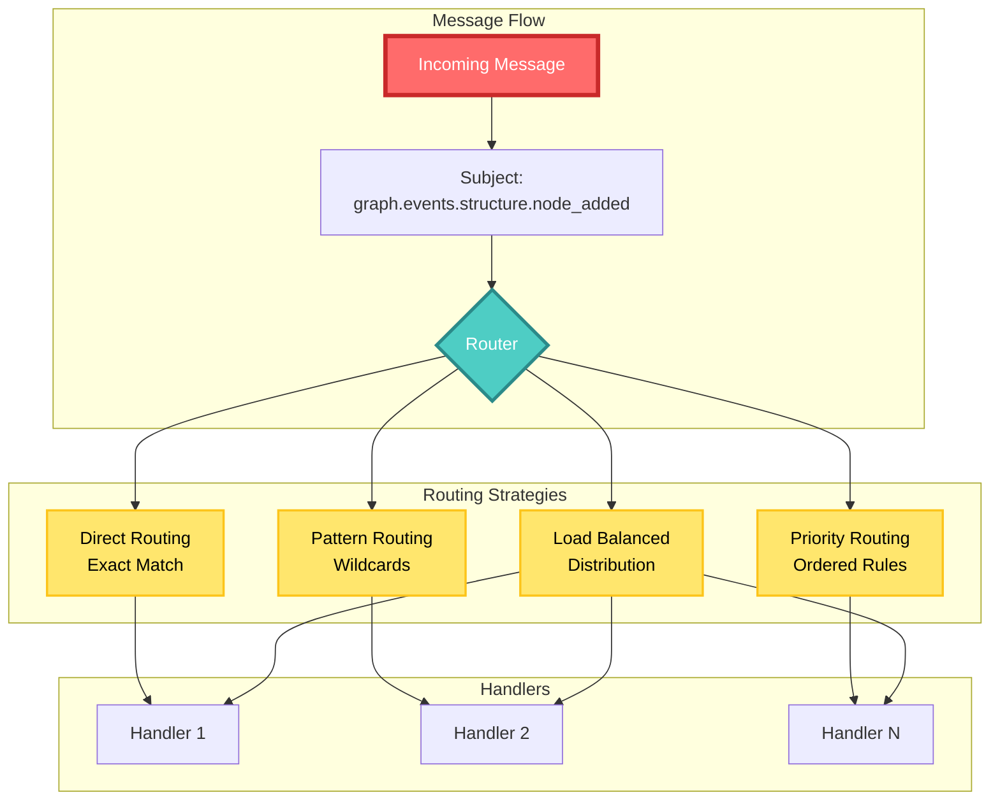

## Subject Naming Standard

### Hierarchical Structure Visualization

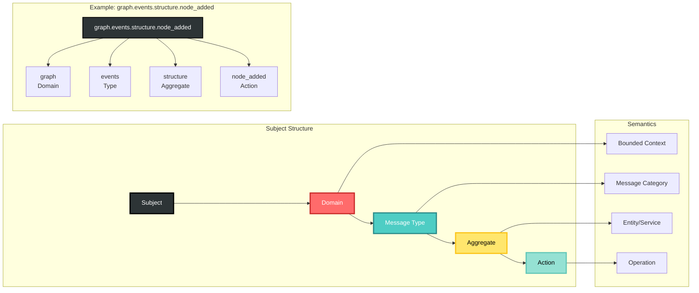

The standard subject format follows a strict hierarchy:

```
{domain}.{message_type}.{aggregate}.{action}
```

### Domain Prefixes

Each bounded context has its own domain prefix:

| Domain | Prefix | Purpose |
|--------|---------|----------|
| Graph | `graph` | Graph structure and operations |
| Workflow | `workflow` | Workflow execution and state |
| Location | `location` | Spatial and location services |
| Identity | `identity` | Authentication and authorization |
| Document | `document` | Document management |
| Persistence | `persistence` | Storage operations |
| Intelligence | `intelligence` | AI/ML operations |

### Message Type Segments

Standard message types:
- `commands` - State change requests
- `events` - State change notifications
- `queries` - Read requests
- `responses` - Query responses
- `errors` - Error notifications

### Examples

```
# Commands
graph.commands.structure.add_node
workflow.commands.execution.start
identity.commands.user.authenticate

# Events
graph.events.structure.node_added
workflow.events.execution.completed
document.events.content.uploaded

# Queries
graph.queries.analysis.find_shortest_path
location.queries.search.find_nearby
```

## Wildcard Patterns

### Wildcard Pattern Visualization

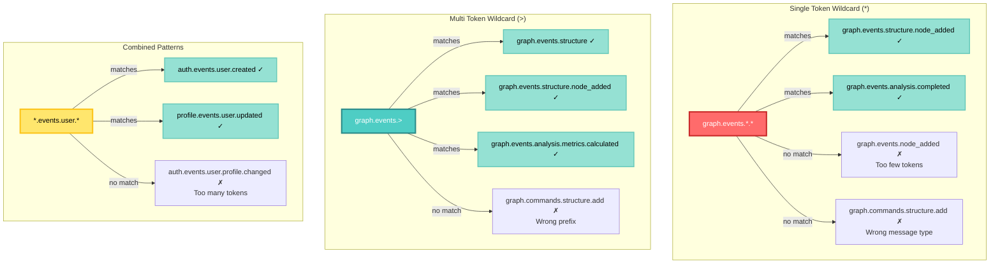

### Single Token Wildcard (`*`)

Matches exactly one token:

```rust
pub struct SingleTokenPattern {
    pattern: String,
}

impl SingleTokenPattern {
    pub fn matches(&self, subject: &str) -> bool {
        let pattern_tokens: Vec<&str> = self.pattern.split('.').collect();
        let subject_tokens: Vec<&str> = subject.split('.').collect();
        
        if pattern_tokens.len() != subject_tokens.len() {
            return false;
        }
        
        pattern_tokens.iter()
            .zip(subject_tokens.iter())
            .all(|(p, s)| p == &"*" || p == s)
    }
}
```

Use cases:
```
# Subscribe to all graph events
graph.events.*.* 

# All commands for any aggregate in workflow domain
workflow.commands.*.*

# All user-related events across domains
*.events.user.*
```

### Multi-Token Wildcard (`>`)

Matches one or more tokens at the end:

```rust
pub struct MultiTokenPattern {
    prefix: String,
}

impl MultiTokenPattern {
    pub fn matches(&self, subject: &str) -> bool {
        subject.starts_with(&self.prefix)
    }
}
```

Use cases:
```
# All graph-related messages
graph.>

# All events in the system
*.events.>

# All persistence operations
persistence.>
```

## Routing Strategies

### Routing Strategy Comparison

```mermaid
graph TB
    subgraph "Direct Routing"
        DR[Exact Match Only]
        DR1[graph.events.node_added]
        DR2[→ Handler A]
        DR1 --> DR2
        
        DR3[graph.events.edge_added]
        DR4[→ Handler B]
        DR3 --> DR4
    end
    
    subgraph "Pattern-Based Routing"
        PR[Wildcard Matching]
        PR1[graph.events.*]
        PR2[→ Handlers [A, B, C]]
        PR1 --> PR2
        
        PR3[*.events.>]
        PR4[→ Event Logger]
        PR3 --> PR4
    end
    
    subgraph "Priority-Based Routing"
        PRI[Ordered Evaluation]
        PRI1[Priority 10: graph.events.critical.*]
        PRI2[Priority 5: graph.events.*.*]
        PRI3[Priority 1: graph.>]
        
        PRI1 --> H1[Critical Handler]
        PRI2 --> H2[Normal Handler]
        PRI3 --> H3[Fallback Handler]
    end
    
    subgraph "Load-Balanced Routing"
        LB[Distribution Strategy]
        LB1[Round Robin]
        LB2[Weighted]
        LB3[Least Connections]
        
        LB --> LB1
        LB --> LB2
        LB --> LB3
        
        LB1 --> POOL[Handler Pool<br/>[H1, H2, H3]]
    end
    
    style DR fill:#FF6B6B,stroke:#C92A2A,stroke-width:3px,color:#FFF
    style PR fill:#4ECDC4,stroke:#2B8A89,stroke-width:3px,color:#FFF
    style PRI fill:#FFE66D,stroke:#FCC419,stroke-width:3px,color:#000
    style LB fill:#95E1D3,stroke:#63C7B8,stroke-width:3px,color:#000
```

### 1. Direct Routing

Simple one-to-one subject mapping:

```rust
pub struct DirectRouter {
    routes: HashMap<String, Handler>,
}

impl DirectRouter {
    pub fn route(&self, subject: &str) -> Option<&Handler> {
        self.routes.get(subject)
    }
}
```

### 2. Pattern-Based Routing

Uses wildcards for flexible routing:

```rust
pub struct PatternRouter {
    patterns: Vec<(SubjectPattern, Handler)>,
}

impl PatternRouter {
    pub fn route(&self, subject: &str) -> Vec<&Handler> {
        self.patterns.iter()
            .filter(|(pattern, _)| pattern.matches(subject))
            .map(|(_, handler)| handler)
            .collect()
    }
    
    pub fn add_route(&mut self, pattern: &str, handler: Handler) {
        let pattern = SubjectPattern::parse(pattern);
        self.patterns.push((pattern, handler));
    }
}
```

### 3. Priority-Based Routing

Routes with priority ordering:

```rust
pub struct PriorityRouter {
    routes: BTreeMap<Priority, Vec<(SubjectPattern, Handler)>>,
}

impl PriorityRouter {
    pub fn route(&self, subject: &str) -> Option<&Handler> {
        for (_, patterns) in self.routes.iter().rev() { // Highest priority first
            for (pattern, handler) in patterns {
                if pattern.matches(subject) {
                    return Some(handler);
                }
            }
        }
        None
    }
}
```

### 4. Load-Balanced Routing

#### Load Balancing Visualization

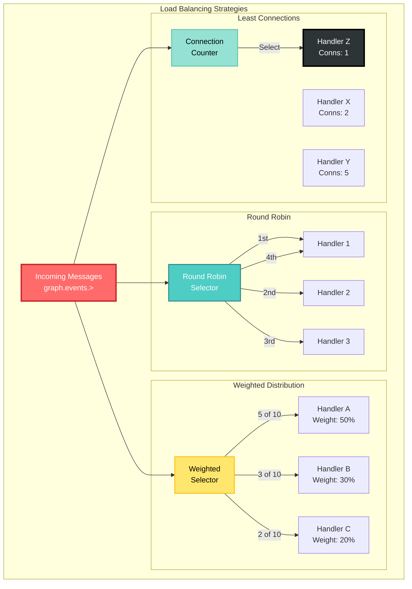

Distributes messages across handlers:

```rust
pub struct LoadBalancedRouter {
    routes: HashMap<SubjectPattern, Vec<Handler>>,
    strategy: LoadBalanceStrategy,
}

pub enum LoadBalanceStrategy {
    RoundRobin,
    Random,
    LeastConnections,
    WeightedRoundRobin(Vec<usize>),
}

impl LoadBalancedRouter {
    pub fn route(&mut self, subject: &str) -> Option<&Handler> {
        for (pattern, handlers) in &mut self.routes {
            if pattern.matches(subject) {
                return self.strategy.select(handlers);
            }
        }
        None
    }
}
```

## Advanced Routing Patterns

### Advanced Pattern Overview

```mermaid
graph TB
    subgraph "Advanced Routing Patterns"
        ADV[Advanced Patterns]
        
        CB[Content-Based<br/>Message inspection]
        SAGA[Saga Routing<br/>Workflow state]
        SG[Scatter-Gather<br/>Fan-out/Fan-in]
        CB2[Circuit Breaker<br/>Fault tolerance]
        
        ADV --> CB
        ADV --> SAGA
        ADV --> SG
        ADV --> CB2
    end
    
    subgraph "Content-Based Example"
        MSG1[Order Message]
        CHECK{Check Amount}
        
        MSG1 --> CHECK
        CHECK -->|> $1000| PREMIUM[Premium Handler]
        CHECK -->|<= $1000| STANDARD[Standard Handler]
    end
    
    subgraph "Saga Example"
        SMSG[Saga Event]
        STATE{Current State}
        
        SMSG --> STATE
        STATE -->|Order Created| PAY[Process Payment]
        STATE -->|Payment Done| SHIP[Ship Order]
        STATE -->|Ship Failed| COMP[Compensate]
    end
    
    subgraph "Scatter-Gather Example"
        REQ[Search Request]
        SCATTER[Scatter to Services]
        S1[Service 1]
        S2[Service 2]
        S3[Service 3]
        GATHER[Gather Results]
        RESP[Combined Response]
        
        REQ --> SCATTER
        SCATTER --> S1
        SCATTER --> S2
        SCATTER --> S3
        S1 --> GATHER
        S2 --> GATHER
        S3 --> GATHER
        GATHER --> RESP
    end
    
    style ADV fill:#2D3436,stroke:#000,stroke-width:3px,color:#FFF
    style CB fill:#FF6B6B,stroke:#C92A2A,stroke-width:2px,color:#FFF
    style SAGA fill:#4ECDC4,stroke:#2B8A89,stroke-width:2px,color:#FFF
    style SG fill:#FFE66D,stroke:#FCC419,stroke-width:2px,color:#000
    style CB2 fill:#95E1D3,stroke:#63C7B8,stroke-width:2px,color:#000
```

### 1. Content-Based Routing

Route based on message content:

```rust
pub struct ContentBasedRouter {
    content_rules: Vec<ContentRule>,
}

pub struct ContentRule {
    subject_pattern: SubjectPattern,
    content_predicate: Box<dyn Fn(&MessageContent) -> bool>,
    handler: Handler,
}

impl ContentBasedRouter {
    pub fn route(&self, message: &Message) -> Option<&Handler> {
        for rule in &self.content_rules {
            if rule.subject_pattern.matches(&message.subject) 
                && (rule.content_predicate)(&message.content) {
                return Some(&rule.handler);
            }
        }
        None
    }
}
```

### 2. Saga Routing

#### Saga State Machine Visualization

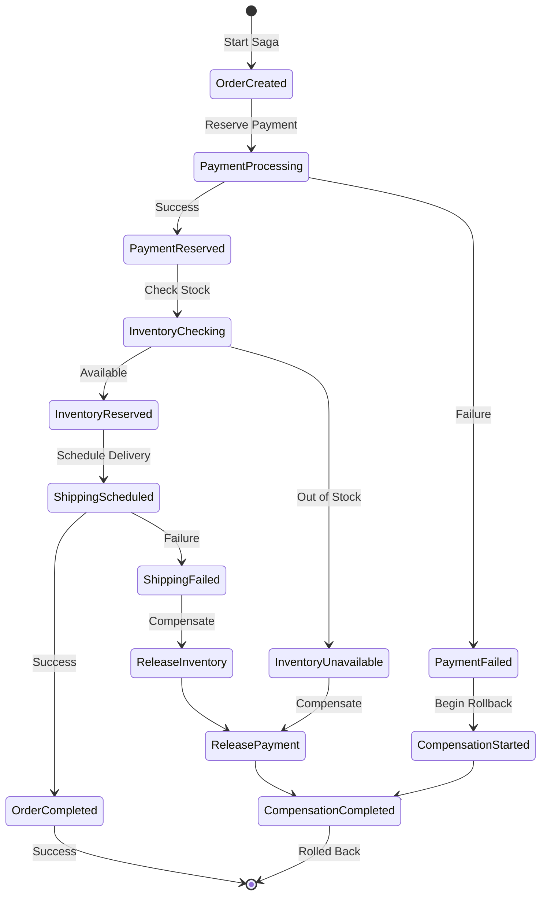

Routes messages within saga workflows:

```rust
pub struct SagaRouter {
    sagas: HashMap<CorrelationId, SagaState>,
}

impl SagaRouter {
    pub fn route(&mut self, message: &Message) -> Result<SagaAction, SagaError> {
        let saga = self.sagas.get_mut(&message.correlation_id)
            .ok_or(SagaError::NotFound)?;
        
        match saga.handle_message(message) {
            SagaTransition::Continue(next_commands) => {
                Ok(SagaAction::SendCommands(next_commands))
            }
            SagaTransition::Complete => {
                self.sagas.remove(&message.correlation_id);
                Ok(SagaAction::Complete)
            }
            SagaTransition::Compensate(compensations) => {
                Ok(SagaAction::Compensate(compensations))
            }
        }
    }
}
```

### 3. Scatter-Gather Routing

#### Scatter-Gather Flow Visualization

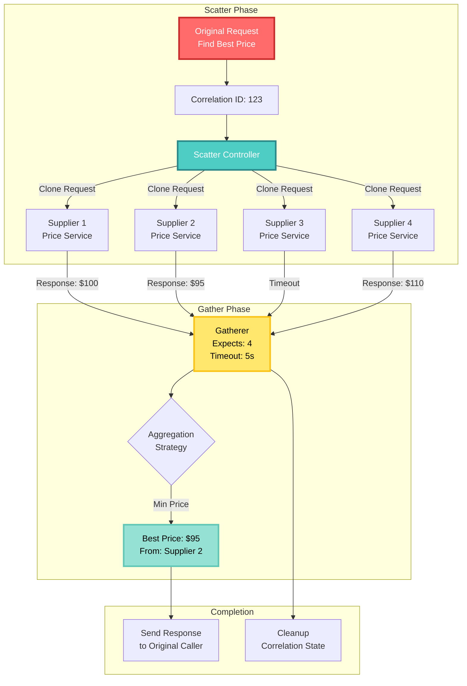

Broadcast and collect responses:

```rust
pub struct ScatterGatherRouter {
    scatter_patterns: HashMap<SubjectPattern, Vec<String>>,
    gatherers: HashMap<CorrelationId, Gatherer>,
}

pub struct Gatherer {
    expected_responses: usize,
    received_responses: Vec<Message>,
    completion_handler: Handler,
    timeout: Duration,
}

impl ScatterGatherRouter {
    pub async fn scatter(&mut self, request: &Message) -> Result<(), Error> {
        // Find matching scatter pattern
        let targets = self.find_scatter_targets(&request.subject)?;
        
        // Create gatherer
        let gatherer = Gatherer {
            expected_responses: targets.len(),
            received_responses: Vec::new(),
            completion_handler: self.create_completion_handler(),
            timeout: Duration::from_secs(30),
        };
        
        self.gatherers.insert(request.correlation_id.clone(), gatherer);
        
        // Scatter to all targets
        for target in targets {
            self.send_to_target(target, request).await?;
        }
        
        Ok(())
    }
    
    pub fn gather(&mut self, response: Message) -> Option<Message> {
        if let Some(gatherer) = self.gatherers.get_mut(&response.correlation_id) {
            gatherer.received_responses.push(response);
            
            if gatherer.received_responses.len() == gatherer.expected_responses {
                // All responses received, create aggregate response
                let aggregate = self.aggregate_responses(&gatherer.received_responses);
                self.gatherers.remove(&response.correlation_id);
                return Some(aggregate);
            }
        }
        None
    }
}
```

### 4. Circuit Breaker Routing

#### Circuit Breaker State Transitions

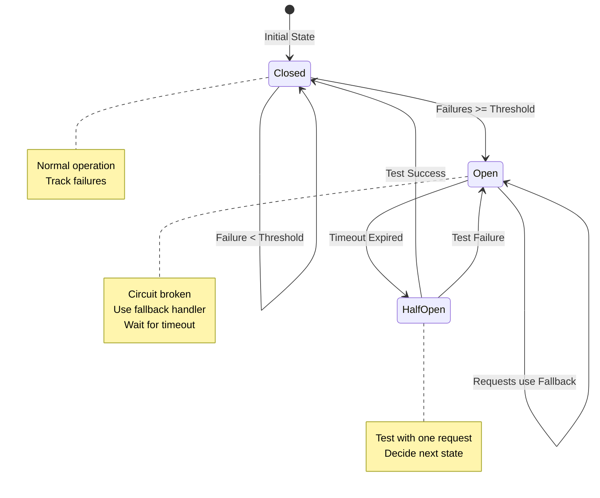

#### Circuit Breaker Flow

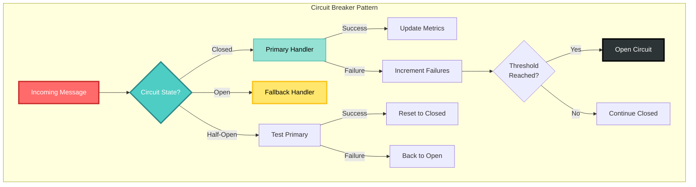

Protects against cascading failures:

```rust
pub struct CircuitBreakerRouter {
    routes: HashMap<SubjectPattern, CircuitBreaker>,
}

pub struct CircuitBreaker {
    primary_handler: Handler,
    fallback_handler: Handler,
    failure_threshold: usize,
    reset_timeout: Duration,
    state: CircuitState,
}

pub enum CircuitState {
    Closed { failure_count: usize },
    Open { opened_at: Instant },
    HalfOpen,
}

impl CircuitBreakerRouter {
    pub fn route(&mut self, message: &Message) -> Result<&Handler, Error> {
        for (pattern, breaker) in &mut self.routes {
            if pattern.matches(&message.subject) {
                return breaker.get_handler();
            }
        }
        Err(Error::NoRoute)
    }
}

impl CircuitBreaker {
    pub fn get_handler(&mut self) -> Result<&Handler, Error> {
        match &self.state {
            CircuitState::Closed { failure_count } => {
                Ok(&self.primary_handler)
            }
            CircuitState::Open { opened_at } => {
                if opened_at.elapsed() > self.reset_timeout {
                    self.state = CircuitState::HalfOpen;
                    Ok(&self.primary_handler)
                } else {
                    Ok(&self.fallback_handler)
                }
            }
            CircuitState::HalfOpen => {
                Ok(&self.primary_handler)
            }
        }
    }
}
```

## Subject Translation

### Subject Translation Flow

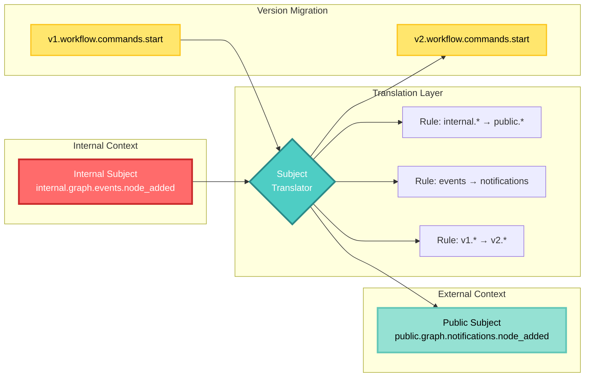

### Context Mapping

Translate subjects between bounded contexts:

```rust
pub struct SubjectTranslator {
    mappings: Vec<TranslationRule>,
}

pub struct TranslationRule {
    source_pattern: SubjectPattern,
    target_template: String,
    transform: Box<dyn Fn(&str) -> String>,
}

impl SubjectTranslator {
    pub fn translate(&self, subject: &str) -> Option<String> {
        for rule in &self.mappings {
            if rule.source_pattern.matches(subject) {
                return Some((rule.transform)(subject));
            }
        }
        None
    }
}

// Example translations
let translator = SubjectTranslator::new()
    .add_rule(
        "internal.graph.events.*",
        "public.graph.notifications.$1",
        |s| s.replace("internal", "public").replace("events", "notifications")
    )
    .add_rule(
        "v1.workflow.commands.*",
        "v2.workflow.commands.$1",
        |s| s.replace("v1", "v2")
    );
```

### Environment Routing

#### Environment-Based Routing Visualization

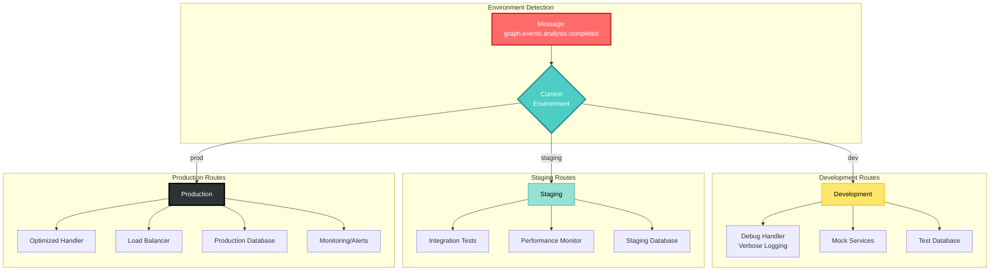

Route based on deployment environment:

```rust
pub struct EnvironmentRouter {
    environment: Environment,
    routes: HashMap<Environment, HashMap<SubjectPattern, Handler>>,
}

pub enum Environment {
    Development,
    Staging,
    Production,
}

impl EnvironmentRouter {
    pub fn route(&self, subject: &str) -> Option<&Handler> {
        self.routes.get(&self.environment)
            .and_then(|env_routes| {
                env_routes.iter()
                    .find(|(pattern, _)| pattern.matches(subject))
                    .map(|(_, handler)| handler)
            })
    }
}
```

## Performance Optimization

### Performance Optimization Strategies

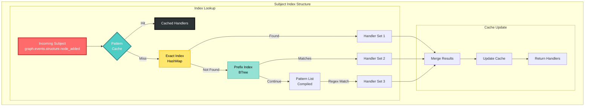

### Subject Index

Pre-compute subject matches for performance:

```rust
pub struct SubjectIndex {
    exact_index: HashMap<String, Vec<Handler>>,
    prefix_index: BTreeMap<String, Vec<Handler>>,
    pattern_cache: LruCache<String, Vec<Handler>>,
}

impl SubjectIndex {
    pub fn lookup(&mut self, subject: &str) -> Vec<&Handler> {
        // Check cache first
        if let Some(handlers) = self.pattern_cache.get(subject) {
            return handlers.iter().collect();
        }
        
        let mut results = Vec::new();
        
        // Exact match
        if let Some(handlers) = self.exact_index.get(subject) {
            results.extend(handlers);
        }
        
        // Prefix match
        for (prefix, handlers) in self.prefix_index.range(..=subject.to_string()) {
            if subject.starts_with(prefix) {
                results.extend(handlers);
            }
        }
        
        // Cache results
        self.pattern_cache.put(subject.to_string(), results.clone());
        
        results.iter().collect()
    }
}
```

### Routing Table Compilation

Compile patterns for faster matching:

```rust
pub struct CompiledRouter {
    routes: Vec<CompiledRoute>,
}

pub struct CompiledRoute {
    pattern: CompiledPattern,
    handler: Handler,
}

pub enum CompiledPattern {
    Exact(String),
    Prefix(String),
    Regex(regex::Regex),
}

impl CompiledPattern {
    pub fn compile(pattern: &str) -> Self {
        if !pattern.contains('*') && !pattern.contains('>') {
            CompiledPattern::Exact(pattern.to_string())
        } else if pattern.ends_with('>') {
            CompiledPattern::Prefix(pattern[..pattern.len()-1].to_string())
        } else {
            let regex_pattern = pattern
                .replace(".", "\\.")
                .replace("*", "[^.]+")
                .replace(">", ".*");
            CompiledPattern::Regex(regex::Regex::new(&regex_pattern).unwrap())
        }
    }
}
```

## Testing Routing

### Route Testing Framework

```rust
#[cfg(test)]
mod tests {
    use super::*;
    
    #[test]
    fn test_pattern_matching() {
        let pattern = SubjectPattern::new("graph.events.*.*");
        
        assert!(pattern.matches("graph.events.structure.node_added"));
        assert!(pattern.matches("graph.events.analysis.completed"));
        assert!(!pattern.matches("graph.commands.structure.add_node"));
        assert!(!pattern.matches("graph.events.node_added")); // Too few tokens
    }
    
    #[test]
    fn test_router_priority() {
        let mut router = PriorityRouter::new();
        
        router.add_route(Priority::Low, "graph.>", low_handler);
        router.add_route(Priority::High, "graph.events.>", high_handler);
        
        // More specific pattern with higher priority wins
        assert_eq!(
            router.route("graph.events.structure.node_added"),
            Some(&high_handler)
        );
    }
}
```

### Route Coverage Analysis

```rust
pub struct RouteCoverage {
    routes: HashSet<String>,
    covered: HashSet<String>,
}

impl RouteCoverage {
    pub fn record(&mut self, subject: &str) {
        self.covered.insert(subject.to_string());
    }
    
    pub fn coverage_percent(&self) -> f64 {
        (self.covered.len() as f64 / self.routes.len() as f64) * 100.0
    }
    
    pub fn uncovered_routes(&self) -> Vec<&String> {
        self.routes.difference(&self.covered).collect()
    }
}
```