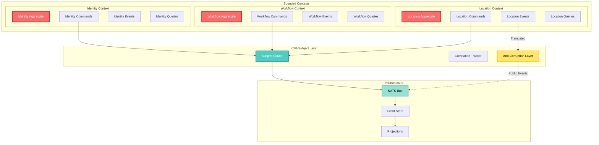
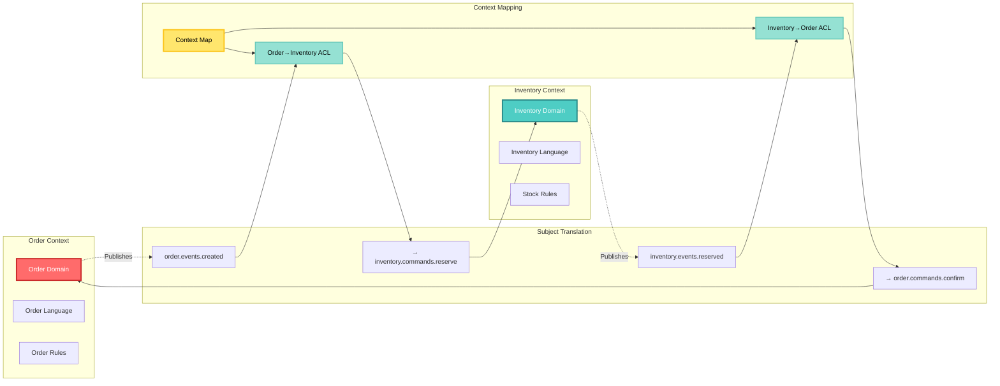
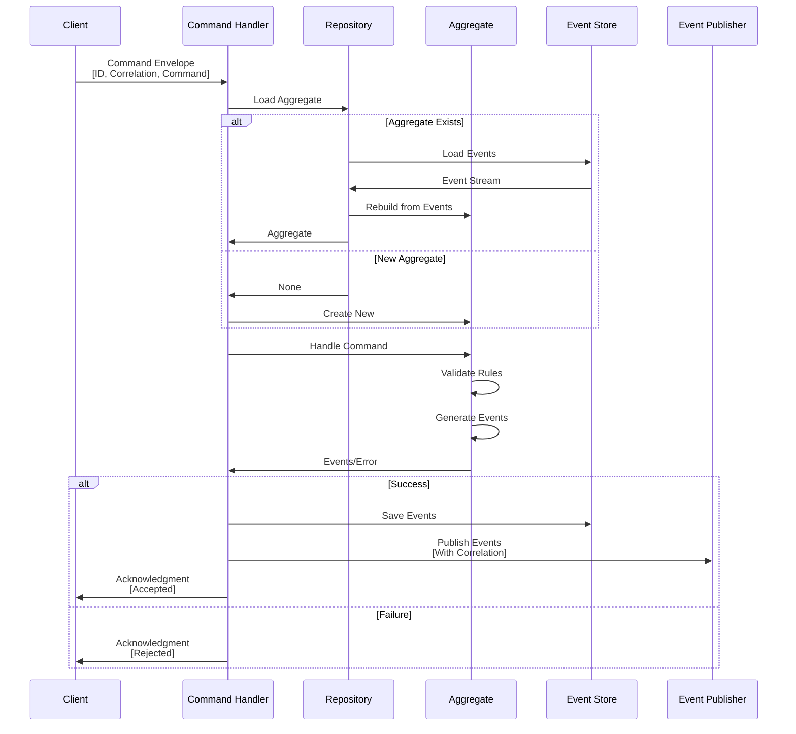
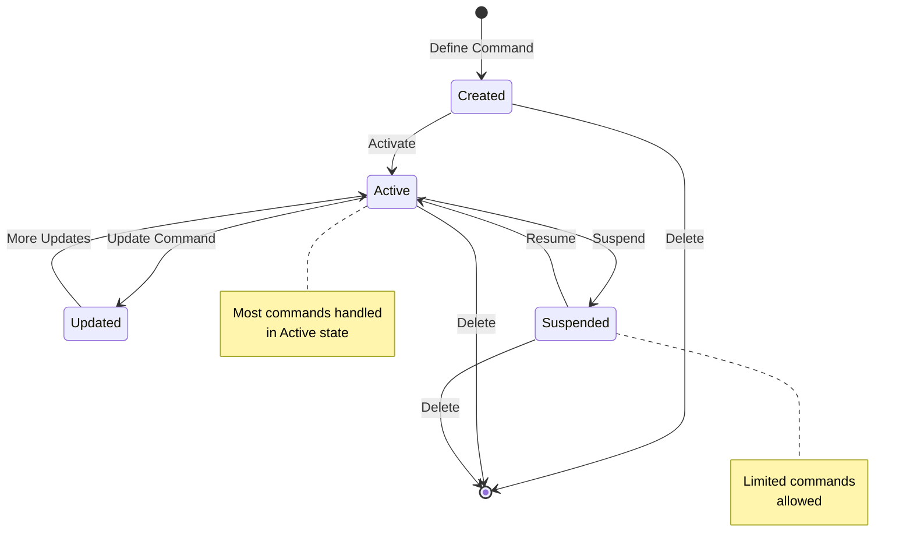
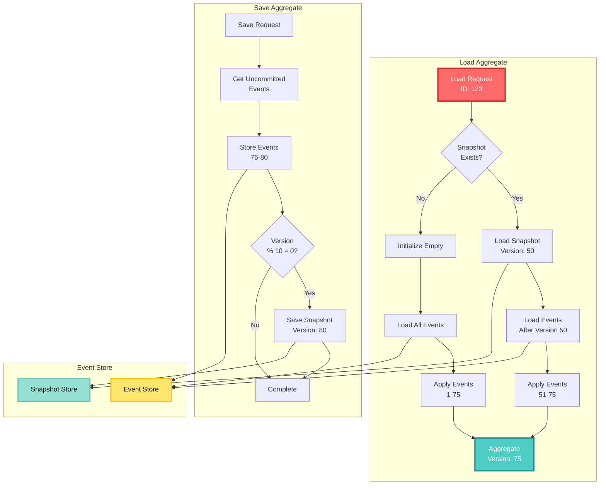
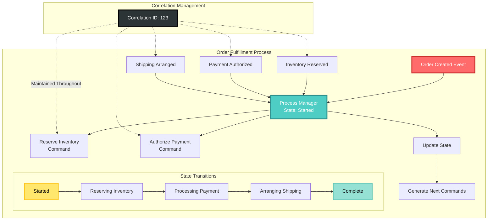
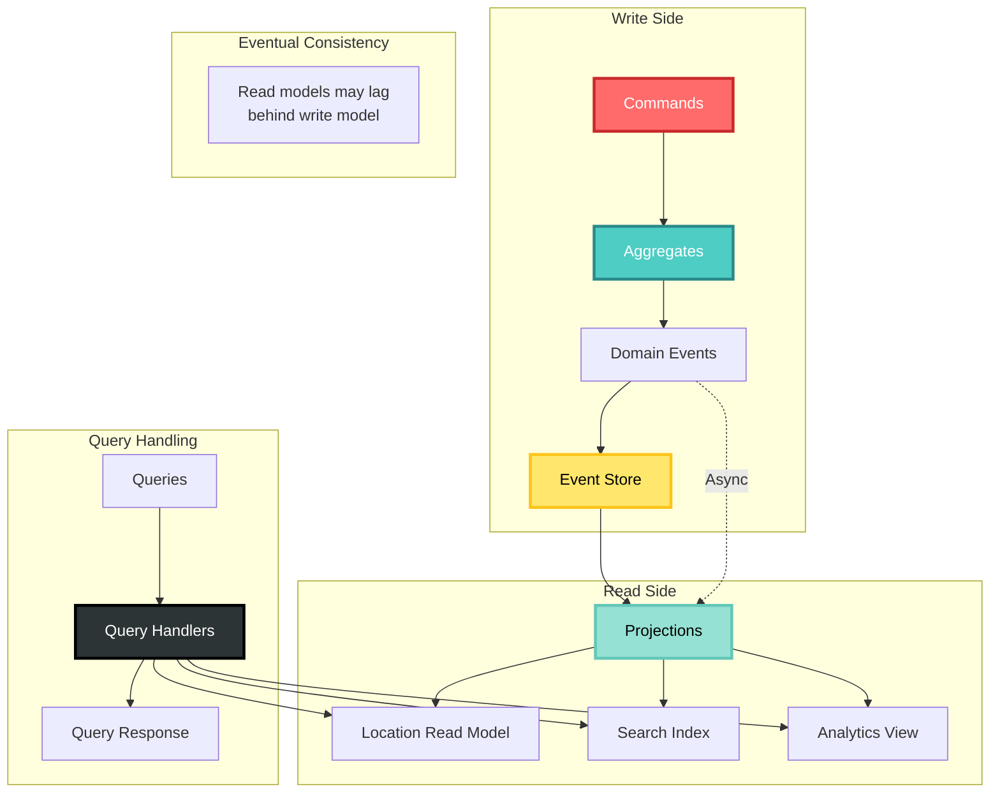
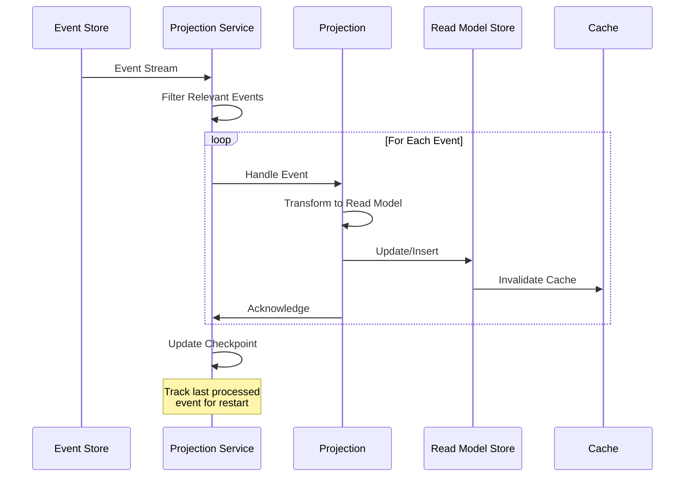
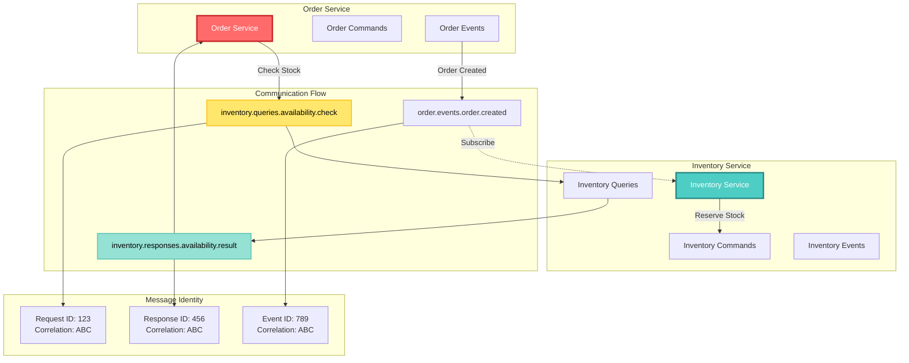
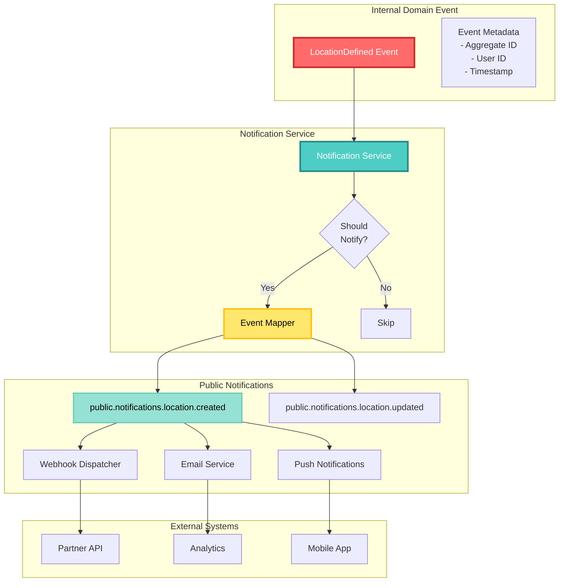

<!-- Copyright (c) 2025 Cowboy AI, LLC. -->
# Domain-Driven Design Integration

## Overview

CIM-Subject provides first-class support for Domain-Driven Design (DDD) patterns, enabling proper bounded context separation, aggregate communication, and event-driven architectures. This integration ensures that domain concepts remain pure while leveraging powerful messaging infrastructure.

## DDD Architecture with CIM-Subject



## Bounded Context Communication

### Context Boundaries Visualization



### Context Mapping

CIM-Subject enforces clear boundaries between bounded contexts through subject namespacing:

```rust
pub trait BoundedContext {
    fn name(&self) -> &str;
    fn subject_prefix(&self) -> String {
        self.name().to_lowercase()
    }
}

pub struct LocationContext;
impl BoundedContext for LocationContext {
    fn name(&self) -> &str { "Location" }
}

pub struct WorkflowContext;
impl BoundedContext for WorkflowContext {
    fn name(&self) -> &str { "Workflow" }
}
```

### Anti-Corruption Layer

#### ACL Translation Flow

```mermaid
graph TB
    subgraph "External Interface"
        EXT[External Request<br/>REST/GraphQL]
        EXTDATA[External Data Model<br/>{ place_name, lat, lng }]
    end
    
    subgraph "Anti-Corruption Layer"
        VAL{Validate}
        TRANS[Translate]
        MAP[Map Fields]
        ENRICH[Enrich Data]
        
        EXT --> VAL
        VAL -->|Valid| TRANS
        VAL -->|Invalid| REJECT[Reject]
        TRANS --> MAP
        MAP --> ENRICH
    end
    
    subgraph "Internal Domain"
        CMD[Domain Command<br/>DefineLocation]
        AGG[Location Aggregate]
        EVT[Domain Event<br/>LocationDefined]
    end
    
    subgraph "Outbound Translation"
        EVTTRANS[Event Translator]
        PUBEVT[Public Event<br/>LocationCreated]
        NOTIFY[External Notification]
    end
    
    ENRICH --> CMD
    CMD --> AGG
    AGG --> EVT
    EVT --> EVTTRANS
    EVTTRANS --> PUBEVT
    PUBEVT --> NOTIFY
    
    style EXT fill:#2D3436,stroke:#000,stroke-width:3px,color:#FFF
    style VAL fill:#FF6B6B,stroke:#C92A2A,stroke-width:3px,color:#FFF
    style TRANS fill:#4ECDC4,stroke:#2B8A89,stroke-width:3px,color:#FFF
    style CMD fill:#FFE66D,stroke:#FCC419,stroke-width:3px,color:#000
    style AGG fill:#95E1D3,stroke:#63C7B8,stroke-width:3px,color:#000
```

Translate between internal and external representations:

```rust
pub trait AntiCorruptionLayer {
    type InternalCommand;
    type ExternalCommand;
    type InternalEvent;
    type ExternalEvent;
    
    fn translate_inbound_command(&self, external: Self::ExternalCommand) -> Result<Self::InternalCommand>;
    fn translate_outbound_event(&self, internal: Self::InternalEvent) -> Self::ExternalEvent;
}

pub struct LocationACL;

impl AntiCorruptionLayer for LocationACL {
    type InternalCommand = DefineLocation;
    type ExternalCommand = ExternalLocationRequest;
    type InternalEvent = LocationDefined;
    type ExternalEvent = LocationCreatedNotification;
    
    fn translate_inbound_command(&self, external: ExternalLocationRequest) -> Result<DefineLocation> {
        Ok(DefineLocation {
            location_id: Uuid::new_v4(),
            name: external.place_name,
            location_type: self.map_location_type(external.category),
            coordinates: self.map_coordinates(external.lat, external.lng),
            // ... additional mapping
        })
    }
    
    fn translate_outbound_event(&self, internal: LocationDefined) -> LocationCreatedNotification {
        LocationCreatedNotification {
            place_id: internal.location_id.to_string(),
            place_name: internal.name,
            created_at: Utc::now(),
            // ... additional mapping
        }
    }
}
```

## Aggregate Patterns

### Aggregate Command Flow



### Aggregate State Machine



### Command Handling

Integrate CIM-Subject with aggregate command handling:

```rust
pub trait Aggregate {
    type Command;
    type Event;
    type Error;
    
    fn handle_command(&mut self, command: Self::Command) -> Result<Vec<Self::Event>, Self::Error>;
}

pub struct CommandEnvelope<C> {
    pub id: CommandId,
    pub identity: MessageIdentity,
    pub command: C,
    pub issued_by: String,
}

pub trait CommandHandler<C> {
    fn handle(&mut self, envelope: CommandEnvelope<C>) -> CommandAcknowledgment;
}

// Example: Location aggregate command handler
pub struct LocationCommandHandler<R: AggregateRepository<Location>> {
    repository: Arc<R>,
    event_publisher: Arc<dyn EventPublisher>,
}

impl<R: AggregateRepository<Location>> CommandHandler<DefineLocation> for LocationCommandHandler<R> {
    fn handle(&mut self, envelope: CommandEnvelope<DefineLocation>) -> CommandAcknowledgment {
        let command = &envelope.command;
        let location_id = EntityId::from_uuid(command.location_id);
        
        // Load or create aggregate
        let result = match self.repository.load(location_id) {
            Ok(Some(_)) => {
                CommandAcknowledgment::rejected(
                    envelope.id,
                    envelope.identity.correlation_id.clone(),
                    "Location already exists"
                )
            }
            Ok(None) => {
                // Create new location aggregate
                let location = Location::define(
                    location_id,
                    command.name.clone(),
                    command.location_type.clone(),
                    command.coordinates.clone(),
                )?;
                
                // Save aggregate
                self.repository.save(&location)?;
                
                // Publish events with correlation
                let events = vec![LocationDefined {
                    location_id: command.location_id,
                    name: command.name.clone(),
                    location_type: command.location_type.clone(),
                    // ...
                }];
                
                self.event_publisher.publish_events(
                    events,
                    envelope.identity.correlation_id.clone()
                )?;
                
                CommandAcknowledgment::accepted(
                    envelope.id,
                    envelope.identity.correlation_id.clone()
                )
            }
            Err(e) => {
                CommandAcknowledgment::rejected(
                    envelope.id,
                    envelope.identity.correlation_id.clone(),
                    &format!("Repository error: {}", e)
                )
            }
        };
        
        result
    }
}
```

### Event Publishing

#### Event Publishing Flow

```mermaid
graph TB
    subgraph "Aggregate Processing"
        CMD[Command Received]
        AGG[Aggregate<br/>Processes Command]
        EVTS[Events Generated<br/>[E1, E2, E3]]
        
        CMD --> AGG
        AGG --> EVTS
    end
    
    subgraph "Event Publishing"
        PUB{Event Publisher}
        MAPPER[Subject Mapper]
        IDENT[Identity Creator]
        
        EVTS --> PUB
        PUB --> MAPPER
        PUB --> IDENT
        
        MAPPER --> S1[location.events.location.defined]
        MAPPER --> S2[location.events.metadata.updated]
        MAPPER --> S3[location.events.tags.added]
        
        IDENT --> ID1[Derived Identity<br/>Same Correlation]
        IDENT --> ID2[Derived Identity<br/>Same Correlation]
        IDENT --> ID3[Derived Identity<br/>Same Correlation]
    end
    
    subgraph "NATS Publishing"
        NATS[NATS Client]
        
        S1 --> NATS
        S2 --> NATS
        S3 --> NATS
        
        ID1 --> NATS
        ID2 --> NATS
        ID3 --> NATS
        
        NATS --> BUS[Message Bus]
    end
    
    style CMD fill:#FF6B6B,stroke:#C92A2A,stroke-width:3px,color:#FFF
    style AGG fill:#4ECDC4,stroke:#2B8A89,stroke-width:3px,color:#FFF
    style PUB fill:#FFE66D,stroke:#FCC419,stroke-width:3px,color:#000
    style NATS fill:#95E1D3,stroke:#63C7B8,stroke-width:3px,color:#000
    style BUS fill:#2D3436,stroke:#000,stroke-width:3px,color:#FFF
```

Maintain correlation through event publishing:

```rust
pub trait EventPublisher: Send + Sync {
    fn publish_events(
        &self,
        events: Vec<impl DomainEvent>,
        correlation_id: CorrelationId,
    ) -> Result<(), PublishError>;
}

pub struct NatsEventPublisher {
    client: NatsClient,
    subject_mapper: SubjectMapper,
}

impl EventPublisher for NatsEventPublisher {
    fn publish_events(
        &self,
        events: Vec<impl DomainEvent>,
        correlation_id: CorrelationId,
    ) -> Result<(), PublishError> {
        for event in events {
            let subject = self.subject_mapper.event_to_subject(&event);
            let identity = MessageIdentity::new_derived_from_correlation(correlation_id.clone());
            
            self.client.publish_with_identity(
                &subject,
                &event,
                &identity
            ).await?;
        }
        Ok(())
    }
}
```

### Aggregate Repository

#### Event Sourcing Flow



Integrate with event sourcing:

```rust
pub trait AggregateRepository<A: Aggregate> {
    fn load(&self, id: EntityId) -> Result<Option<A>, RepositoryError>;
    fn save(&self, aggregate: &A) -> Result<(), RepositoryError>;
}

pub struct EventSourcedRepository<A: Aggregate> {
    event_store: Arc<dyn EventStore>,
    snapshot_store: Arc<dyn SnapshotStore>,
}

impl<A: Aggregate> AggregateRepository<A> for EventSourcedRepository<A> {
    fn load(&self, id: EntityId) -> Result<Option<A>, RepositoryError> {
        // Try to load from snapshot
        let mut aggregate = if let Some(snapshot) = self.snapshot_store.load(id)? {
            A::from_snapshot(snapshot)?
        } else {
            A::new(id)
        };
        
        // Apply events since snapshot
        let events = self.event_store.load_events(id, aggregate.version())?;
        for event in events {
            aggregate.apply_event(event)?;
        }
        
        Ok(Some(aggregate))
    }
    
    fn save(&self, aggregate: &A) -> Result<(), RepositoryError> {
        let uncommitted_events = aggregate.uncommitted_events();
        
        // Save events with correlation
        for event in uncommitted_events {
            self.event_store.append(event)?;
        }
        
        // Maybe save snapshot
        if aggregate.version() % 10 == 0 {
            self.snapshot_store.save(aggregate.to_snapshot()?)?;
        }
        
        Ok(())
    }
}
```

## Domain Events

### Event Definition

Structure domain events with proper identity:

```rust
pub trait DomainEvent: Serialize + DeserializeOwned + Clone {
    fn event_type(&self) -> &str;
    fn aggregate_id(&self) -> EntityId;
    fn occurred_at(&self) -> DateTime<Utc>;
}

#[derive(Clone, Debug, Serialize, Deserialize)]
pub struct LocationDefined {
    pub location_id: Uuid,
    pub name: String,
    pub location_type: LocationType,
    pub coordinates: Option<GeoCoordinates>,
    pub occurred_at: DateTime<Utc>,
}

impl DomainEvent for LocationDefined {
    fn event_type(&self) -> &str { "LocationDefined" }
    fn aggregate_id(&self) -> EntityId { EntityId::from_uuid(self.location_id) }
    fn occurred_at(&self) -> DateTime<Utc> { self.occurred_at }
}
```

### Event Envelope

Wrap events with routing information:

```rust
pub struct EventEnvelope<E: DomainEvent> {
    pub id: EventId,
    pub identity: MessageIdentity,
    pub event: E,
    pub metadata: EventMetadata,
}

pub struct EventMetadata {
    pub source: String,
    pub user_id: Option<String>,
    pub tenant_id: Option<String>,
    pub custom: HashMap<String, Value>,
}
```

## Process Managers and Sagas

### Process Manager Flow



### Process Manager

Coordinate between aggregates:

```rust
pub trait ProcessManager {
    type Command;
    type Event;
    
    fn handle_event(&mut self, event: EventEnvelope<Self::Event>) -> Vec<Self::Command>;
    fn is_complete(&self) -> bool;
}

pub struct OrderFulfillmentProcess {
    order_id: Uuid,
    state: FulfillmentState,
    correlation_id: CorrelationId,
}

impl ProcessManager for OrderFulfillmentProcess {
    type Command = FulfillmentCommand;
    type Event = FulfillmentEvent;
    
    fn handle_event(&mut self, envelope: EventEnvelope<Self::Event>) -> Vec<Self::Command> {
        let mut commands = Vec::new();
        
        match (&self.state, &envelope.event) {
            (FulfillmentState::Started, FulfillmentEvent::OrderCreated { items, .. }) => {
                // Reserve inventory for each item
                for item in items {
                    commands.push(FulfillmentCommand::ReserveInventory {
                        item_id: item.id,
                        quantity: item.quantity,
                    });
                }
                self.state = FulfillmentState::ReservingInventory;
            }
            (FulfillmentState::ReservingInventory, FulfillmentEvent::InventoryReserved { .. }) => {
                // Check if all items reserved
                if self.all_items_reserved() {
                    commands.push(FulfillmentCommand::ProcessPayment {
                        order_id: self.order_id,
                    });
                    self.state = FulfillmentState::ProcessingPayment;
                }
            }
            // ... more state transitions
        }
        
        // Maintain correlation for all commands
        commands.into_iter()
            .map(|cmd| self.wrap_with_correlation(cmd))
            .collect()
    }
}
```

### Saga Implementation

#### Saga Pattern Visualization

```mermaid
graph TB
    subgraph "Saga Execution"
        START[Start Saga]
        
        subgraph "Forward Path"
            T1[Transaction 1<br/>Reserve Inventory]
            T2[Transaction 2<br/>Charge Payment]
            T3[Transaction 3<br/>Book Shipping]
            SUCCESS[All Complete]
            
            START --> T1
            T1 -->|Success| T2
            T2 -->|Success| T3
            T3 -->|Success| SUCCESS
        end
        
        subgraph "Compensation Path"
            FAIL[Failure at T3]
            C3[Compensate T3<br/>Cancel Shipping]
            C2[Compensate T2<br/>Refund Payment]
            C1[Compensate T1<br/>Release Inventory]
            ROLLBACK[Rollback Complete]
            
            T3 -->|Failure| FAIL
            FAIL --> C3
            C3 --> C2
            C2 --> C1
            C1 --> ROLLBACK
        end
    end
    
    subgraph "Saga State"
        STATE[Saga State<br/>Steps: [T1, T2, T3]<br/>Current: 2<br/>Status: Compensating]
        LOG[Event Log<br/>T1: Success<br/>T2: Success<br/>T3: Failed]
    end
    
    style START fill:#FF6B6B,stroke:#C92A2A,stroke-width:3px,color:#FFF
    style SUCCESS fill:#95E1D3,stroke:#63C7B8,stroke-width:3px,color:#000
    style FAIL fill:#2D3436,stroke:#000,stroke-width:3px,color:#FFF
    style T1 fill:#4ECDC4,stroke:#2B8A89,stroke-width:2px,color:#FFF
    style T2 fill:#4ECDC4,stroke:#2B8A89,stroke-width:2px,color:#FFF
    style T3 fill:#4ECDC4,stroke:#2B8A89,stroke-width:2px,color:#FFF
    style C3 fill:#FFE66D,stroke:#FCC419,stroke-width:2px,color:#000
    style C2 fill:#FFE66D,stroke:#FCC419,stroke-width:2px,color:#000
    style C1 fill:#FFE66D,stroke:#FCC419,stroke-width:2px,color:#000
```

Implement distributed transactions with compensations:

```rust
pub trait Saga {
    type Command;
    type Event;
    
    fn start(&mut self) -> Vec<Self::Command>;
    fn handle_event(&mut self, event: Self::Event) -> SagaAction<Self::Command>;
    fn compensate(&mut self) -> Vec<Self::Command>;
}

pub enum SagaAction<C> {
    Continue(Vec<C>),
    Compensate(Vec<C>),
    Complete,
}

pub struct OrderSaga {
    order_id: Uuid,
    steps: Vec<SagaStep>,
    current_step: usize,
    correlation_id: CorrelationId,
}

impl Saga for OrderSaga {
    type Command = OrderCommand;
    type Event = OrderEvent;
    
    fn handle_event(&mut self, event: Self::Event) -> SagaAction<Self::Command> {
        match event {
            OrderEvent::PaymentFailed { .. } => {
                // Start compensation
                SagaAction::Compensate(self.compensate())
            }
            OrderEvent::StepCompleted { step_id } => {
                self.current_step += 1;
                if self.current_step < self.steps.len() {
                    SagaAction::Continue(vec![self.steps[self.current_step].command.clone()])
                } else {
                    SagaAction::Complete
                }
            }
            _ => SagaAction::Continue(vec![])
        }
    }
    
    fn compensate(&mut self) -> Vec<Self::Command> {
        self.steps[..self.current_step]
            .iter()
            .rev()
            .filter_map(|step| step.compensation.clone())
            .collect()
    }
}
```

## Query Handling

### CQRS Architecture



### CQRS Read Models

Separate read models with proper querying:

```rust
pub trait QueryHandler<Q: Query> {
    type Result;
    
    fn handle(&self, query: Q) -> Result<Self::Result, QueryError>;
}

pub struct LocationQueryHandler {
    read_store: Arc<dyn ReadModelStore>,
}

impl QueryHandler<FindLocationByCoordinates> for LocationQueryHandler {
    type Result = Vec<LocationReadModel>;
    
    fn handle(&self, query: FindLocationByCoordinates) -> Result<Self::Result, QueryError> {
        self.read_store.find_by_coordinates(
            query.center,
            query.radius_meters
        )
    }
}
```

### Projection Management

#### Projection Update Flow



Update read models from events:

```rust
pub trait Projection {
    type Event;
    
    fn handle_event(&mut self, event: EventEnvelope<Self::Event>) -> Result<(), ProjectionError>;
}

pub struct LocationProjection {
    read_store: Arc<dyn ReadModelStore>,
}

impl Projection for LocationProjection {
    type Event = LocationEvent;
    
    fn handle_event(&mut self, envelope: EventEnvelope<Self::Event>) -> Result<(), ProjectionError> {
        match envelope.event {
            LocationEvent::LocationDefined { location_id, name, coordinates, .. } => {
                let read_model = LocationReadModel {
                    id: location_id,
                    name,
                    coordinates,
                    last_updated: envelope.event.occurred_at(),
                };
                self.read_store.upsert(read_model)?;
            }
            LocationEvent::LocationMoved { location_id, new_coordinates, .. } => {
                self.read_store.update_coordinates(location_id, new_coordinates)?;
            }
            // ... handle other events
        }
        Ok(())
    }
}
```

## Integration Patterns

### Domain Service Communication



### Domain Service Integration

```rust
pub trait DomainService {
    fn subject_prefix(&self) -> &str;
}

pub struct InventoryService {
    nats_client: NatsClient,
}

impl DomainService for InventoryService {
    fn subject_prefix(&self) -> &str {
        "inventory"
    }
}

impl InventoryService {
    pub async fn check_availability(&self, item_id: Uuid) -> Result<bool, ServiceError> {
        let query_subject = format!("{}.queries.availability.check", self.subject_prefix());
        let response_subject = format!("{}.responses.availability.result", self.subject_prefix());
        
        let query = CheckAvailability { item_id };
        let identity = MessageIdentity::new_root();
        
        let response = self.nats_client
            .request_with_identity(&query_subject, &query, &identity)
            .await?;
        
        Ok(response.available)
    }
}
```

### Event Notification

#### Event Notification Flow



Publish domain notifications:

```rust
pub struct DomainNotificationService {
    publisher: Arc<dyn EventPublisher>,
    notification_mapper: NotificationMapper,
}

impl DomainNotificationService {
    pub async fn notify_domain_event<E: DomainEvent>(
        &self,
        event: E,
        correlation_id: CorrelationId,
    ) -> Result<(), NotificationError> {
        // Map to public notification
        let notification = self.notification_mapper.map_event(event)?;
        
        // Publish with proper subject
        let subject = format!("public.notifications.{}", notification.notification_type());
        
        self.publisher.publish_with_subject(
            &subject,
            notification,
            correlation_id
        ).await?;
        
        Ok(())
    }
}
```

## Best Practices

### 1. Maintain Bounded Context Isolation

```rust
// Good: Clear context boundaries
mod location_context {
    pub const SUBJECT_PREFIX: &str = "location";
    
    pub fn command_subject(aggregate: &str, command: &str) -> String {
        format!("{}.commands.{}.{}", SUBJECT_PREFIX, aggregate, command)
    }
}

// Bad: Crossing context boundaries directly
fn bad_example() {
    // Don't directly call other contexts
    let subject = "inventory.commands.stock.update"; // Wrong context!
}
```

### 2. Use Anti-Corruption Layers

```rust
// Good: Translate at boundaries
pub struct OrderToInventoryTranslator {
    pub fn translate_order_item(&self, order_item: OrderItem) -> InventoryRequest {
        InventoryRequest {
            sku: order_item.product_sku,
            quantity: order_item.quantity,
            warehouse_id: self.determine_warehouse(order_item.shipping_address),
        }
    }
}
```

### 3. Leverage Process Managers for Coordination

```rust
// Good: Process manager coordinates between aggregates
pub struct CheckoutProcessManager {
    pub fn coordinate_checkout(&mut self, order_id: Uuid) -> Vec<Command> {
        vec![
            Command::ValidateInventory { order_id },
            Command::AuthorizePayment { order_id },
            Command::AllocateShipping { order_id },
        ]
    }
}
```

### 4. Keep Aggregates Small

```rust
// Good: Focused aggregate
pub struct Location {
    id: LocationId,
    name: String,
    coordinates: GeoCoordinates,
    location_type: LocationType,
}

// Bad: Aggregate doing too much
pub struct BadLocation {
    id: LocationId,
    name: String,
    coordinates: GeoCoordinates,
    weather_data: WeatherData,        // Should be separate aggregate
    traffic_data: TrafficData,        // Should be separate aggregate
    business_listings: Vec<Business>, // Should be separate aggregate
}
```