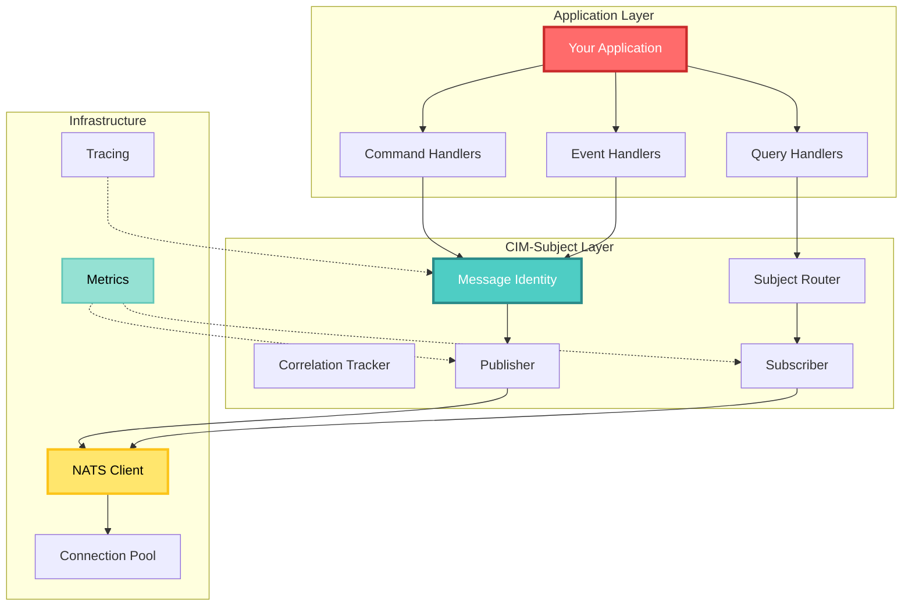
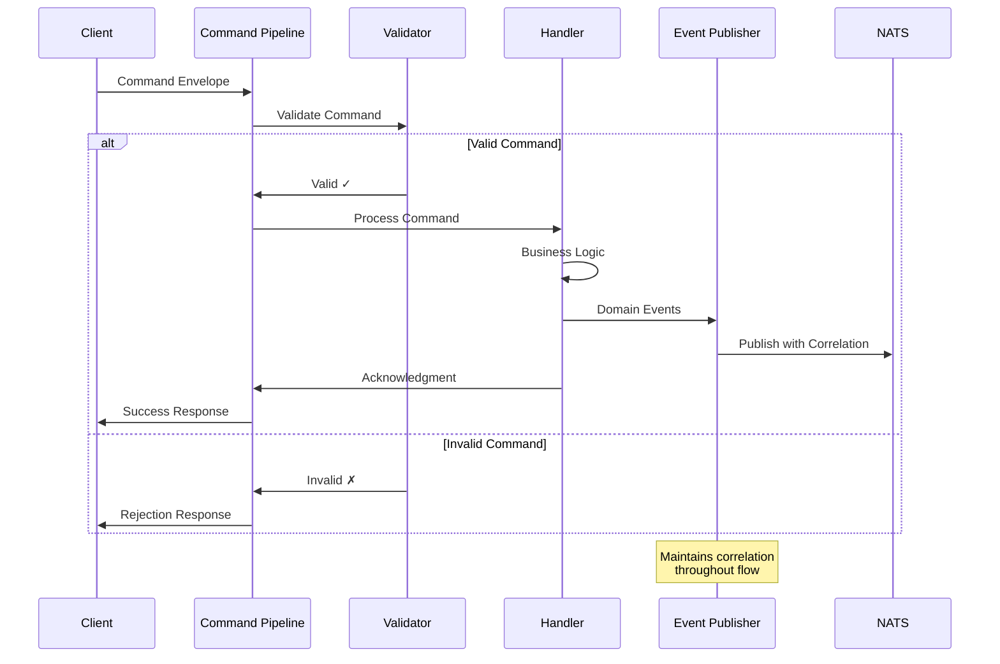
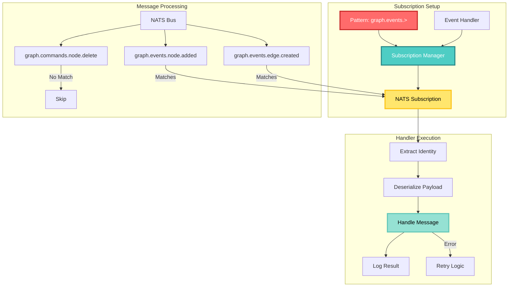
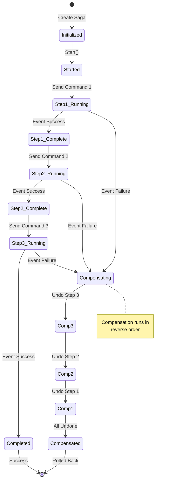
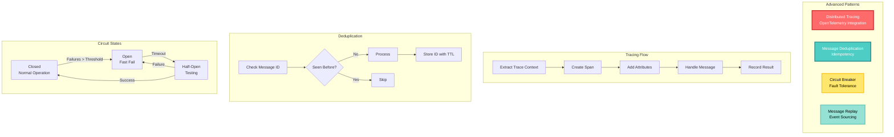
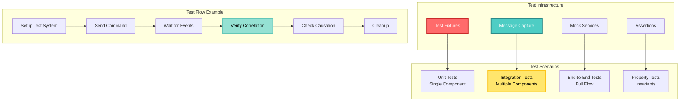
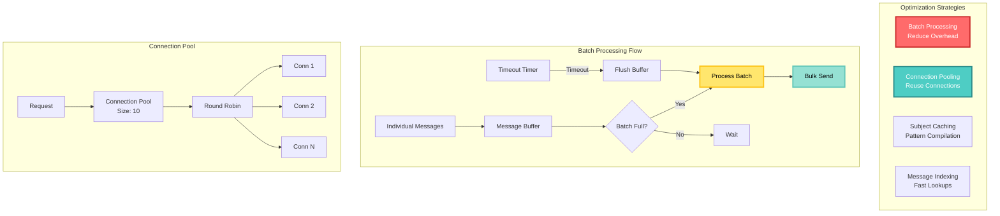
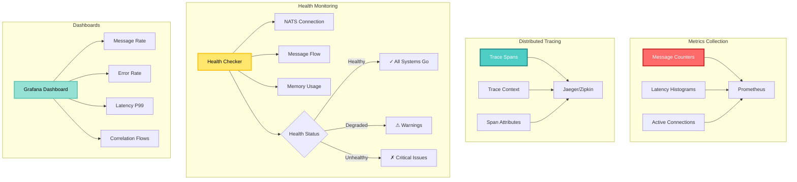

<!-- Copyright (c) 2025 Cowboy AI, LLC. -->
# Implementation Guide

## Getting Started

This guide provides practical examples and patterns for implementing CIM-Subject in your applications. We'll cover common scenarios, best practices, and integration patterns.

## Implementation Architecture



## Basic Setup

### Dependencies

Add CIM-Subject to your Cargo.toml:

```toml
[dependencies]
cim-subject = { git = "https://github.com/TheCowboyAI/cim-domain.git", branch = "main" }
cim-domain = { git = "https://github.com/TheCowboyAI/cim-domain.git", branch = "main" }
async-nats = "0.35"
uuid = { version = "1.4", features = ["v4", "serde"] }
serde = { version = "1.0", features = ["derive"] }
chrono = { version = "0.4", features = ["serde"] }
```

### Initial Configuration

```rust
use cim_subject::{MessageIdentity, CorrelationId, CausationId, IdType};
use cim_domain::{CommandEnvelope, EventEnvelope};
use async_nats::Client;
use std::sync::Arc;

pub struct MessageSystem {
    nats_client: Client,
    domain_prefix: String,
}

impl MessageSystem {
    pub async fn new(nats_url: &str, domain: &str) -> Result<Self, Box<dyn std::error::Error>> {
        let client = async_nats::connect(nats_url).await?;
        
        Ok(Self {
            nats_client: client,
            domain_prefix: domain.to_string(),
        })
    }
}
```

## Common Implementation Patterns

### Command Processing Pipeline Flow



### 1. Command Processing Pipeline

```rust
use cim_domain::{CommandHandler, CommandAcknowledgment, CommandStatus};

pub struct CommandProcessor<H: CommandHandler<C>, C> {
    handler: H,
    event_publisher: Arc<dyn EventPublisher>,
    _phantom: std::marker::PhantomData<C>,
}

impl<H: CommandHandler<C>, C> CommandProcessor<H, C> {
    pub async fn process(&mut self, envelope: CommandEnvelope<C>) -> Result<(), ProcessError> {
        // Pre-process validation
        self.validate_command(&envelope)?;
        
        // Log command reception
        tracing::info!(
            command_id = %envelope.id,
            correlation_id = %envelope.identity.correlation_id,
            "Processing command"
        );
        
        // Handle command
        let ack = self.handler.handle(envelope.clone());
        
        // Process acknowledgment
        match ack.status {
            CommandStatus::Accepted => {
                tracing::info!(
                    command_id = %ack.command_id,
                    "Command accepted"
                );
                Ok(())
            }
            CommandStatus::Rejected => {
                tracing::warn!(
                    command_id = %ack.command_id,
                    reason = ?ack.reason,
                    "Command rejected"
                );
                Err(ProcessError::Rejected(ack.reason.unwrap_or_default()))
            }
        }
    }
    
    fn validate_command(&self, envelope: &CommandEnvelope<C>) -> Result<(), ValidationError> {
        // Validate identity consistency
        if envelope.identity.is_root() {
            ensure!(
                envelope.identity.message_id == envelope.identity.correlation_id,
                "Root command must have matching IDs"
            );
        }
        
        // Add domain-specific validation here
        
        Ok(())
    }
}
```

### 2. Event Publishing with Correlation

```rust
use cim_subject::{MessageIdentity, Subject};

pub struct EventPublisher {
    nats_client: Client,
    domain: String,
}

impl EventPublisher {
    pub async fn publish<E: DomainEvent>(
        &self,
        event: E,
        correlation_id: CorrelationId,
        causation_id: MessageId,
    ) -> Result<(), PublishError> {
        // Create event identity
        let identity = MessageIdentity {
            message_id: MessageId::new(),
            correlation_id,
            causation_id: CausationId(causation_id.into()),
        };
        
        // Build subject
        let subject = format!(
            "{}.events.{}.{}",
            self.domain,
            event.aggregate_type(),
            event.event_type()
        );
        
        // Create envelope
        let envelope = EventEnvelope {
            id: EventId::new(),
            identity,
            event,
            metadata: self.build_metadata(),
        };
        
        // Serialize and publish
        let payload = serde_json::to_vec(&envelope)?;
        let headers = self.build_headers(&envelope.identity);
        
        self.nats_client
            .publish_with_headers(subject, headers, payload.into())
            .await?;
        
        Ok(())
    }
    
    fn build_headers(&self, identity: &MessageIdentity) -> HeaderMap {
        let mut headers = HeaderMap::new();
        headers.insert("X-Message-ID", identity.message_id.to_string());
        headers.insert("X-Correlation-ID", identity.correlation_id.to_string());
        headers.insert("X-Causation-ID", identity.causation_id.to_string());
        headers.insert("X-Domain", self.domain.clone());
        headers
    }
}
```

### 3. Subscription Management

#### Subscription Pattern Flow



```rust
pub struct SubscriptionManager {
    subscriptions: Vec<Subscription>,
    handlers: HashMap<String, Box<dyn MessageHandler>>,
}

impl SubscriptionManager {
    pub async fn subscribe_pattern(
        &mut self,
        pattern: &str,
        handler: Box<dyn MessageHandler>,
    ) -> Result<(), SubscribeError> {
        let subscription = self.nats_client.subscribe(pattern).await?;
        
        // Store subscription and handler
        self.subscriptions.push(subscription);
        self.handlers.insert(pattern.to_string(), handler);
        
        // Start processing messages
        self.start_processing(pattern).await;
        
        Ok(())
    }
    
    async fn start_processing(&self, pattern: &str) {
        let handler = self.handlers.get(pattern).unwrap();
        let subscription = self.subscriptions.last().unwrap();
        
        tokio::spawn(async move {
            while let Some(message) = subscription.next().await {
                // Extract identity from headers
                let identity = MessageIdentity::from_headers(&message.headers)?;
                
                // Deserialize payload
                let payload = serde_json::from_slice(&message.payload)?;
                
                // Handle message
                if let Err(e) = handler.handle(payload, identity).await {
                    tracing::error!(
                        error = %e,
                        subject = %message.subject,
                        "Failed to handle message"
                    );
                }
            }
        });
    }
}
```

### 4. Saga Implementation

#### Saga Coordination Flow



```rust
pub struct SagaCoordinator<S: Saga> {
    saga: S,
    command_sender: Arc<dyn CommandSender>,
    correlation_id: CorrelationId,
}

impl<S: Saga> SagaCoordinator<S> {
    pub async fn start(&mut self) -> Result<(), SagaError> {
        // Start saga with root correlation
        self.correlation_id = CorrelationId::new();
        
        let initial_commands = self.saga.start();
        self.send_commands(initial_commands).await?;
        
        Ok(())
    }
    
    pub async fn handle_event(&mut self, event: S::Event) -> Result<(), SagaError> {
        let action = self.saga.handle_event(event);
        
        match action {
            SagaAction::Continue(commands) => {
                self.send_commands(commands).await?;
            }
            SagaAction::Compensate(compensations) => {
                tracing::warn!("Starting saga compensation");
                self.send_commands(compensations).await?;
            }
            SagaAction::Complete => {
                tracing::info!("Saga completed successfully");
            }
        }
        
        Ok(())
    }
    
    async fn send_commands(&self, commands: Vec<S::Command>) -> Result<(), SagaError> {
        for command in commands {
            let envelope = CommandEnvelope {
                id: CommandId::new(),
                identity: MessageIdentity::new_derived(self.correlation_id.clone()),
                command,
                issued_by: "saga_coordinator".to_string(),
            };
            
            self.command_sender.send(envelope).await?;
        }
        
        Ok(())
    }
}
```

## Advanced Patterns

### Advanced Pattern Overview



### 1. Distributed Tracing Integration

```rust
use opentelemetry::{trace::{Tracer, SpanKind}, Context};

pub struct TracedMessageHandler<H: MessageHandler> {
    inner: H,
    tracer: Box<dyn Tracer>,
}

impl<H: MessageHandler> MessageHandler for TracedMessageHandler<H> {
    async fn handle(&self, message: Message, identity: MessageIdentity) -> Result<(), HandleError> {
        // Extract trace context from correlation
        let trace_id = identity.correlation_id.to_trace_id();
        let parent_span_id = identity.causation_id.to_span_id();
        
        // Create span for this message
        let span = self.tracer
            .span_builder(&format!("handle.{}", message.subject))
            .with_kind(SpanKind::Consumer)
            .with_trace_id(trace_id)
            .with_parent_context(Context::current_with_span(parent_span_id))
            .start();
        
        // Set span attributes
        span.set_attribute("message.id", identity.message_id.to_string());
        span.set_attribute("message.subject", message.subject.clone());
        span.set_attribute("correlation.id", identity.correlation_id.to_string());
        
        // Handle message in span context
        let result = self.inner.handle(message, identity).await;
        
        // Record result
        match &result {
            Ok(_) => span.set_status(Status::Ok),
            Err(e) => {
                span.set_status(Status::error(e.to_string()));
                span.record_error(e);
            }
        }
        
        result
    }
}
```

### 2. Message Deduplication

```rust
use std::collections::HashSet;
use std::time::Duration;

pub struct DeduplicatingHandler<H: MessageHandler> {
    inner: H,
    seen_messages: Arc<Mutex<HashSet<MessageId>>>,
    ttl: Duration,
}

impl<H: MessageHandler> MessageHandler for DeduplicatingHandler<H> {
    async fn handle(&self, message: Message, identity: MessageIdentity) -> Result<(), HandleError> {
        // Check if we've seen this message
        {
            let mut seen = self.seen_messages.lock().await;
            if seen.contains(&identity.message_id) {
                tracing::debug!(
                    message_id = %identity.message_id,
                    "Skipping duplicate message"
                );
                return Ok(());
            }
            seen.insert(identity.message_id.clone());
        }
        
        // Schedule cleanup
        let message_id = identity.message_id.clone();
        let seen_messages = self.seen_messages.clone();
        tokio::spawn(async move {
            tokio::time::sleep(self.ttl).await;
            seen_messages.lock().await.remove(&message_id);
        });
        
        // Process message
        self.inner.handle(message, identity).await
    }
}
```

### 3. Circuit Breaker Pattern

```rust
pub struct CircuitBreakerHandler<H: MessageHandler> {
    inner: H,
    state: Arc<Mutex<CircuitState>>,
    failure_threshold: usize,
    reset_timeout: Duration,
}

impl<H: MessageHandler> MessageHandler for CircuitBreakerHandler<H> {
    async fn handle(&self, message: Message, identity: MessageIdentity) -> Result<(), HandleError> {
        let mut state = self.state.lock().await;
        
        match *state {
            CircuitState::Open { opened_at } => {
                if opened_at.elapsed() > self.reset_timeout {
                    *state = CircuitState::HalfOpen;
                } else {
                    return Err(HandleError::CircuitOpen);
                }
            }
            _ => {}
        }
        
        drop(state); // Release lock before processing
        
        // Try to handle message
        match self.inner.handle(message, identity).await {
            Ok(()) => {
                let mut state = self.state.lock().await;
                *state = CircuitState::Closed { failure_count: 0 };
                Ok(())
            }
            Err(e) => {
                let mut state = self.state.lock().await;
                match *state {
                    CircuitState::Closed { failure_count } => {
                        if failure_count + 1 >= self.failure_threshold {
                            *state = CircuitState::Open { opened_at: Instant::now() };
                        } else {
                            *state = CircuitState::Closed { failure_count: failure_count + 1 };
                        }
                    }
                    CircuitState::HalfOpen => {
                        *state = CircuitState::Open { opened_at: Instant::now() };
                    }
                    _ => {}
                }
                Err(e)
            }
        }
    }
}
```

### 4. Message Replay

#### Message Replay Architecture

```mermaid
graph TB
    subgraph "Event Store"
        ES[Event Store]
        IDX[Correlation Index]
        POS[Position Tracker]
        
        ES --> E1[Event 1<br/>Pos: 0]
        ES --> E2[Event 2<br/>Pos: 1]
        ES --> E3[Event 3<br/>Pos: 2]
        ES --> E4[Event 4<br/>Pos: 3]
        
        IDX --> C1[Corr ABC: [0,2]]
        IDX --> C2[Corr XYZ: [1,3]]
    end
    
    subgraph "Replay Strategies"
        R1[Replay by Correlation]
        R2[Replay from Position]
        R3[Replay Time Range]
        
        R1 --> TREE[Build Causation Tree]
        TREE --> ORDER[Causal Order]
        ORDER --> HANDLE[Process Events]
        
        R2 --> SEQ[Sequential Order]
        SEQ --> HANDLE
        
        R3 --> FILTER[Filter by Time]
        FILTER --> HANDLE
    end
    
    subgraph "Handler Processing"
        HANDLE --> H1[Handler 1]
        HANDLE --> H2[Handler 2]
        HANDLE --> PROJ[Update Projections]
    end
    
    style ES fill:#FF6B6B,stroke:#C92A2A,stroke-width:3px,color:#FFF
    style IDX fill:#4ECDC4,stroke:#2B8A89,stroke-width:3px,color:#FFF
    style TREE fill:#FFE66D,stroke:#FCC419,stroke-width:3px,color:#000
    style HANDLE fill:#95E1D3,stroke:#63C7B8,stroke-width:3px,color:#000
```

```rust
pub struct ReplayableEventStore {
    events: Vec<StoredEvent>,
    index: HashMap<CorrelationId, Vec<usize>>,
}

impl ReplayableEventStore {
    pub async fn replay_correlation(
        &self,
        correlation_id: &CorrelationId,
        handler: &dyn EventHandler,
    ) -> Result<(), ReplayError> {
        // Get events for correlation
        let event_indices = self.index.get(correlation_id)
            .ok_or(ReplayError::CorrelationNotFound)?;
        
        // Build causation tree
        let events: Vec<_> = event_indices.iter()
            .map(|i| &self.events[*i])
            .collect();
        
        let tree = CausationTree::build(events);
        
        // Replay in causal order
        for event in tree.causal_order() {
            handler.handle(event).await?;
        }
        
        Ok(())
    }
    
    pub async fn replay_from_position(
        &self,
        position: EventPosition,
        handler: &dyn EventHandler,
    ) -> Result<(), ReplayError> {
        for event in &self.events[position.0..] {
            handler.handle(event).await?;
        }
        
        Ok(())
    }
}
```

## Testing Patterns

### Testing Strategy Overview



### 1. Test Fixtures

```rust
pub mod fixtures {
    use super::*;
    
    pub fn create_test_envelope<C>(command: C) -> CommandEnvelope<C> {
        CommandEnvelope {
            id: CommandId::new(),
            identity: MessageIdentity::new_root(),
            command,
            issued_by: "test_user".to_string(),
        }
    }
    
    pub fn create_derived_envelope<C>(
        command: C,
        parent: &MessageIdentity,
    ) -> CommandEnvelope<C> {
        CommandEnvelope {
            id: CommandId::new(),
            identity: MessageIdentity::new_derived(parent),
            command,
            issued_by: "test_user".to_string(),
        }
    }
}
```

### 2. Message Capture

```rust
pub struct MessageCapture {
    messages: Arc<Mutex<Vec<CapturedMessage>>>,
}

#[derive(Clone)]
pub struct CapturedMessage {
    pub subject: String,
    pub identity: MessageIdentity,
    pub payload: Vec<u8>,
    pub timestamp: Instant,
}

impl MessageCapture {
    pub async fn capture_pattern(&self, pattern: &str) -> CaptureHandle {
        let messages = self.messages.clone();
        
        CaptureHandle {
            pattern: pattern.to_string(),
            messages,
        }
    }
}

pub struct CaptureHandle {
    pattern: String,
    messages: Arc<Mutex<Vec<CapturedMessage>>>,
}

impl CaptureHandle {
    pub async fn wait_for_messages(&self, count: usize, timeout: Duration) -> Vec<CapturedMessage> {
        let deadline = Instant::now() + timeout;
        
        loop {
            let messages = self.messages.lock().await;
            let matching: Vec<_> = messages.iter()
                .filter(|m| self.matches_pattern(&m.subject))
                .cloned()
                .collect();
            
            if matching.len() >= count {
                return matching;
            }
            
            if Instant::now() > deadline {
                panic!("Timeout waiting for {} messages, got {}", count, matching.len());
            }
            
            drop(messages);
            tokio::time::sleep(Duration::from_millis(10)).await;
        }
    }
}
```

### 3. Correlation Testing

```rust
#[cfg(test)]
mod tests {
    use super::*;
    
    #[tokio::test]
    async fn test_correlation_flow() {
        let mut system = TestMessageSystem::new();
        
        // Start with root command
        let root_command = CreateOrder { items: vec![] };
        let root_envelope = fixtures::create_test_envelope(root_command);
        let correlation_id = root_envelope.identity.correlation_id.clone();
        
        // Process command
        system.handle_command(root_envelope).await.unwrap();
        
        // Verify events have same correlation
        let events = system.get_events_for_correlation(&correlation_id).await;
        assert!(!events.is_empty());
        
        for event in events {
            assert_eq!(event.identity.correlation_id, correlation_id);
        }
        
        // Verify causation chain
        let tree = CausationTree::build(events);
        assert_eq!(tree.depth(), 3); // Expected chain depth
    }
}
```

## Performance Optimization

### Performance Architecture



### 1. Batch Processing

```rust
pub struct BatchProcessor<T> {
    batch_size: usize,
    timeout: Duration,
    pending: Vec<T>,
    processor: Box<dyn BatchHandler<T>>,
}

impl<T> BatchProcessor<T> {
    pub async fn add(&mut self, item: T) -> Result<(), ProcessError> {
        self.pending.push(item);
        
        if self.pending.len() >= self.batch_size {
            self.flush().await?;
        }
        
        Ok(())
    }
    
    pub async fn flush(&mut self) -> Result<(), ProcessError> {
        if self.pending.is_empty() {
            return Ok(());
        }
        
        let batch = std::mem::take(&mut self.pending);
        self.processor.process_batch(batch).await
    }
}
```

### 2. Connection Pooling

```rust
pub struct NatsConnectionPool {
    connections: Vec<Client>,
    next: AtomicUsize,
}

impl NatsConnectionPool {
    pub async fn new(urls: Vec<String>, size: usize) -> Result<Self, Error> {
        let mut connections = Vec::new();
        
        for url in urls.iter().cycle().take(size) {
            let client = async_nats::connect(url).await?;
            connections.push(client);
        }
        
        Ok(Self {
            connections,
            next: AtomicUsize::new(0),
        })
    }
    
    pub fn get(&self) -> &Client {
        let index = self.next.fetch_add(1, Ordering::Relaxed) % self.connections.len();
        &self.connections[index]
    }
}
```

## Monitoring and Observability

### Observability Stack



### 1. Metrics Collection

```rust
use prometheus::{Counter, Histogram, Registry};

pub struct MessageMetrics {
    messages_received: Counter,
    messages_processed: Counter,
    messages_failed: Counter,
    processing_duration: Histogram,
}

impl MessageMetrics {
    pub fn new(registry: &Registry) -> Self {
        Self {
            messages_received: Counter::new("messages_received_total", "Total messages received")
                .expect("metric creation failed"),
            messages_processed: Counter::new("messages_processed_total", "Total messages processed")
                .expect("metric creation failed"),
            messages_failed: Counter::new("messages_failed_total", "Total messages failed")
                .expect("metric creation failed"),
            processing_duration: Histogram::with_opts(
                HistogramOpts::new("message_processing_duration_seconds", "Message processing duration")
            ).expect("metric creation failed"),
        }
    }
    
    pub fn record_processing(&self, duration: Duration, success: bool) {
        self.processing_duration.observe(duration.as_secs_f64());
        
        if success {
            self.messages_processed.inc();
        } else {
            self.messages_failed.inc();
        }
    }
}
```

### 2. Health Checks

```rust
pub struct HealthChecker {
    nats_client: Client,
    last_message_time: Arc<Mutex<Instant>>,
}

impl HealthChecker {
    pub async fn check_health(&self) -> HealthStatus {
        let mut status = HealthStatus::default();
        
        // Check NATS connection
        match self.nats_client.connection_state() {
            State::Connected => status.nats_connected = true,
            _ => {
                status.nats_connected = false;
                status.errors.push("NATS disconnected".to_string());
            }
        }
        
        // Check message flow
        let last_message = self.last_message_time.lock().await;
        if last_message.elapsed() > Duration::from_secs(60) {
            status.warnings.push("No messages received in last 60 seconds".to_string());
        }
        
        status
    }
}
```