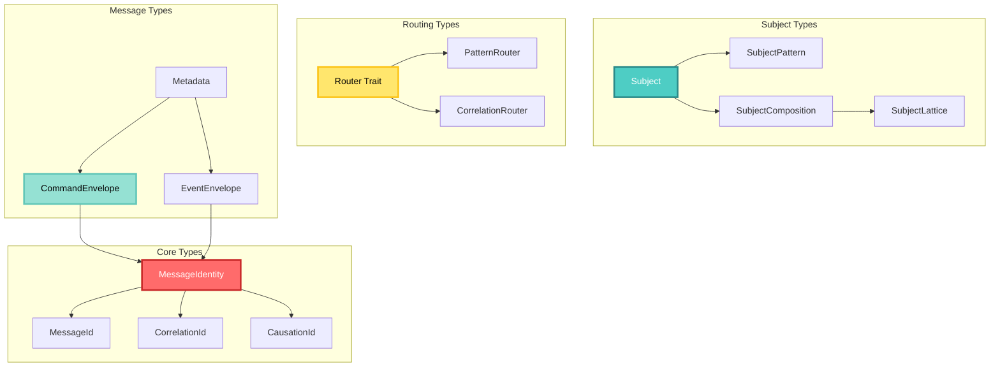
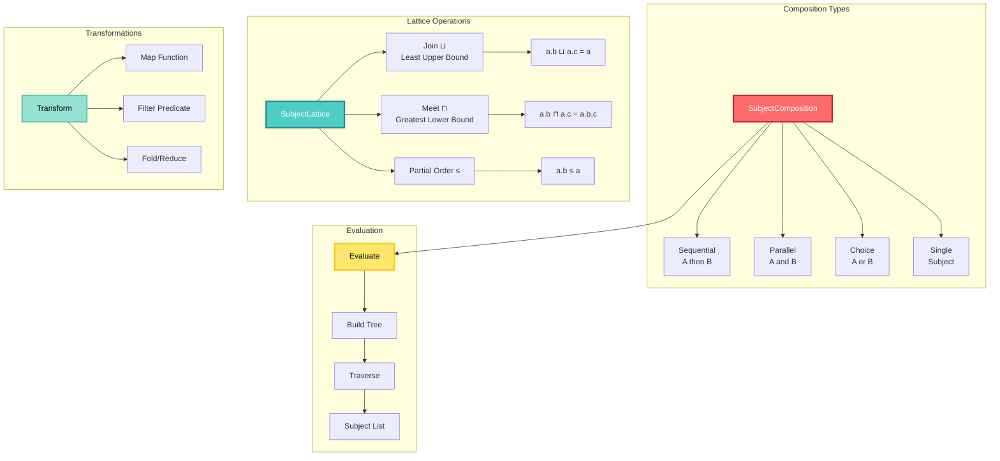
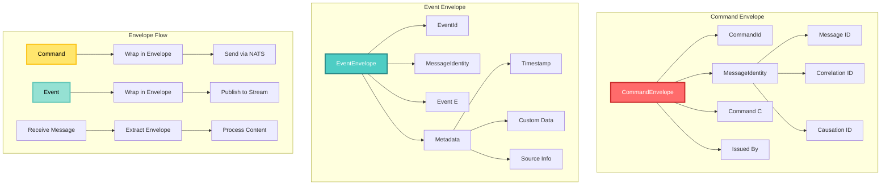
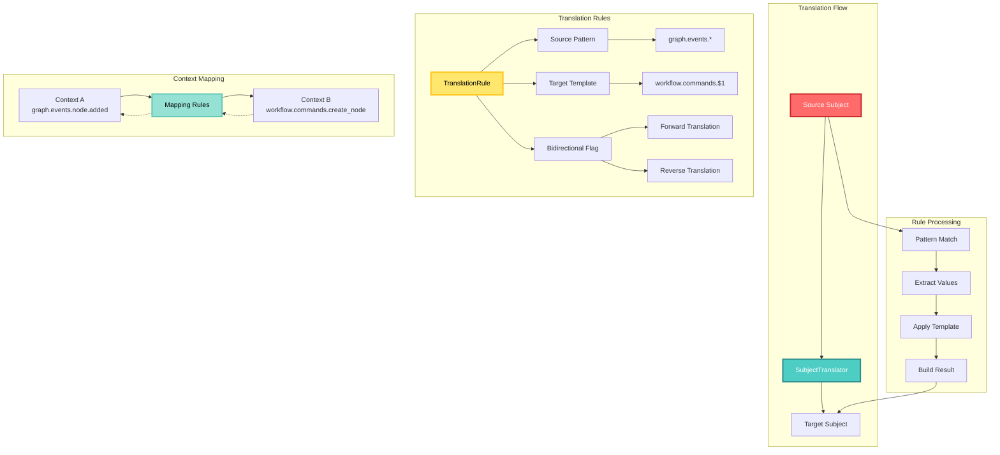

<!-- Copyright (c) 2025 Cowboy AI, LLC. -->
# API Reference

## API Overview



## Core Types

### Type Hierarchy

```mermaid
graph TB
    subgraph "Identity Types"
        MI[MessageIdentity]
        MID[MessageId]
        CID[CorrelationId]
        CAID[CausationId]
        
        MI --> MID
        MI --> CID
        MI --> CAID
        
        MID --> UUID1[UUID v4]
        CID --> UUID2[UUID v4]
        CAID --> UUID3[UUID v4]
    end
    
    subgraph "Traits & Implementations"
        TRAITS[Common Traits]
        CLONE[Clone]
        DEBUG[Debug]
        EQ[PartialEq/Eq]
        HASH[Hash]
        SERDE[Serialize/Deserialize]
        
        TRAITS --> CLONE
        TRAITS --> DEBUG
        TRAITS --> EQ
        TRAITS --> HASH
        TRAITS --> SERDE
        
        MID -.-> TRAITS
        CID -.-> TRAITS
        CAID -.-> TRAITS
    end
    
    subgraph "Conversions"
        FROM[From Traits]
        TO[To Methods]
        
        FROM --> F1[From<Uuid>]
        FROM --> F2[From<String>]
        FROM --> F3[From<&str>]
        
        TO --> T1[to_string()]
        TO --> T2[to_uuid()]
        TO --> T3[to_headers()]
    end
    
    style MI fill:#FF6B6B,stroke:#C92A2A,stroke-width:3px,color:#FFF
    style TRAITS fill:#4ECDC4,stroke:#2B8A89,stroke-width:3px,color:#FFF
    style FROM fill:#FFE66D,stroke:#FCC419,stroke-width:3px,color:#000
    style TO fill:#95E1D3,stroke:#63C7B8,stroke-width:3px,color:#000
```

## Core Types

### MessageIdentity

The fundamental identity structure for all messages in the CIM system.

```rust
pub struct MessageIdentity {
    pub message_id: MessageId,
    pub correlation_id: CorrelationId,
    pub causation_id: CausationId,
}
```

#### Methods

```rust
impl MessageIdentity {
    /// Create a new root message identity (all IDs are the same)
    pub fn new_root() -> Self

    /// Create a derived message identity from a parent
    pub fn new_derived(parent: &MessageIdentity) -> Self

    /// Create a derived message with specific correlation
    pub fn new_derived_from_correlation(correlation_id: CorrelationId) -> Self

    /// Check if this is a root message
    pub fn is_root(&self) -> bool

    /// Convert to NATS headers
    pub fn to_headers(&self) -> HeaderMap

    /// Parse from NATS headers
    pub fn from_headers(headers: &HeaderMap) -> Result<Self, ParseError>
}
```

### MessageId

Unique identifier for a message.

```rust
#[derive(Clone, Debug, PartialEq, Eq, Hash)]
pub struct MessageId(Uuid);
```

#### Methods

```rust
impl MessageId {
    /// Create a new unique message ID
    pub fn new() -> Self

    /// Create from UUID
    pub fn from_uuid(id: Uuid) -> Self

    /// Get the inner UUID
    pub fn as_uuid(&self) -> &Uuid

    /// Convert to string representation
    pub fn to_string(&self) -> String

    /// Parse from string
    pub fn from_str(s: &str) -> Result<Self, ParseError>
}
```

### CorrelationId

Groups related messages within a business transaction.

```rust
#[derive(Clone, Debug, PartialEq, Eq, Hash)]
pub struct CorrelationId(Uuid);
```

#### Methods

```rust
impl CorrelationId {
    /// Create a new correlation ID
    pub fn new() -> Self

    /// Create from UUID
    pub fn from_uuid(id: Uuid) -> Self

    /// Convert to trace ID for distributed tracing
    pub fn to_trace_id(&self) -> TraceId

    /// Check if two messages are correlated
    pub fn is_correlated_with(&self, other: &CorrelationId) -> bool
}
```

### CausationId

Identifies which message caused this one.

```rust
#[derive(Clone, Debug, PartialEq, Eq, Hash)]
pub struct CausationId(Uuid);
```

#### Methods

```rust
impl CausationId {
    /// Create from a message ID
    pub fn from_message_id(id: MessageId) -> Self

    /// Convert to span ID for distributed tracing
    pub fn to_span_id(&self) -> SpanId

    /// Get the causing message ID
    pub fn as_message_id(&self) -> MessageId
}
```

## Subject Types

### Subject System Architecture

```mermaid
graph TB
    subgraph "Subject Components"
        SUBJ[Subject]
        TOKENS[Token Array]
        VALIDATOR[Validator]
        
        SUBJ --> TOKENS
        SUBJ --> VALIDATOR
        
        TOKENS --> T1[Domain]
        TOKENS --> T2[Type]
        TOKENS --> T3[Aggregate]
        TOKENS --> T4[Action]
        TOKENS --> TN[...]
    end
    
    subgraph "Pattern Matching"
        PAT[SubjectPattern]
        WILD[Wildcards]
        COMPILE[Compiled Pattern]
        
        PAT --> WILD
        WILD --> W1[* Single Token]
        WILD --> W2[> Multi Token]
        
        PAT --> COMPILE
        COMPILE --> REGEX[Regex Engine]
    end
    
    subgraph "Operations"
        OPS[Subject Operations]
        PARSE[Parse & Validate]
        MATCH[Pattern Match]
        MANIP[Manipulate]
        
        OPS --> PARSE
        OPS --> MATCH
        OPS --> MANIP
        
        PARSE --> P1[from_str()]
        PARSE --> P2[validate()]
        
        MATCH --> M1[matches()]
        MATCH --> M2[filter()]
        
        MANIP --> MN1[append()]
        MANIP --> MN2[parent()]
        MANIP --> MN3[is_parent_of()]
    end
    
    style SUBJ fill:#FF6B6B,stroke:#C92A2A,stroke-width:3px,color:#FFF
    style PAT fill:#4ECDC4,stroke:#2B8A89,stroke-width:3px,color:#FFF
    style OPS fill:#FFE66D,stroke:#FCC419,stroke-width:3px,color:#000
    style COMPILE fill:#95E1D3,stroke:#63C7B8,stroke-width:3px,color:#000
```

## Subject Types

### Subject

Represents a hierarchical message subject.

```rust
pub struct Subject {
    tokens: Vec<String>,
}
```

#### Methods

```rust
impl Subject {
    /// Create from dot-separated string
    pub fn from_str(s: &str) -> Result<Self, SubjectError>

    /// Create from tokens
    pub fn from_tokens(tokens: Vec<String>) -> Self

    /// Get the domain (first token)
    pub fn domain(&self) -> Option<&str>

    /// Get the message type (second token)
    pub fn message_type(&self) -> Option<&str>

    /// Get the aggregate (third token)
    pub fn aggregate(&self) -> Option<&str>

    /// Get the action (fourth token)
    pub fn action(&self) -> Option<&str>

    /// Convert to string
    pub fn to_string(&self) -> String

    /// Get parent subject (without last token)
    pub fn parent(&self) -> Option<Subject>

    /// Check if this is a parent of another subject
    pub fn is_parent_of(&self, other: &Subject) -> bool

    /// Append a token
    pub fn append(&mut self, token: String)

    /// Get token count
    pub fn len(&self) -> usize
}
```

### SubjectPattern

Pattern for matching subjects with wildcards.

```rust
pub struct SubjectPattern {
    pattern: String,
    compiled: CompiledPattern,
}
```

#### Methods

```rust
impl SubjectPattern {
    /// Create from pattern string
    pub fn new(pattern: &str) -> Result<Self, PatternError>

    /// Check if a subject matches this pattern
    pub fn matches(&self, subject: &Subject) -> bool

    /// Get all matching subjects from a list
    pub fn filter<'a>(&self, subjects: &'a [Subject]) -> Vec<&'a Subject>

    /// Convert to regex pattern
    pub fn to_regex(&self) -> &Regex
}
```

## Subject Algebra

### Algebraic Operations Flow



## Subject Algebra

### SubjectComposition

Algebraic composition of subjects.

```rust
pub enum SubjectComposition {
    Sequential(Box<SubjectComposition>, Box<SubjectComposition>),
    Parallel(Vec<SubjectComposition>),
    Choice(Vec<SubjectComposition>),
    Single(Subject),
}
```

#### Methods

```rust
impl SubjectComposition {
    /// Sequential composition (A then B)
    pub fn then(self, next: SubjectComposition) -> Self

    /// Parallel composition (A and B)
    pub fn parallel(self, other: SubjectComposition) -> Self

    /// Choice composition (A or B)
    pub fn or(self, alternative: SubjectComposition) -> Self

    /// Evaluate to concrete subjects
    pub fn evaluate(&self) -> Vec<Subject>

    /// Apply a transformation
    pub fn map<F>(&self, f: F) -> Self
    where F: Fn(&Subject) -> Subject

    /// Filter subjects
    pub fn filter<P>(&self, predicate: P) -> Option<Self>
    where P: Fn(&Subject) -> bool
}
```

### SubjectLattice

Lattice operations on subjects.

```rust
pub struct SubjectLattice;
```

#### Methods

```rust
impl SubjectLattice {
    /// Find the join (least upper bound) of two subjects
    pub fn join(a: &Subject, b: &Subject) -> Subject

    /// Find the meet (greatest lower bound) of two subjects
    pub fn meet(a: &Subject, b: &Subject) -> Option<Subject>

    /// Check if subjects are comparable in the lattice
    pub fn are_comparable(a: &Subject, b: &Subject) -> bool

    /// Get the lattice height between two subjects
    pub fn distance(a: &Subject, b: &Subject) -> Option<usize>
}
```

## Routing Types

### Router Architecture

```mermaid
graph TB
    subgraph "Router Trait"
        TRAIT[Router Trait]
        INPUT[Input Type]
        OUTPUT[Output Type]
        ERROR[Error Type]
        METHOD[route() Method]
        
        TRAIT --> INPUT
        TRAIT --> OUTPUT
        TRAIT --> ERROR
        TRAIT --> METHOD
    end
    
    subgraph "Pattern Router"
        PR[PatternRouter<H>]
        ROUTES[Route Table]
        PATTERNS[Patterns]
        HANDLERS[Handlers]
        
        PR --> ROUTES
        ROUTES --> ENTRY[Pattern → Handler]
        
        PATTERNS --> P1[graph.events.*]
        PATTERNS --> P2[*.commands.>]
        PATTERNS --> P3[specific.exact.match]
        
        HANDLERS --> H1[Handler 1]
        HANDLERS --> H2[Handler 2]
        HANDLERS --> HN[Handler N]
    end
    
    subgraph "Correlation Router"
        CR[CorrelationRouter<H>]
        MAP[HashMap]
        CORR[Correlation IDs]
        CHANDLERS[Handlers]
        
        CR --> MAP
        MAP --> CENTRY[CorrelationId → Handler]
        
        CORR --> C1[Corr ABC]
        CORR --> C2[Corr XYZ]
        
        CHANDLERS --> CH1[Saga Handler]
        CHANDLERS --> CH2[Workflow Handler]
    end
    
    subgraph "Routing Flow"
        MSG[Message]
        EXTRACT[Extract Subject/Correlation]
        LOOKUP[Lookup Handler]
        EXECUTE[Execute Handler]
        
        MSG --> EXTRACT
        EXTRACT --> LOOKUP
        LOOKUP --> EXECUTE
    end
    
    style TRAIT fill:#FF6B6B,stroke:#C92A2A,stroke-width:3px,color:#FFF
    style PR fill:#4ECDC4,stroke:#2B8A89,stroke-width:3px,color:#FFF
    style CR fill:#FFE66D,stroke:#FCC419,stroke-width:3px,color:#000
    style MSG fill:#95E1D3,stroke:#63C7B8,stroke-width:3px,color:#000
```

## Routing Types

### Router

Main routing interface.

```rust
pub trait Router {
    type Input;
    type Output;
    type Error;

    /// Route a message
    fn route(&self, input: Self::Input) -> Result<Self::Output, Self::Error>;
}
```

### PatternRouter

Routes based on subject patterns.

```rust
pub struct PatternRouter<H> {
    routes: Vec<(SubjectPattern, H)>,
}
```

#### Methods

```rust
impl<H> PatternRouter<H> {
    /// Create a new router
    pub fn new() -> Self

    /// Add a route
    pub fn add_route(&mut self, pattern: &str, handler: H) -> Result<(), RouterError>

    /// Remove routes matching a pattern
    pub fn remove_route(&mut self, pattern: &str) -> usize

    /// Get all handlers matching a subject
    pub fn get_handlers(&self, subject: &Subject) -> Vec<&H>

    /// Get the first matching handler
    pub fn get_handler(&self, subject: &Subject) -> Option<&H>
}
```

### CorrelationRouter

Routes based on correlation ID.

```rust
pub struct CorrelationRouter<H> {
    routes: HashMap<CorrelationId, H>,
}
```

#### Methods

```rust
impl<H> CorrelationRouter<H> {
    /// Route a correlation to a handler
    pub fn add_correlation(&mut self, correlation_id: CorrelationId, handler: H)

    /// Remove a correlation route
    pub fn remove_correlation(&mut self, correlation_id: &CorrelationId) -> Option<H>

    /// Get handler for correlation
    pub fn get_handler(&self, correlation_id: &CorrelationId) -> Option<&H>

    /// Clear all routes
    pub fn clear(&mut self)
}
```

## Message Envelopes

### Envelope Structure



## Message Envelopes

### CommandEnvelope

Wraps commands with identity and metadata.

```rust
pub struct CommandEnvelope<C> {
    pub id: CommandId,
    pub identity: MessageIdentity,
    pub command: C,
    pub issued_by: String,
}
```

#### Methods

```rust
impl<C> CommandEnvelope<C> {
    /// Create a new command envelope
    pub fn new(command: C, issued_by: String) -> Self

    /// Create with specific identity
    pub fn with_identity(command: C, identity: MessageIdentity, issued_by: String) -> Self

    /// Get the correlation ID
    pub fn correlation_id(&self) -> &CorrelationId

    /// Get the causation ID
    pub fn causation_id(&self) -> &CausationId
}
```

### EventEnvelope

Wraps events with identity and metadata.

```rust
pub struct EventEnvelope<E> {
    pub id: EventId,
    pub identity: MessageIdentity,
    pub event: E,
    pub metadata: EventMetadata,
}
```

#### Methods

```rust
impl<E> EventEnvelope<E> {
    /// Create a new event envelope
    pub fn new(event: E, identity: MessageIdentity) -> Self

    /// Add metadata
    pub fn with_metadata(mut self, key: String, value: Value) -> Self

    /// Get metadata value
    pub fn get_metadata(&self, key: &str) -> Option<&Value>

    /// Get the event timestamp
    pub fn timestamp(&self) -> DateTime<Utc>
}
```

## Translation Types

### Translation System



## Translation Types

### SubjectTranslator

Translates subjects between contexts.

```rust
pub struct SubjectTranslator {
    rules: Vec<TranslationRule>,
}
```

#### Methods

```rust
impl SubjectTranslator {
    /// Create a new translator
    pub fn new() -> Self

    /// Add a translation rule
    pub fn add_rule(&mut self, rule: TranslationRule)

    /// Translate a subject
    pub fn translate(&self, subject: &Subject) -> Option<Subject>

    /// Reverse translate a subject
    pub fn reverse_translate(&self, subject: &Subject) -> Option<Subject>

    /// Check if a subject can be translated
    pub fn can_translate(&self, subject: &Subject) -> bool
}
```

### TranslationRule

Rule for subject translation.

```rust
pub struct TranslationRule {
    pub source_pattern: SubjectPattern,
    pub target_template: String,
    pub bidirectional: bool,
}
```

## Builder Types

### MessageBuilder

Fluent builder for messages.

```rust
pub struct MessageBuilder<T> {
    payload: Option<T>,
    identity: Option<MessageIdentity>,
    metadata: HashMap<String, Value>,
}
```

#### Methods

```rust
impl<T> MessageBuilder<T> {
    /// Create a new builder
    pub fn new() -> Self

    /// Set the payload
    pub fn payload(mut self, payload: T) -> Self

    /// Set as root message
    pub fn as_root(mut self) -> Self

    /// Set as derived from parent
    pub fn derived_from(mut self, parent: &MessageIdentity) -> Self

    /// Add metadata
    pub fn metadata(mut self, key: String, value: Value) -> Self

    /// Build the message
    pub fn build(self) -> Result<Message<T>, BuildError>
}
```

## Error Types

### Error Hierarchy

```mermaid
graph TB
    subgraph "Error Categories"
        ERRORS[CIM-Subject Errors]
        SUBJECT[SubjectError]
        ROUTING[RoutingError]
        IDENTITY[IdentityError]
        BUILD[BuildError]
        
        ERRORS --> SUBJECT
        ERRORS --> ROUTING
        ERRORS --> IDENTITY
        ERRORS --> BUILD
    end
    
    subgraph "Subject Errors"
        SUBJECT --> SE1[InvalidFormat]
        SUBJECT --> SE2[Empty]
        SUBJECT --> SE3[InvalidCharacter]
        SUBJECT --> SE4[TooManyTokens]
        
        SE1 --> SE1D[Bad subject syntax]
        SE2 --> SE2D[Empty subject string]
        SE3 --> SE3D[Illegal char in token]
        SE4 --> SE4D[Exceeds max depth]
    end
    
    subgraph "Routing Errors"
        ROUTING --> RE1[NoRoute]
        ROUTING --> RE2[AmbiguousRoute]
        ROUTING --> RE3[HandlerError]
        ROUTING --> RE4[CircuitBreakerOpen]
        
        RE1 --> RE1D[No handler found]
        RE2 --> RE2D[Multiple matches]
        RE3 --> RE3D[Handler failed]
        RE4 --> RE4D[Circuit open]
    end
    
    subgraph "Identity Errors"
        IDENTITY --> IE1[InvalidCorrelationChain]
        IDENTITY --> IE2[CausationCycle]
        IDENTITY --> IE3[MissingHeaders]
        IDENTITY --> IE4[InvalidUuid]
        
        IE1 --> IE1D[Broken correlation]
        IE2 --> IE2D[Circular causation]
        IE3 --> IE3D[No identity headers]
        IE4 --> IE4D[Bad UUID format]
    end
    
    style ERRORS fill:#FF6B6B,stroke:#C92A2A,stroke-width:3px,color:#FFF
    style SUBJECT fill:#4ECDC4,stroke:#2B8A89,stroke-width:3px,color:#FFF
    style ROUTING fill:#FFE66D,stroke:#FCC419,stroke-width:3px,color:#000
    style IDENTITY fill:#95E1D3,stroke:#63C7B8,stroke-width:3px,color:#000
```



## Error Types

### SubjectError

Errors related to subject parsing and validation.

```rust
#[derive(Debug, thiserror::Error)]
pub enum SubjectError {
    #[error("Invalid subject format: {0}")]
    InvalidFormat(String),
    
    #[error("Empty subject")]
    Empty,
    
    #[error("Invalid character in subject: {0}")]
    InvalidCharacter(char),
    
    #[error("Too many tokens: {0} (max: {1})")]
    TooManyTokens(usize, usize),
}
```

### RoutingError

Errors during message routing.

```rust
#[derive(Debug, thiserror::Error)]
pub enum RoutingError {
    #[error("No route found for subject: {0}")]
    NoRoute(String),
    
    #[error("Multiple routes found: {0}")]
    AmbiguousRoute(String),
    
    #[error("Handler error: {0}")]
    HandlerError(String),
    
    #[error("Circuit breaker open")]
    CircuitBreakerOpen,
}
```

### IdentityError

Errors related to message identity.

```rust
#[derive(Debug, thiserror::Error)]
pub enum IdentityError {
    #[error("Invalid correlation chain")]
    InvalidCorrelationChain,
    
    #[error("Causation cycle detected")]
    CausationCycle,
    
    #[error("Missing identity headers")]
    MissingHeaders,
    
    #[error("Invalid UUID: {0}")]
    InvalidUuid(String),
}
```

## Utility Functions

### Correlation Helpers

```rust
/// Check if two messages are in the same transaction
pub fn are_correlated(a: &MessageIdentity, b: &MessageIdentity) -> bool

/// Get the root message ID from an identity
pub fn get_root_message_id(identity: &MessageIdentity) -> Option<MessageId>

/// Build a causation chain from a list of messages
pub fn build_causation_chain(messages: Vec<Message>) -> CausationTree

/// Validate identity consistency
pub fn validate_identity(identity: &MessageIdentity) -> Result<(), IdentityError>
```

### Subject Helpers

```rust
/// Parse a subject with validation
pub fn parse_subject(s: &str) -> Result<Subject, SubjectError>

/// Build a subject from parts
pub fn build_subject(domain: &str, msg_type: &str, aggregate: &str, action: &str) -> Subject

/// Extract domain from subject string
pub fn extract_domain(subject: &str) -> Option<&str>

/// Check if subject matches pattern
pub fn matches_pattern(subject: &str, pattern: &str) -> bool
```

### Pattern Helpers

```rust
/// Compile a pattern for efficient matching
pub fn compile_pattern(pattern: &str) -> Result<CompiledPattern, PatternError>

/// Convert wildcard pattern to regex
pub fn pattern_to_regex(pattern: &str) -> String

/// Find all subjects matching a pattern
pub fn find_matching_subjects(subjects: &[Subject], pattern: &str) -> Vec<&Subject>

/// Generate subject from pattern and values
pub fn generate_subject(pattern: &str, values: &[&str]) -> Result<Subject, GenerateError>
```

## Constants

```rust
/// Maximum subject depth
pub const MAX_SUBJECT_DEPTH: usize = 8;

/// Maximum subject token length
pub const MAX_TOKEN_LENGTH: usize = 128;

/// Valid characters in subject tokens
pub const VALID_TOKEN_CHARS: &str = "abcdefghijklmnopqrstuvwxyzABCDEFGHIJKLMNOPQRSTUVWXYZ0123456789_-";

/// Single token wildcard
pub const WILDCARD_SINGLE: char = '*';

/// Multi-token wildcard
pub const WILDCARD_MULTI: char = '>';

/// Subject separator
pub const SUBJECT_SEPARATOR: char = '.';

/// Header name for message ID
pub const HEADER_MESSAGE_ID: &str = "X-Message-ID";

/// Header name for correlation ID
pub const HEADER_CORRELATION_ID: &str = "X-Correlation-ID";

/// Header name for causation ID
pub const HEADER_CAUSATION_ID: &str = "X-Causation-ID";
```

## Type Aliases

```rust
/// Result type for subject operations
pub type SubjectResult<T> = Result<T, SubjectError>;

/// Result type for routing operations
pub type RoutingResult<T> = Result<T, RoutingError>;

/// Handler function type
pub type Handler = Box<dyn Fn(Message) -> BoxFuture<'static, Result<(), HandleError>> + Send + Sync>;

/// Async handler function type
pub type AsyncHandler = Arc<dyn Fn(Message) -> BoxFuture<'static, Result<(), HandleError>> + Send + Sync>;

/// Subject predicate type
pub type SubjectPredicate = Box<dyn Fn(&Subject) -> bool>;

/// Pattern matcher type
pub type PatternMatcher = Box<dyn Fn(&str) -> bool>;
```