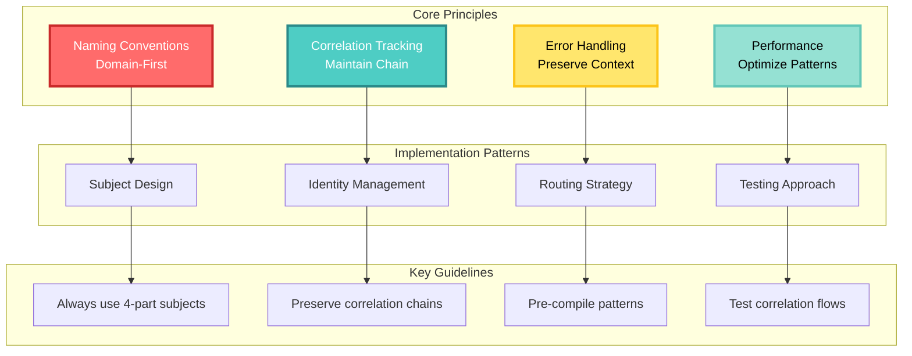
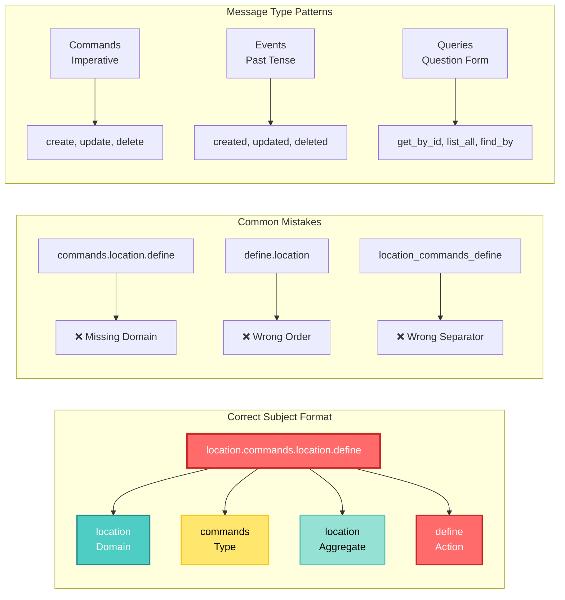
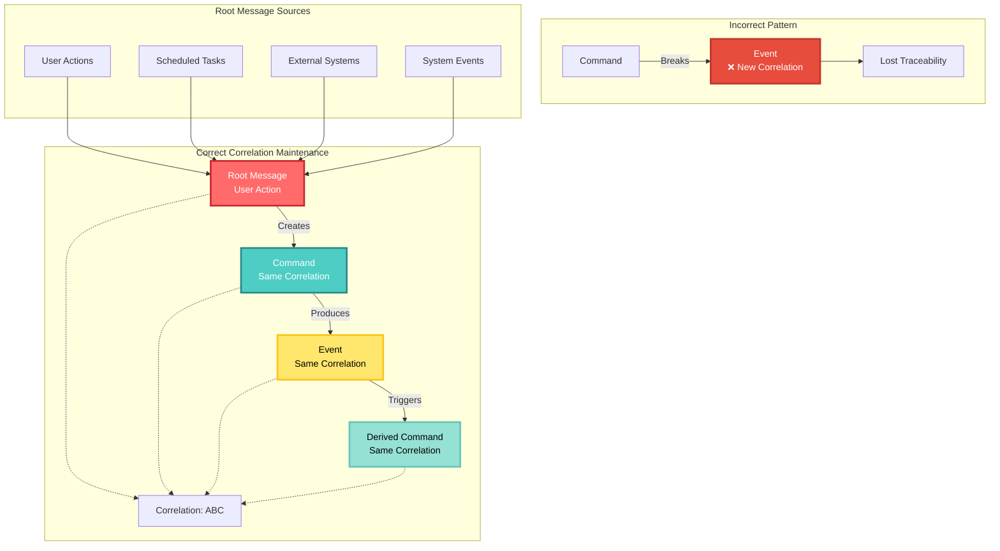
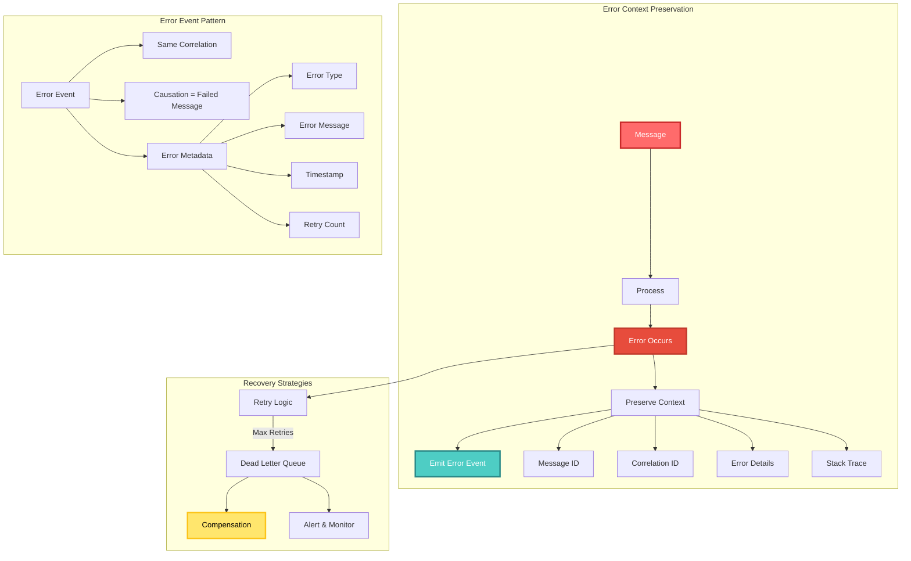
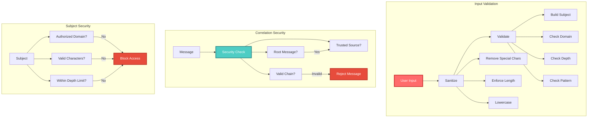
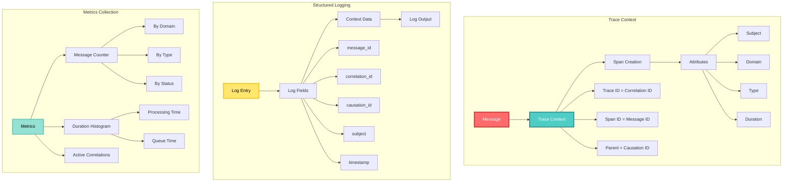

<!-- Copyright (c) 2025 Cowboy AI, LLC. -->
# Best Practices

## Best Practices Overview



## Subject Naming Conventions

### Subject Structure Pattern



## Subject Naming Conventions

### 1. Use Domain-First Naming

Always start subjects with the bounded context/domain name:

```rust
// Good
"location.commands.location.define"
"inventory.events.stock.depleted"
"workflow.queries.execution.status"

// Bad
"commands.location.define"        // Missing domain
"define.location"                 // Wrong order
"location_commands_define"        // Wrong separator
```

### 2. Follow Consistent Patterns

Maintain the standard four-part structure:

```
{domain}.{message_type}.{aggregate}.{action}
```

### 3. Use Appropriate Message Types

- `commands` - For state-changing operations
- `events` - For notifications of state changes
- `queries` - For read operations
- `responses` - For query responses

### 4. Action Naming

Commands use imperative mood:
```rust
"order.commands.order.create"
"inventory.commands.stock.reserve"
"payment.commands.payment.authorize"
```

Events use past tense:
```rust
"order.events.order.created"
"inventory.events.stock.reserved"
"payment.events.payment.authorized"
```

Queries use question form:
```rust
"order.queries.order.get_by_id"
"inventory.queries.stock.check_availability"
"payment.queries.payment.get_status"
```

## Correlation and Causation

### Correlation Flow Patterns



## Correlation and Causation

### 1. Always Maintain Correlation Chains

```rust
// Good - Maintains correlation
pub async fn handle_command(&self, envelope: CommandEnvelope<CreateOrder>) -> Result<()> {
    let order_created = OrderCreated { /* ... */ };
    
    // Preserve correlation
    self.publish_event(
        order_created,
        envelope.identity.correlation_id.clone(),
        envelope.identity.message_id.clone()
    ).await
}

// Bad - Breaks correlation
pub async fn handle_command(&self, envelope: CommandEnvelope<CreateOrder>) -> Result<()> {
    let order_created = OrderCreated { /* ... */ };
    
    // Creates new correlation!
    self.publish_event_as_root(order_created).await
}
```

### 2. Use Root Messages Appropriately

Only create root messages for:
- User-initiated actions
- Scheduled tasks
- External system integration points

```rust
// Good - User action starts new correlation
pub async fn handle_user_request(req: HttpRequest) -> Result<()> {
    let command = CreateOrder::from_request(req)?;
    let envelope = CommandEnvelope::new_root(command, user_id);
    self.send_command(envelope).await
}

// Good - Scheduled task starts new correlation
pub async fn run_scheduled_task() -> Result<()> {
    let command = ProcessDailyReports {};
    let envelope = CommandEnvelope::new_root(command, "scheduler");
    self.send_command(envelope).await
}
```

### 3. Track Causation Properly

```rust
pub struct EventHandler {
    pub async fn handle_event(&self, envelope: EventEnvelope<OrderCreated>) -> Result<()> {
        // Commands caused by this event
        let commands = vec![
            ReserveInventory { /* ... */ },
            ChargePayment { /* ... */ },
        ];
        
        for command in commands {
            let cmd_envelope = CommandEnvelope::new_derived(
                command,
                &envelope.identity,
                "event_handler"
            );
            self.send_command(cmd_envelope).await?;
        }
        
        Ok(())
    }
}
```

## Error Handling

### Error Handling Flow



## Error Handling

### 1. Preserve Context in Errors

```rust
#[derive(Debug, thiserror::Error)]
pub enum ProcessingError {
    #[error("Failed to process message {message_id} in correlation {correlation_id}: {source}")]
    MessageProcessingFailed {
        message_id: MessageId,
        correlation_id: CorrelationId,
        #[source]
        source: Box<dyn std::error::Error + Send + Sync>,
    },
}

// Usage
pub async fn process_message(envelope: &EventEnvelope<Event>) -> Result<(), ProcessingError> {
    do_something().await.map_err(|e| ProcessingError::MessageProcessingFailed {
        message_id: envelope.identity.message_id.clone(),
        correlation_id: envelope.identity.correlation_id.clone(),
        source: Box::new(e),
    })
}
```

### 2. Emit Error Events

```rust
pub async fn handle_with_error_events(&self, envelope: CommandEnvelope<Command>) -> Result<()> {
    match self.process_command(&envelope).await {
        Ok(events) => {
            self.publish_events(events, envelope.identity.correlation_id.clone()).await
        }
        Err(e) => {
            // Emit error event
            let error_event = CommandProcessingFailed {
                command_id: envelope.id,
                error_message: e.to_string(),
                error_type: std::any::type_name::<E>(),
                timestamp: Utc::now(),
            };
            
            self.publish_event(
                error_event,
                envelope.identity.correlation_id.clone(),
                envelope.identity.message_id.clone()
            ).await
        }
    }
}
```

## Performance Optimization

### Optimization Strategies

```mermaid
graph TB
    subgraph "Pattern Compilation"
        RAW[Raw Pattern<br/>graph.events.*]
        COMPILE[Compile Once]
        CACHED[Cached Pattern]
        MATCH[Fast Matching]
        
        RAW --> COMPILE
        COMPILE --> CACHED
        CACHED --> MATCH
        
        COMPILE --> REGEX[Regex Engine]
        COMPILE --> TRIE[Trie Structure]
        COMPILE --> DFA[DFA Automaton]
    end
    
    subgraph "Subject Indexing"
        SUBJ[Subject]
        IDX[Multi-Index]
        DOMAIN[Domain Index]
        TYPE[Type Index]
        FULL[Full Index]
        
        SUBJ --> IDX
        IDX --> DOMAIN
        IDX --> TYPE
        IDX --> FULL
        
        DOMAIN --> D1[location → [subjects]]
        TYPE --> T1[events → [subjects]]
        FULL --> F1[full.path → data]
    end
    
    subgraph "Batch Operations"
        SINGLE[Single Messages]
        BUFFER[Message Buffer]
        BATCH[Batch Process]
        SEND[Bulk Send]
        
        SINGLE --> BUFFER
        BUFFER -->|Size/Time| BATCH
        BATCH --> SEND
        
        BUFFER --> B1[Size: 100]
        BUFFER --> B2[Time: 100ms]
    end
    
    style RAW fill:#FF6B6B,stroke:#C92A2A,stroke-width:3px,color:#FFF
    style IDX fill:#4ECDC4,stroke:#2B8A89,stroke-width:3px,color:#FFF
    style BATCH fill:#FFE66D,stroke:#FCC419,stroke-width:3px,color:#000
    style SEND fill:#95E1D3,stroke:#63C7B8,stroke-width:3px,color:#000
```

## Performance Optimization

### 1. Pre-compile Subject Patterns

```rust
pub struct OptimizedRouter {
    // Pre-compiled patterns
    compiled_routes: Vec<(CompiledPattern, Handler)>,
}

impl OptimizedRouter {
    pub fn new(routes: Vec<(&str, Handler)>) -> Result<Self, CompileError> {
        let compiled_routes = routes.into_iter()
            .map(|(pattern, handler)| {
                Ok((CompiledPattern::compile(pattern)?, handler))
            })
            .collect::<Result<Vec<_>, CompileError>>()?;
        
        Ok(Self { compiled_routes })
    }
}
```

### 2. Use Subject Indexes

```rust
pub struct IndexedSubjectStore {
    // Domain index
    by_domain: HashMap<String, Vec<Subject>>,
    // Full subject index
    by_subject: HashMap<String, MessageData>,
    // Pattern cache
    pattern_cache: LruCache<String, Vec<Subject>>,
}

impl IndexedSubjectStore {
    pub fn insert(&mut self, subject: Subject, data: MessageData) {
        // Update domain index
        self.by_domain
            .entry(subject.domain().unwrap_or("").to_string())
            .or_default()
            .push(subject.clone());
        
        // Update subject index
        self.by_subject.insert(subject.to_string(), data);
        
        // Invalidate pattern cache
        self.pattern_cache.clear();
    }
}
```

### 3. Batch Operations

```rust
pub struct BatchEventPublisher {
    batch_size: usize,
    flush_interval: Duration,
    pending: Vec<EventEnvelope<Event>>,
    last_flush: Instant,
}

impl BatchEventPublisher {
    pub async fn publish(&mut self, event: EventEnvelope<Event>) -> Result<(), PublishError> {
        self.pending.push(event);
        
        if self.should_flush() {
            self.flush().await?;
        }
        
        Ok(())
    }
    
    fn should_flush(&self) -> bool {
        self.pending.len() >= self.batch_size ||
        self.last_flush.elapsed() >= self.flush_interval
    }
    
    async fn flush(&mut self) -> Result<(), PublishError> {
        if self.pending.is_empty() {
            return Ok(());
        }
        
        let batch = std::mem::take(&mut self.pending);
        self.nats_client.publish_batch(batch).await?;
        self.last_flush = Instant::now();
        
        Ok(())
    }
}
```

## Testing Strategies

### Testing Flow Patterns

```mermaid
graph TB
    subgraph "Test Context Setup"
        CTX[Test Context]
        CORR[Correlation ID]
        USER[Test User]
        FIXTURES[Message Fixtures]
        
        CTX --> CORR
        CTX --> USER
        CTX --> FIXTURES
        
        FIXTURES --> F1[Commands]
        FIXTURES --> F2[Events]
        FIXTURES --> F3[Errors]
    end
    
    subgraph "Correlation Testing"
        START[Start Flow]
        CMD[Send Command]
        CAPTURE[Capture Messages]
        VERIFY[Verify Correlation]
        TREE[Build Causation Tree]
        
        START --> CMD
        CMD --> CAPTURE
        CAPTURE --> VERIFY
        VERIFY --> TREE
        
        VERIFY --> V1[All Same Correlation]
        VERIFY --> V2[Proper Causation]
        VERIFY --> V3[No Broken Chains]
    end
    
    subgraph "Error Testing"
        ERR_CMD[Invalid Command]
        ERR_HANDLE[Handle Error]
        ERR_EVENT[Error Event]
        ERR_VERIFY[Verify Error]
        
        ERR_CMD --> ERR_HANDLE
        ERR_HANDLE --> ERR_EVENT
        ERR_EVENT --> ERR_VERIFY
        
        ERR_VERIFY --> E1[Same Correlation]
        ERR_VERIFY --> E2[Error Details]
        ERR_VERIFY --> E3[Recovery Path]
    end
    
    style CTX fill:#FF6B6B,stroke:#C92A2A,stroke-width:3px,color:#FFF
    style CAPTURE fill:#4ECDC4,stroke:#2B8A89,stroke-width:3px,color:#FFF
    style TREE fill:#FFE66D,stroke:#FCC419,stroke-width:3px,color:#000
    style ERR_VERIFY fill:#95E1D3,stroke:#63C7B8,stroke-width:3px,color:#000
```



## Testing Strategies

### 1. Use Test Fixtures

```rust
pub mod test_fixtures {
    use super::*;
    
    pub struct TestContext {
        pub correlation_id: CorrelationId,
        pub user_id: String,
    }
    
    impl TestContext {
        pub fn new() -> Self {
            Self {
                correlation_id: CorrelationId::new(),
                user_id: "test_user".to_string(),
            }
        }
        
        pub fn create_command<C>(&self, command: C) -> CommandEnvelope<C> {
            CommandEnvelope::new_root(command, self.user_id.clone())
                .with_correlation(self.correlation_id.clone())
        }
        
        pub fn create_event<E>(&self, event: E, causing_message: &MessageIdentity) -> EventEnvelope<E> {
            EventEnvelope::new_derived(event, causing_message)
        }
    }
}
```

### 2. Test Correlation Flows

```rust
#[cfg(test)]
mod tests {
    use super::*;
    
    #[tokio::test]
    async fn test_maintains_correlation_through_flow() {
        let ctx = TestContext::new();
        let system = TestSystem::new();
        
        // Start flow
        let create_order = ctx.create_command(CreateOrder { /* ... */ });
        let correlation_id = create_order.identity.correlation_id.clone();
        
        system.handle_command(create_order).await.unwrap();
        
        // Verify all subsequent messages maintain correlation
        let messages = system.get_all_messages().await;
        for message in messages {
            assert_eq!(message.correlation_id(), &correlation_id);
        }
        
        // Verify causation chain
        let tree = build_causation_tree(messages);
        assert!(tree.is_valid());
    }
}
```

### 3. Test Error Scenarios

```rust
#[tokio::test]
async fn test_error_maintains_correlation() {
    let ctx = TestContext::new();
    let system = TestSystem::new();
    
    // Force an error
    let invalid_command = ctx.create_command(InvalidCommand {});
    let correlation_id = invalid_command.identity.correlation_id.clone();
    
    let result = system.handle_command(invalid_command).await;
    assert!(result.is_err());
    
    // Verify error event was emitted with same correlation
    let error_events = system
        .get_events_by_type::<CommandProcessingFailed>()
        .await;
    
    assert_eq!(error_events.len(), 1);
    assert_eq!(error_events[0].correlation_id(), &correlation_id);
}
```

## Security Considerations

### Security Validation Flow



## Security Considerations

### 1. Validate Subjects

```rust
pub fn validate_subject_security(subject: &Subject) -> Result<(), SecurityError> {
    // Check domain access
    if !is_authorized_domain(subject.domain()?) {
        return Err(SecurityError::UnauthorizedDomain);
    }
    
    // Check for injection attempts
    for token in subject.tokens() {
        if contains_invalid_chars(token) {
            return Err(SecurityError::InvalidCharacters);
        }
    }
    
    // Check subject depth
    if subject.len() > MAX_ALLOWED_DEPTH {
        return Err(SecurityError::SubjectTooDeep);
    }
    
    Ok(())
}
```

### 2. Sanitize User Input

```rust
pub fn create_subject_from_user_input(
    domain: &str,
    aggregate: &str,
    action: &str,
) -> Result<Subject, ValidationError> {
    // Sanitize inputs
    let domain = sanitize_token(domain)?;
    let aggregate = sanitize_token(aggregate)?;
    let action = sanitize_token(action)?;
    
    // Build subject
    Ok(Subject::from_tokens(vec![
        domain,
        "commands".to_string(),
        aggregate,
        action,
    ]))
}

fn sanitize_token(token: &str) -> Result<String, ValidationError> {
    // Remove invalid characters
    let sanitized: String = token
        .chars()
        .filter(|c| c.is_alphanumeric() || *c == '_' || *c == '-')
        .collect();
    
    if sanitized.is_empty() {
        return Err(ValidationError::EmptyToken);
    }
    
    if sanitized.len() > MAX_TOKEN_LENGTH {
        return Err(ValidationError::TokenTooLong);
    }
    
    Ok(sanitized.to_lowercase())
}
```

### 3. Prevent Correlation Spoofing

```rust
pub struct SecureMessageHandler {
    trusted_sources: HashSet<String>,
}

impl SecureMessageHandler {
    pub fn validate_correlation(&self, envelope: &EventEnvelope<Event>) -> Result<(), SecurityError> {
        // Only trusted sources can create root messages
        if envelope.identity.is_root() {
            if !self.trusted_sources.contains(&envelope.metadata.source) {
                return Err(SecurityError::UntrustedRootMessage);
            }
        }
        
        // Validate correlation chain integrity
        if !self.is_valid_correlation_chain(&envelope.identity) {
            return Err(SecurityError::InvalidCorrelationChain);
        }
        
        Ok(())
    }
}
```

## Monitoring and Observability

### Observability Architecture



## Monitoring and Observability

### 1. Add Trace Context

```rust
pub fn add_trace_context(message: &Message) -> Span {
    let span = tracer::span_builder(&format!("process.{}", message.subject))
        .with_trace_id(message.correlation_id.to_trace_id())
        .with_span_id(message.message_id.to_span_id())
        .with_parent_span_id(message.causation_id.to_span_id())
        .with_attributes(vec![
            ("message.type", message.message_type()),
            ("message.subject", &message.subject),
            ("message.domain", message.domain()),
        ])
        .start();
    
    span
}
```

### 2. Log Structured Data

```rust
use tracing::{info, warn, error};

pub async fn handle_with_logging(&self, envelope: EventEnvelope<Event>) -> Result<()> {
    let span = info_span!(
        "handle_event",
        message_id = %envelope.identity.message_id,
        correlation_id = %envelope.identity.correlation_id,
        causation_id = %envelope.identity.causation_id,
        event_type = %envelope.event.event_type(),
    );
    
    async move {
        info!("Processing event");
        
        match self.process_event(&envelope).await {
            Ok(()) => {
                info!("Event processed successfully");
                Ok(())
            }
            Err(e) => {
                error!(error = %e, "Failed to process event");
                Err(e)
            }
        }
    }
    .instrument(span)
    .await
}
```

### 3. Metrics Collection

```rust
pub struct MessageMetrics {
    messages_total: CounterVec,
    message_duration: HistogramVec,
    correlation_depth: Histogram,
}

impl MessageMetrics {
    pub fn record_message(&self, message: &Message, duration: Duration, success: bool) {
        let labels = &[
            message.domain(),
            message.message_type(),
            if success { "success" } else { "failure" },
        ];
        
        self.messages_total.with_label_values(labels).inc();
        self.message_duration
            .with_label_values(&labels[..2])
            .observe(duration.as_secs_f64());
    }
    
    pub fn record_correlation_depth(&self, depth: usize) {
        self.correlation_depth.observe(depth as f64);
    }
}
```

## Migration Guidelines

### Migration Strategy

```mermaid
graph TB
    subgraph "Migration Phases"
        PHASE1[Phase 1<br/>Dual Publishing]
        PHASE2[Phase 2<br/>Gradual Cutover]
        PHASE3[Phase 3<br/>Complete Migration]
        PHASE4[Phase 4<br/>Cleanup]
        
        PHASE1 --> PHASE2
        PHASE2 --> PHASE3
        PHASE3 --> PHASE4
    end
    
    subgraph "Dual Publishing"
        EVENT[Event]
        DUAL[Dual Publisher]
        OLD[Old Subject Format]
        NEW[New Subject Format]
        
        EVENT --> DUAL
        DUAL --> OLD
        DUAL --> NEW
        
        OLD --> O1[legacy.order.created]
        NEW --> N1[order.events.order.created]
    end
    
    subgraph "Subject Mapping"
        MIGRATOR[Subject Migrator]
        MAP[Mapping Table]
        DEPRECATED[Deprecated List]
        WARNING[Emit Warnings]
        
        MIGRATOR --> MAP
        MIGRATOR --> DEPRECATED
        DEPRECATED --> WARNING
        
        MAP --> M1[old.subject → new.subject]
        WARNING --> W1[Log Deprecation]
        WARNING --> W2[Metrics Alert]
    end
    
    subgraph "Monitoring Migration"
        TRACK[Track Usage]
        OLD_USAGE[Old Format Usage]
        NEW_USAGE[New Format Usage]
        REPORT[Migration Report]
        
        TRACK --> OLD_USAGE
        TRACK --> NEW_USAGE
        OLD_USAGE --> REPORT
        NEW_USAGE --> REPORT
    end
    
    style PHASE1 fill:#FF6B6B,stroke:#C92A2A,stroke-width:3px,color:#FFF
    style PHASE2 fill:#4ECDC4,stroke:#2B8A89,stroke-width:3px,color:#FFF
    style PHASE3 fill:#FFE66D,stroke:#FCC419,stroke-width:3px,color:#000
    style PHASE4 fill:#95E1D3,stroke:#63C7B8,stroke-width:3px,color:#000
```



## Migration Guidelines

### 1. Gradual Subject Migration

```rust
pub struct SubjectMigrator {
    old_to_new: HashMap<String, String>,
    deprecated_subjects: HashSet<String>,
}

impl SubjectMigrator {
    pub fn handle_with_migration(&self, subject: &str) -> Result<String, MigrationError> {
        // Check if deprecated
        if self.deprecated_subjects.contains(subject) {
            warn!(
                subject = subject,
                "Using deprecated subject"
            );
        }
        
        // Return migrated subject if available
        Ok(self.old_to_new
            .get(subject)
            .cloned()
            .unwrap_or_else(|| subject.to_string()))
    }
}
```

### 2. Dual Publishing During Migration

```rust
pub struct DualPublisher {
    old_format: bool,
    new_format: bool,
}

impl DualPublisher {
    pub async fn publish(&self, event: Event) -> Result<(), PublishError> {
        let futures = vec![];
        
        if self.old_format {
            let old_subject = self.build_old_subject(&event);
            futures.push(self.publish_to_subject(old_subject, &event));
        }
        
        if self.new_format {
            let new_subject = self.build_new_subject(&event);
            futures.push(self.publish_to_subject(new_subject, &event));
        }
        
        futures::future::try_join_all(futures).await?;
        Ok(())
    }
}
```