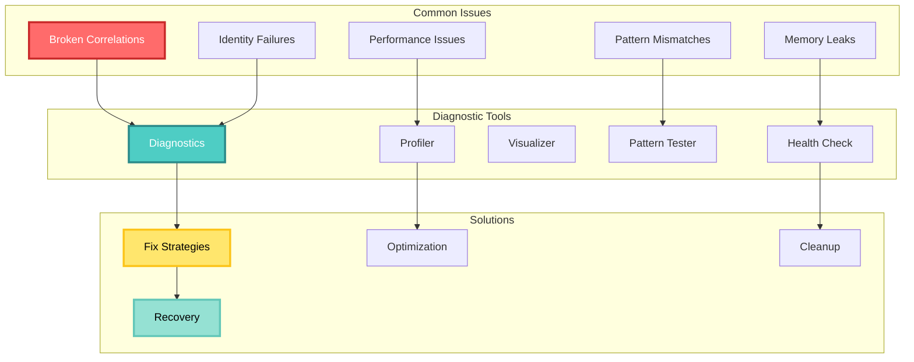
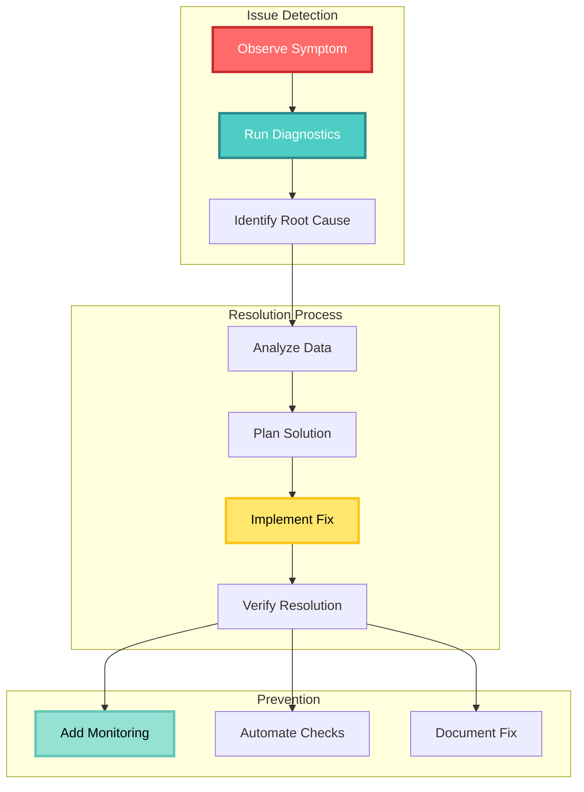
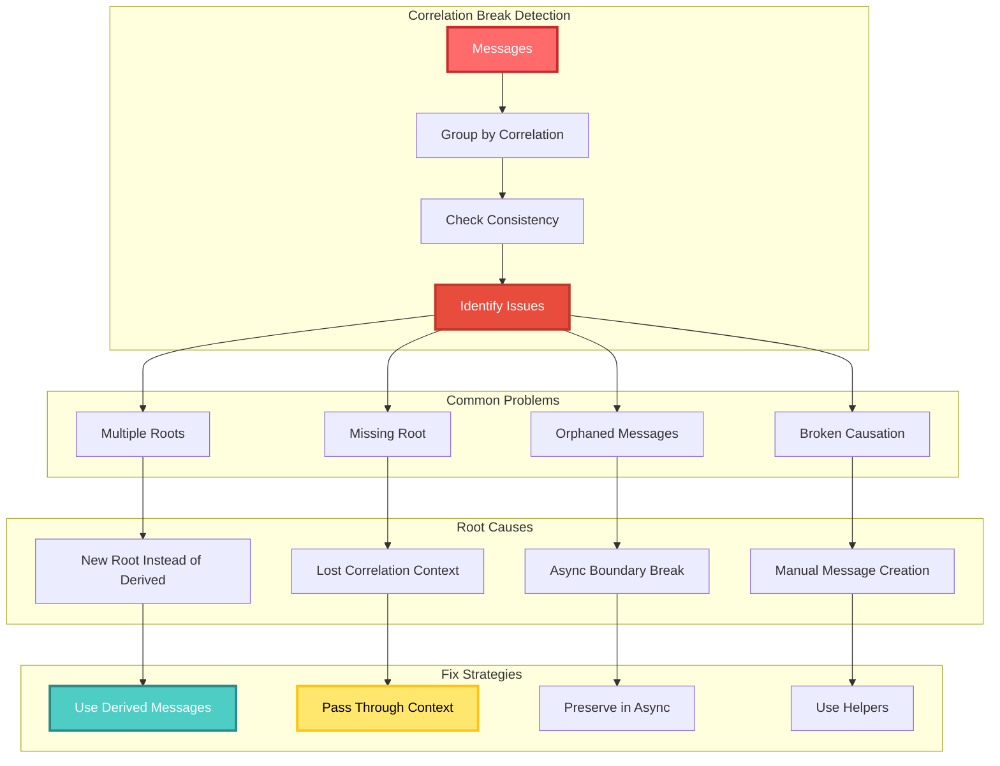
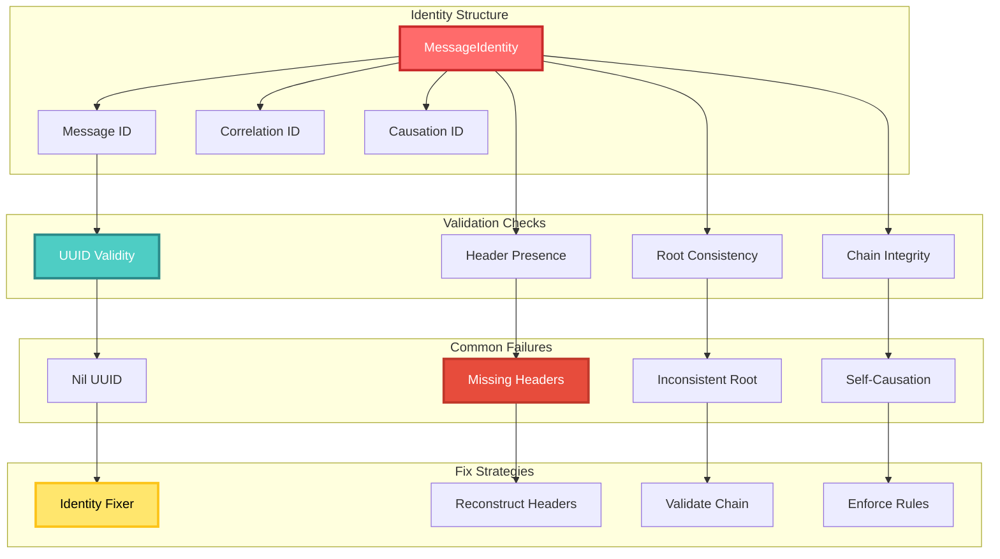
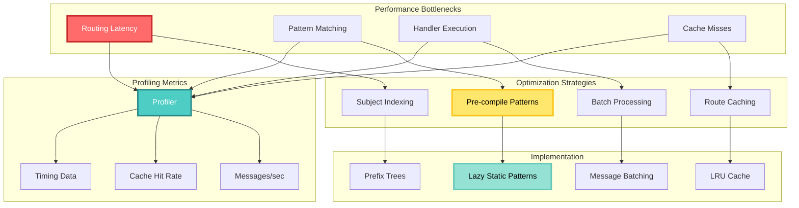
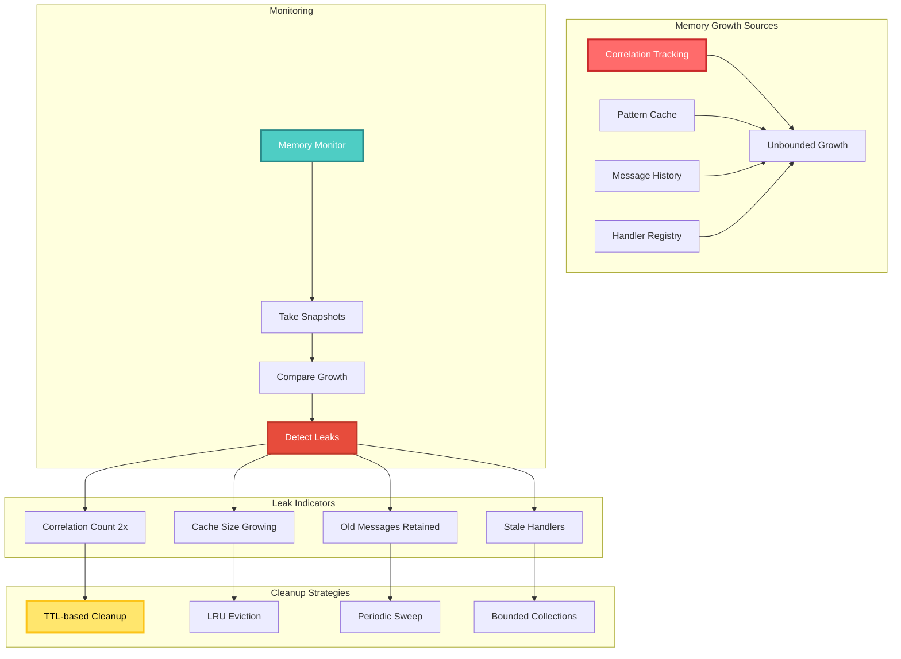
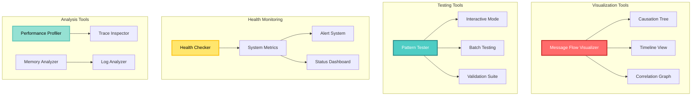
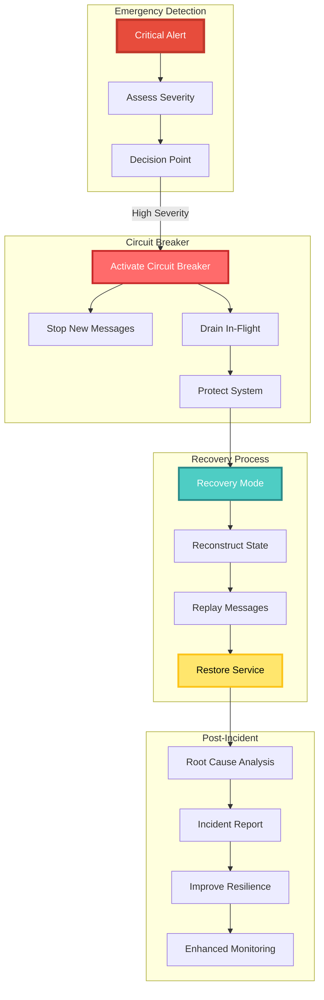

<!-- Copyright (c) 2025 Cowboy AI, LLC. -->
# Troubleshooting Guide

## Troubleshooting Overview



## Common Issues and Solutions

### Issue Resolution Flow



## Common Issues and Solutions

### 1. Broken Correlation Chains

#### Correlation Diagnosis Flow



### 1. Broken Correlation Chains

**Symptom**: Related messages have different correlation IDs when they should be part of the same transaction.

**Common Causes**:
- Creating new root messages instead of derived messages
- Not passing correlation ID through async boundaries
- Manual message creation without proper identity

**Diagnosis**:
```rust
pub fn diagnose_correlation_break(messages: Vec<Message>) -> CorrelationDiagnosis {
    let mut diagnosis = CorrelationDiagnosis::default();
    
    // Group by correlation
    let correlations: HashMap<CorrelationId, Vec<Message>> = messages
        .into_iter()
        .fold(HashMap::new(), |mut acc, msg| {
            acc.entry(msg.correlation_id.clone()).or_default().push(msg);
            acc
        });
    
    // Check each correlation group
    for (correlation_id, group) in correlations {
        // Should have exactly one root
        let roots: Vec<_> = group.iter()
            .filter(|m| m.is_root())
            .collect();
        
        if roots.len() == 0 {
            diagnosis.missing_roots.push(correlation_id);
        } else if roots.len() > 1 {
            diagnosis.multiple_roots.push((correlation_id, roots.len()));
        }
        
        // Check causation validity
        for msg in &group {
            if !msg.is_root() {
                let cause_exists = group.iter()
                    .any(|m| m.message_id == msg.causation_id);
                
                if !cause_exists {
                    diagnosis.orphaned_messages.push(msg.message_id.clone());
                }
            }
        }
    }
    
    diagnosis
}
```

**Solutions**:

1. Use proper message creation helpers:
```rust
// Instead of this:
let event = Event { ... };
let identity = MessageIdentity::new_root(); // Wrong!

// Do this:
let event = Event { ... };
let identity = MessageIdentity::new_derived(&parent_identity);
```

2. Pass correlation through async tasks:
```rust
let correlation_id = envelope.identity.correlation_id.clone();
tokio::spawn(async move {
    // Use correlation_id here
    let new_message = create_message_with_correlation(data, correlation_id);
});
```

### 2. Subject Pattern Mismatches

#### Pattern Debugging Flow

```mermaid
graph TB
    subgraph "Pattern Match Analysis"
        SUBJ[Subject:<br/>graph.events.node.created]
        PAT[Pattern:<br/>graph.events.*]
        MATCH[Match Process]
        RESULT[Match Result]
        
        SUBJ --> MATCH
        PAT --> MATCH
        MATCH --> RESULT
    end
    
    subgraph "Token Comparison"
        T1[graph = graph ✓]
        T2[events = events ✓]
        T3[node = * ✓]
        T4[created = (no token) ✗]
        
        MATCH --> T1
        MATCH --> T2
        MATCH --> T3
        MATCH --> T4
    end
    
    subgraph "Common Mistakes"
        M1[Wrong Wildcard]
        M2[Case Mismatch]
        M3[Token Count]
        M4[Wrong Order]
        
        M1 --> E1[* vs >]
        M2 --> E2[Graph vs graph]
        M3 --> E3[Extra/Missing tokens]
        M4 --> E4[type.domain vs domain.type]
    end
    
    subgraph "Debug Tools"
        DEBUGGER[Pattern Debugger]
        TESTER[Interactive Tester]
        VALIDATOR[Startup Validator]
        
        RESULT --> DEBUGGER
        DEBUGGER --> TESTER
        TESTER --> VALIDATOR
    end
    
    style SUBJ fill:#FF6B6B,stroke:#C92A2A,stroke-width:3px,color:#FFF
    style PAT fill:#4ECDC4,stroke:#2B8A89,stroke-width:3px,color:#FFF
    style T4 fill:#E74C3C,stroke:#C0392B,stroke-width:3px,color:#FFF
    style DEBUGGER fill:#FFE66D,stroke:#FCC419,stroke-width:3px,color:#000
```

### 2. Subject Pattern Mismatches

**Symptom**: Messages not being routed to expected handlers.

**Common Causes**:
- Incorrect wildcard usage
- Case sensitivity issues
- Wrong token order

**Diagnosis Tool**:
```rust
pub struct PatternDebugger {
    pub fn debug_pattern_match(
        &self,
        subject: &str,
        pattern: &str,
    ) -> PatternMatchResult {
        let subject_tokens: Vec<&str> = subject.split('.').collect();
        let pattern_tokens: Vec<&str> = pattern.split('.').collect();
        
        let mut result = PatternMatchResult {
            matches: false,
            reason: None,
            token_comparison: vec![],
        };
        
        // Check multi-token wildcard
        if pattern.ends_with(">") {
            let prefix = &pattern[..pattern.len()-1];
            result.matches = subject.starts_with(prefix);
            if !result.matches {
                result.reason = Some(format!(
                    "Subject '{}' doesn't start with '{}'",
                    subject, prefix
                ));
            }
            return result;
        }
        
        // Check token count
        if subject_tokens.len() != pattern_tokens.len() {
            result.reason = Some(format!(
                "Token count mismatch: {} vs {}",
                subject_tokens.len(),
                pattern_tokens.len()
            ));
            return result;
        }
        
        // Compare tokens
        for (i, (subj, patt)) in subject_tokens.iter()
            .zip(pattern_tokens.iter())
            .enumerate() 
        {
            let token_match = *patt == "*" || subj == patt;
            result.token_comparison.push(TokenComparison {
                position: i,
                subject_token: subj.to_string(),
                pattern_token: patt.to_string(),
                matches: token_match,
            });
            
            if !token_match {
                result.reason = Some(format!(
                    "Token mismatch at position {}: '{}' != '{}'",
                    i, subj, patt
                ));
                return result;
            }
        }
        
        result.matches = true;
        result
    }
}
```

**Solutions**:

1. Use pattern testing tool:
```rust
#[cfg(debug_assertions)]
pub fn test_pattern(pattern: &str, test_subjects: Vec<&str>) {
    let pattern = SubjectPattern::new(pattern).unwrap();
    
    println!("Testing pattern: {}", pattern);
    for subject in test_subjects {
        let matches = pattern.matches(subject);
        println!("  {} {} {}",
            if matches { "✓" } else { "✗" },
            subject,
            if matches { "matches" } else { "no match" }
        );
    }
}
```

2. Validate patterns at startup:
```rust
pub fn validate_router_config(config: &RouterConfig) -> Result<(), ValidationError> {
    for (pattern, _) in &config.routes {
        SubjectPattern::new(pattern)
            .map_err(|e| ValidationError::InvalidPattern(pattern.clone(), e))?;
    }
    Ok(())
}
```

### 3. Message Identity Validation Failures

#### Identity Validation Flow



### 3. Message Identity Validation Failures

**Symptom**: Messages rejected due to invalid identity.

**Common Causes**:
- Malformed UUIDs
- Missing headers in NATS messages
- Identity manipulation

**Diagnostic Function**:
```rust
pub fn validate_message_identity(identity: &MessageIdentity) -> ValidationResult {
    let mut errors = Vec::new();
    
    // Check UUID validity
    if identity.message_id.as_uuid().is_nil() {
        errors.push("Message ID is nil UUID");
    }
    
    if identity.correlation_id.as_uuid().is_nil() {
        errors.push("Correlation ID is nil UUID");
    }
    
    if identity.causation_id.as_uuid().is_nil() {
        errors.push("Causation ID is nil UUID");
    }
    
    // Check root message consistency
    if identity.message_id == identity.correlation_id 
        && identity.message_id == identity.causation_id {
        // This is a root message - valid
    } else if identity.message_id == identity.correlation_id {
        errors.push("Non-root message has message_id == correlation_id");
    } else if identity.message_id == identity.causation_id {
        errors.push("Non-root message has message_id == causation_id");
    }
    
    ValidationResult {
        valid: errors.is_empty(),
        errors,
        identity_type: if identity.is_root() { "root" } else { "derived" },
    }
}
```

**Solution Helper**:
```rust
pub fn fix_identity_headers(headers: &mut HeaderMap) -> Result<(), FixError> {
    // Ensure all required headers exist
    let required = [
        HEADER_MESSAGE_ID,
        HEADER_CORRELATION_ID,
        HEADER_CAUSATION_ID,
    ];
    
    for header in required {
        if !headers.contains_key(header) {
            // For missing headers, try to reconstruct
            match header {
                HEADER_MESSAGE_ID => {
                    headers.insert(header, Uuid::new_v4().to_string());
                }
                HEADER_CORRELATION_ID => {
                    // Use message ID if this is likely a root message
                    if let Some(msg_id) = headers.get(HEADER_MESSAGE_ID) {
                        headers.insert(header, msg_id.clone());
                    }
                }
                HEADER_CAUSATION_ID => {
                    // Use correlation ID for causation if missing
                    if let Some(corr_id) = headers.get(HEADER_CORRELATION_ID) {
                        headers.insert(header, corr_id.clone());
                    }
                }
                _ => {}
            }
        }
    }
    
    Ok(())
}
```

### 4. Performance Issues

#### Performance Analysis Flow



### 4. Performance Issues

**Symptom**: High latency in message routing or pattern matching.

**Profiling Tools**:
```rust
pub struct RoutingProfiler {
    metrics: Arc<Mutex<RoutingMetrics>>,
}

#[derive(Default)]
pub struct RoutingMetrics {
    pattern_match_times: Vec<Duration>,
    route_lookup_times: Vec<Duration>,
    handler_execution_times: Vec<Duration>,
    pattern_cache_hits: usize,
    pattern_cache_misses: usize,
}

impl RoutingProfiler {
    pub fn profile_routing<F, R>(&self, operation: &str, f: F) -> R 
    where 
        F: FnOnce() -> R 
    {
        let start = Instant::now();
        let result = f();
        let duration = start.elapsed();
        
        let mut metrics = self.metrics.lock().unwrap();
        match operation {
            "pattern_match" => metrics.pattern_match_times.push(duration),
            "route_lookup" => metrics.route_lookup_times.push(duration),
            "handler_execution" => metrics.handler_execution_times.push(duration),
            _ => {}
        }
        
        result
    }
    
    pub fn report(&self) -> ProfilingReport {
        let metrics = self.metrics.lock().unwrap();
        
        ProfilingReport {
            avg_pattern_match: avg_duration(&metrics.pattern_match_times),
            avg_route_lookup: avg_duration(&metrics.route_lookup_times),
            avg_handler_execution: avg_duration(&metrics.handler_execution_times),
            cache_hit_rate: metrics.pattern_cache_hits as f64 / 
                (metrics.pattern_cache_hits + metrics.pattern_cache_misses) as f64,
        }
    }
}
```

**Optimization Strategies**:

1. Pre-compile patterns:
```rust
lazy_static! {
    static ref COMPILED_PATTERNS: HashMap<String, CompiledPattern> = {
        let mut map = HashMap::new();
        // Pre-compile common patterns
        map.insert("graph.events.>".to_string(), 
            CompiledPattern::compile("graph.events.>").unwrap());
        map.insert("*.commands.*.*".to_string(),
            CompiledPattern::compile("*.commands.*.*").unwrap());
        map
    };
}
```

2. Use subject indexes:
```rust
pub struct OptimizedRouter {
    // Exact match index
    exact_routes: HashMap<String, Handler>,
    // Prefix index for > patterns
    prefix_tree: PrefixTree<Handler>,
    // Complex patterns requiring full match
    pattern_routes: Vec<(CompiledPattern, Handler)>,
}
```

### 5. Memory Leaks

#### Memory Leak Detection



### 5. Memory Leaks

**Symptom**: Growing memory usage over time.

**Common Causes**:
- Unbounded correlation tracking
- Message history accumulation
- Pattern cache growth

**Memory Profiling**:
```rust
pub struct MemoryMonitor {
    snapshots: Vec<MemorySnapshot>,
}

#[derive(Clone)]
pub struct MemorySnapshot {
    timestamp: Instant,
    correlation_count: usize,
    message_cache_size: usize,
    pattern_cache_size: usize,
    total_allocations: usize,
}

impl MemoryMonitor {
    pub fn take_snapshot(&mut self, system: &MessageSystem) -> MemorySnapshot {
        let snapshot = MemorySnapshot {
            timestamp: Instant::now(),
            correlation_count: system.active_correlations.len(),
            message_cache_size: system.message_cache.len(),
            pattern_cache_size: system.pattern_cache.len(),
            total_allocations: get_allocation_count(),
        };
        
        self.snapshots.push(snapshot.clone());
        
        // Detect potential leaks
        if self.snapshots.len() > 10 {
            let old = &self.snapshots[self.snapshots.len() - 10];
            if snapshot.correlation_count > old.correlation_count * 2 {
                warn!("Potential correlation leak detected");
            }
        }
        
        snapshot
    }
}
```

**Cleanup Strategies**:

1. Implement correlation TTL:
```rust
pub struct CorrelationManager {
    correlations: HashMap<CorrelationId, CorrelationData>,
    ttl: Duration,
}

impl CorrelationManager {
    pub fn cleanup_expired(&mut self) {
        let now = Instant::now();
        self.correlations.retain(|_, data| {
            now.duration_since(data.created_at) < self.ttl
        });
    }
    
    pub fn start_cleanup_task(self: Arc<Self>) {
        tokio::spawn(async move {
            let mut interval = tokio::time::interval(Duration::from_secs(300));
            loop {
                interval.tick().await;
                self.cleanup_expired();
            }
        });
    }
}
```

2. Bound caches:
```rust
pub struct BoundedPatternCache {
    cache: LruCache<String, CompiledPattern>,
    max_size: usize,
}

impl BoundedPatternCache {
    pub fn new(max_size: usize) -> Self {
        Self {
            cache: LruCache::new(max_size),
            max_size,
        }
    }
    
    pub fn get_or_compile(&mut self, pattern: &str) -> &CompiledPattern {
        if !self.cache.contains(pattern) {
            let compiled = CompiledPattern::compile(pattern).unwrap();
            self.cache.put(pattern.to_string(), compiled);
        }
        self.cache.get(pattern).unwrap()
    }
}
```

## Debugging Tools

### Debugging Toolkit Overview



## Debugging Tools

### Message Flow Visualizer

```rust
pub struct MessageFlowVisualizer {
    pub fn visualize_correlation(&self, correlation_id: &CorrelationId) -> String {
        let messages = self.get_messages_for_correlation(correlation_id);
        let tree = CausationTree::build(messages);
        
        let mut output = String::new();
        output.push_str(&format!("Correlation: {}\n", correlation_id));
        output.push_str(&format!("Message Count: {}\n", tree.nodes.len()));
        output.push_str("\nMessage Flow:\n");
        
        for root in &tree.roots {
            self.print_tree(&tree, root, &mut output, 0);
        }
        
        output
    }
    
    fn print_tree(
        &self,
        tree: &CausationTree,
        node_id: &MessageId,
        output: &mut String,
        depth: usize,
    ) {
        let indent = "  ".repeat(depth);
        if let Some(node) = tree.nodes.get(node_id) {
            output.push_str(&format!(
                "{}├─ {} [{}]\n",
                indent,
                node.message.subject,
                node.message.message_id.to_string().chars().take(8).collect::<String>()
            ));
            
            for (i, child) in node.children.iter().enumerate() {
                self.print_tree(tree, child, output, depth + 1);
            }
        }
    }
}
```

### Subject Pattern Tester

```rust
pub struct PatternTester {
    pub fn interactive_test(&self) {
        loop {
            print!("Enter pattern (or 'quit'): ");
            io::stdout().flush().unwrap();
            
            let mut pattern = String::new();
            io::stdin().read_line(&mut pattern).unwrap();
            let pattern = pattern.trim();
            
            if pattern == "quit" {
                break;
            }
            
            match SubjectPattern::new(pattern) {
                Ok(compiled) => {
                    println!("✓ Valid pattern");
                    
                    print!("Enter test subject: ");
                    io::stdout().flush().unwrap();
                    
                    let mut subject = String::new();
                    io::stdin().read_line(&mut subject).unwrap();
                    let subject = subject.trim();
                    
                    if compiled.matches(subject) {
                        println!("✓ MATCH");
                    } else {
                        println!("✗ NO MATCH");
                    }
                }
                Err(e) => {
                    println!("✗ Invalid pattern: {}", e);
                }
            }
            println!();
        }
    }
}
```

### Health Check Endpoint

```rust
pub struct HealthChecker {
    pub async fn check_message_system(&self) -> HealthReport {
        let mut report = HealthReport::default();
        
        // Check NATS connection
        report.nats_connected = self.check_nats_connection().await;
        
        // Check message flow
        let flow_metrics = self.get_flow_metrics().await;
        report.messages_per_second = flow_metrics.current_rate;
        report.average_latency = flow_metrics.avg_latency;
        
        // Check correlation health
        let correlation_health = self.check_correlations().await;
        report.active_correlations = correlation_health.active_count;
        report.stuck_correlations = correlation_health.stuck_count;
        
        // Check memory usage
        let memory = self.check_memory().await;
        report.memory_usage_mb = memory.used_mb;
        report.memory_growth_rate = memory.growth_rate;
        
        // Overall status
        report.status = if report.is_healthy() {
            "healthy"
        } else if report.has_warnings() {
            "degraded"
        } else {
            "unhealthy"
        };
        
        report
    }
}
```

## Emergency Procedures

### Emergency Response Flow



## Emergency Procedures

### 1. Circuit Breaker Activation

```rust
pub async fn emergency_circuit_break(system: &mut MessageSystem) {
    warn!("Activating emergency circuit breaker");
    
    // Stop accepting new messages
    system.stop_accepting_messages().await;
    
    // Drain in-flight messages with timeout
    let drain_timeout = Duration::from_secs(30);
    let drain_result = timeout(
        drain_timeout,
        system.drain_in_flight_messages()
    ).await;
    
    match drain_result {
        Ok(Ok(count)) => info!("Drained {} messages", count),
        Ok(Err(e)) => error!("Drain error: {}", e),
        Err(_) => error!("Drain timeout after {:?}", drain_timeout),
    }
    
    // Activate circuit breakers on all routes
    system.activate_all_circuit_breakers().await;
}
```

### 2. Correlation Recovery

```rust
pub async fn recover_broken_correlations(
    store: &EventStore,
    time_range: Range<DateTime<Utc>>,
) -> RecoveryReport {
    let mut report = RecoveryReport::default();
    
    // Load all messages in time range
    let messages = store.get_messages_in_range(time_range).await.unwrap();
    
    // Group by approximate correlation
    let groups = group_by_likely_correlation(&messages);
    
    for group in groups {
        match reconstruct_correlation(&group) {
            Ok(correlation_id) => {
                // Fix correlation IDs
                for msg in group {
                    store.update_correlation(msg.id, correlation_id).await.unwrap();
                }
                report.recovered_correlations += 1;
            }
            Err(e) => {
                report.failed_correlations.push(e.to_string());
            }
        }
    }
    
    report
}
```