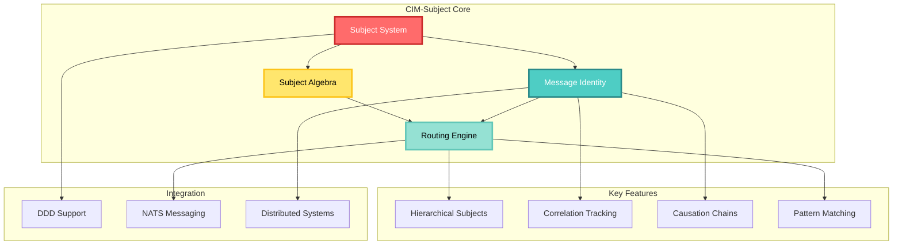
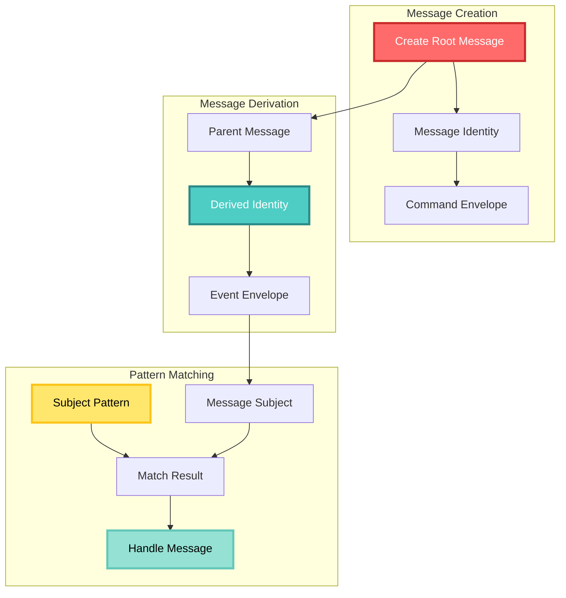
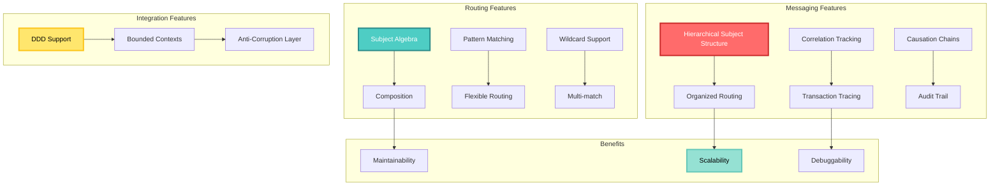
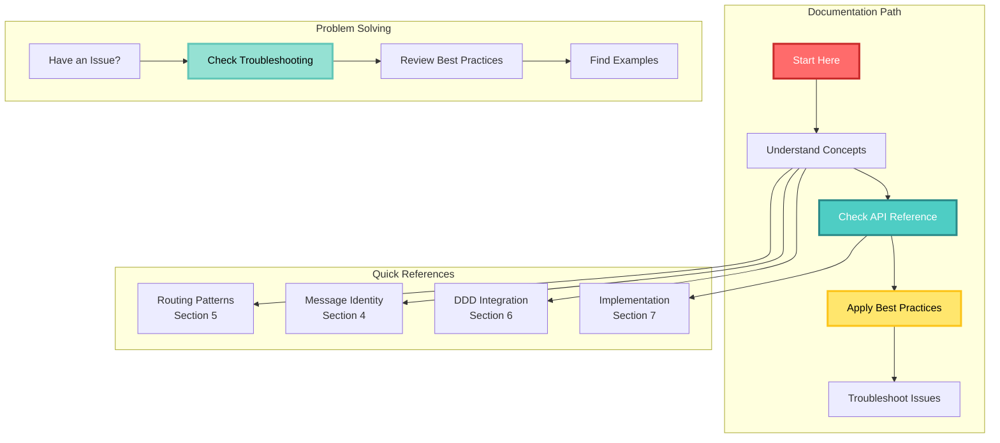

<!-- Copyright (c) 2025 Cowboy AI, LLC. -->
# CIM-Subject Documentation

## CIM-Subject Overview



Comprehensive documentation for the CIM-Subject module, which provides subject-based message routing, correlation tracking, and algebraic operations for NATS messaging in distributed domain-driven systems.

## Documentation Structure

### Documentation Flow

```mermaid
graph LR
    subgraph "Foundation"
        DOC1[1. Overview]
        DOC2[2. Core Concepts]
        DOC3[3. Subject Algebra]
        
        DOC1 --> DOC2
        DOC2 --> DOC3
    end
    
    subgraph "Core Features"
        DOC4[4. Message Identity]
        DOC5[5. Routing Patterns]
        DOC6[6. DDD Integration]
        
        DOC3 --> DOC4
        DOC4 --> DOC5
        DOC5 --> DOC6
    end
    
    subgraph "Implementation"
        DOC7[7. Implementation Guide]
        DOC8[8. API Reference]
        
        DOC6 --> DOC7
        DOC7 --> DOC8
    end
    
    subgraph "Operations"
        DOC9[9. Best Practices]
        DOC10[10. Troubleshooting]
        
        DOC8 --> DOC9
        DOC9 --> DOC10
    end
    
    style DOC1 fill:#FF6B6B,stroke:#C92A2A,stroke-width:3px,color:#FFF
    style DOC4 fill:#4ECDC4,stroke:#2B8A89,stroke-width:3px,color:#FFF
    style DOC7 fill:#FFE66D,stroke:#FCC419,stroke-width:3px,color:#000
    style DOC9 fill:#95E1D3,stroke:#63C7B8,stroke-width:3px,color:#000
```



## Documentation Structure

1. **[Overview](./01-overview.md)** - Introduction and architectural position
2. **[Core Concepts](./02-core-concepts.md)** - Fundamental concepts and patterns
3. **[Subject Algebra](./03-subject-algebra.md)** - Mathematical operations and theory
4. **[Message Identity](./04-message-identity.md)** - Correlation and causation tracking
5. **[Routing Patterns](./05-routing-patterns.md)** - Subject naming and routing strategies
6. **[DDD Integration](./06-ddd-integration.md)** - Domain-Driven Design patterns
7. **[Implementation Guide](./07-implementation-guide.md)** - Practical usage examples
8. **[API Reference](./08-api-reference.md)** - Complete API documentation
9. **[Best Practices](./09-best-practices.md)** - Guidelines and recommendations
10. **[Troubleshooting](./10-troubleshooting.md)** - Common issues and solutions

## Quick Start

### Quick Start Flow



## Quick Start

### Basic Usage

```rust
use cim_subject::{MessageIdentity, Subject, SubjectPattern};
use cim_domain::{CommandEnvelope, EventEnvelope};

// Create a root message (start of a transaction)
let identity = MessageIdentity::new_root();
let command = CreateOrder { /* ... */ };
let envelope = CommandEnvelope::new(command, identity, "user@example.com");

// Create a derived message (part of existing transaction)
let derived_identity = MessageIdentity::new_derived(&envelope.identity);
let event = OrderCreated { /* ... */ };
let event_envelope = EventEnvelope::new(event, derived_identity);

// Subject pattern matching
let pattern = SubjectPattern::new("order.events.*")?;
if pattern.matches("order.events.created") {
    // Handle matching subject
}
```

### Subject Naming Convention

#### Subject Structure

```mermaid
graph LR
    subgraph "Subject Format"
        SUBJ[Subject]
        DOMAIN[Domain]
        TYPE[Message Type]
        AGG[Aggregate]
        ACTION[Action]
        
        SUBJ --> DOMAIN
        DOMAIN --> TYPE
        TYPE --> AGG
        AGG --> ACTION
    end
    
    subgraph "Command Example"
        C1[order]
        C2[commands]
        C3[order]
        C4[create]
        
        C1 -->|.| C2
        C2 -->|.| C3
        C3 -->|.| C4
    end
    
    subgraph "Event Example"
        E1[order]
        E2[events]
        E3[order]
        E4[created]
        
        E1 -->|.| E2
        E2 -->|.| E3
        E3 -->|.| E4
    end
    
    subgraph "Query Example"
        Q1[inventory]
        Q2[queries]
        Q3[stock]
        Q4[check_availability]
        
        Q1 -->|.| Q2
        Q2 -->|.| Q3
        Q3 -->|.| Q4
    end
    
    style SUBJ fill:#FF6B6B,stroke:#C92A2A,stroke-width:3px,color:#FFF
    style DOMAIN fill:#4ECDC4,stroke:#2B8A89,stroke-width:2px,color:#FFF
    style TYPE fill:#FFE66D,stroke:#FCC419,stroke-width:2px,color:#000
    style AGG fill:#95E1D3,stroke:#63C7B8,stroke-width:2px,color:#000
    style ACTION fill:#FF6B6B,stroke:#C92A2A,stroke-width:2px,color:#FFF
```



### Subject Naming Convention

```
{domain}.{message_type}.{aggregate}.{action}
```

Examples:
- `order.commands.order.create`
- `order.events.order.created`
- `inventory.queries.stock.check_availability`

### Key Features

#### Feature Architecture



### Key Features

- **Hierarchical Subject Structure**: Organized, semantic message routing
- **Correlation Tracking**: Complete transaction traceability
- **Causation Chains**: Track cause-effect relationships
- **Subject Algebra**: Mathematical operations for complex routing
- **DDD Support**: First-class bounded context integration
- **Pattern Matching**: Flexible wildcard-based routing

## Module Location

CIM-Subject is part of the `cim-domain` repository:

```toml
[dependencies]
cim-subject = { git = "https://github.com/TheCowboyAI/cim-domain.git", branch = "main" }
```

## Getting Help

### Help Resources



## Getting Help

- Review the documentation sections in order for comprehensive understanding
- Check the [API Reference](./08-api-reference.md) for specific function details
- See [Best Practices](./09-best-practices.md) for recommended patterns
- Consult [Troubleshooting](./10-troubleshooting.md) for common issues

## Contributing

### Contribution Guidelines

```mermaid
graph TB
    subgraph "Contribution Requirements"
        REQ1[Maintain Compatibility]
        REQ2[Preserve Integrity]
        REQ3[Follow Algebra Laws]
        REQ4[Add Tests]
        REQ5[Update Docs]
    end
    
    subgraph "Compatibility Areas"
        COMPAT1[Subject Patterns]
        COMPAT2[Identity Chain]
        COMPAT3[API Contracts]
        
        REQ1 --> COMPAT1
        REQ2 --> COMPAT2
        REQ1 --> COMPAT3
    end
    
    subgraph "Testing Requirements"
        TEST1[Unit Tests]
        TEST2[Integration Tests]
        TEST3[Pattern Tests]
        TEST4[Correlation Tests]
        
        REQ4 --> TEST1
        REQ4 --> TEST2
        REQ4 --> TEST3
        REQ4 --> TEST4
    end
    
    subgraph "Documentation Updates"
        DOC1[API Changes]
        DOC2[New Features]
        DOC3[Examples]
        DOC4[Best Practices]
        
        REQ5 --> DOC1
        REQ5 --> DOC2
        REQ5 --> DOC3
        REQ5 --> DOC4
    end
    
    style REQ1 fill:#FF6B6B,stroke:#C92A2A,stroke-width:3px,color:#FFF
    style REQ2 fill:#4ECDC4,stroke:#2B8A89,stroke-width:3px,color:#FFF
    style REQ4 fill:#FFE66D,stroke:#FCC419,stroke-width:3px,color:#000
    style REQ5 fill:#95E1D3,stroke:#63C7B8,stroke-width:3px,color:#000
```



## Contributing

When contributing to CIM-Subject:

1. Maintain backward compatibility for subject patterns
2. Preserve correlation/causation chain integrity
3. Follow the established algebraic laws
4. Add tests for new routing patterns
5. Update documentation for API changes