# CIM Subject Module - Private Mortgage Lending Workflow Diagrams

## Overview

This document provides visual representations of the private mortgage lending workflows described in the CIM Subject user stories using Mermaid diagrams.

## Loan Application Processing

### Multi-Broker Application Routing

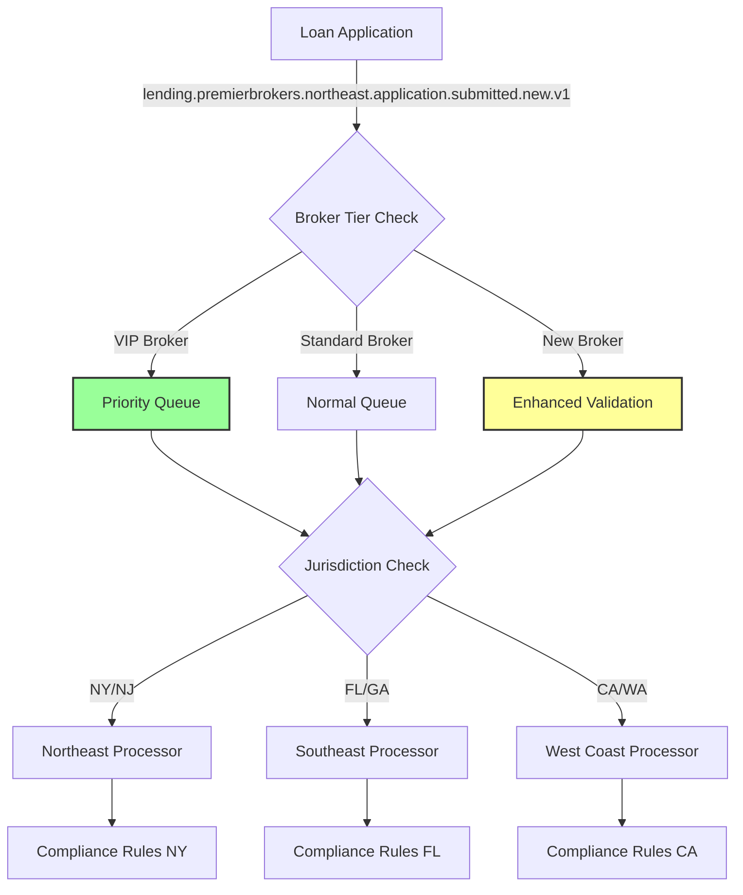

### Document Collection and Validation Flow

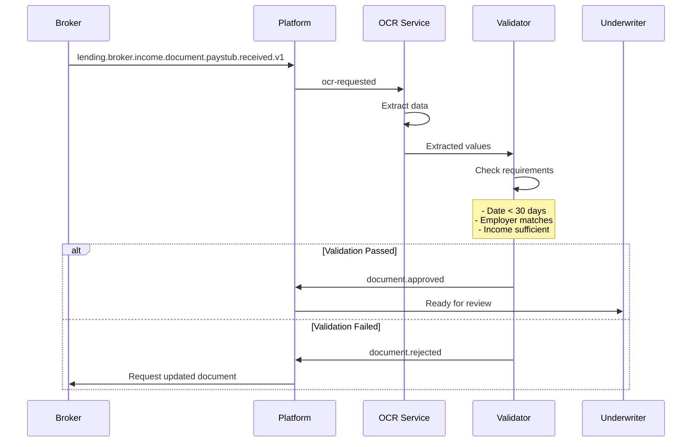

### Borrower Identity Verification

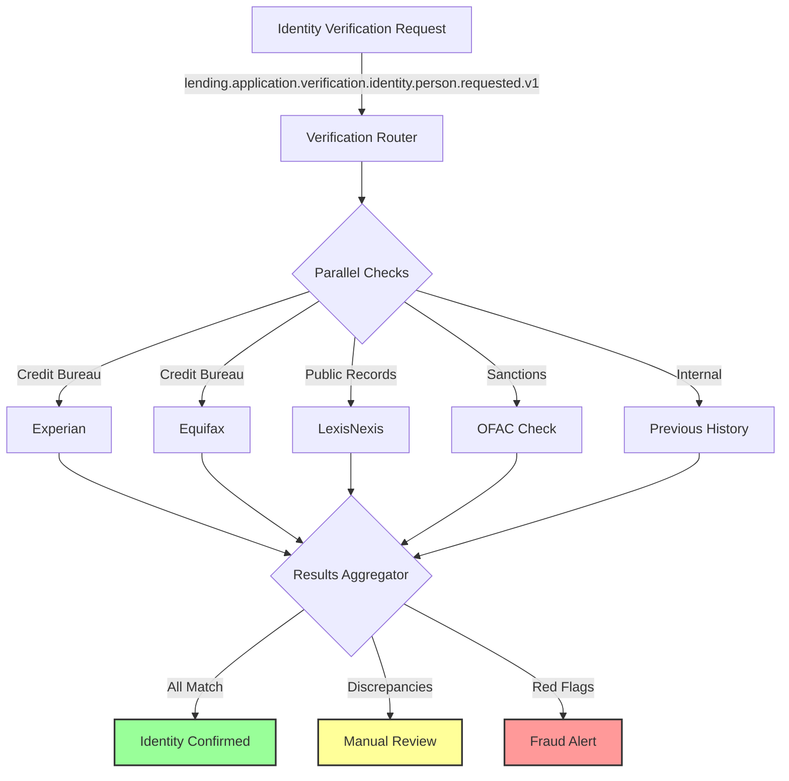

## Property Valuation and Title Processing

### Appraisal Coordination Workflow

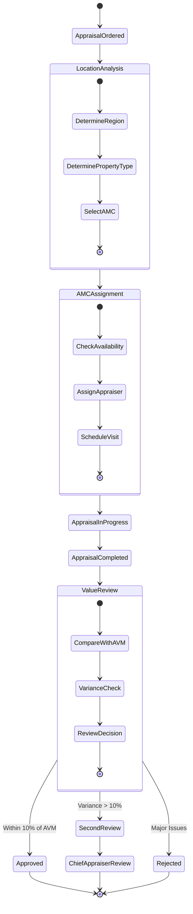

### Title Search Process

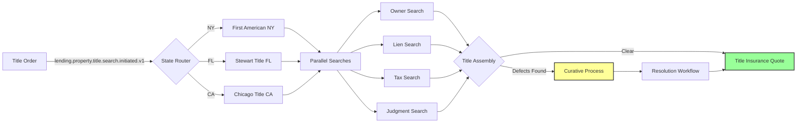

## Rate Shopping and Pricing

### Multi-Lender Rate Shopping

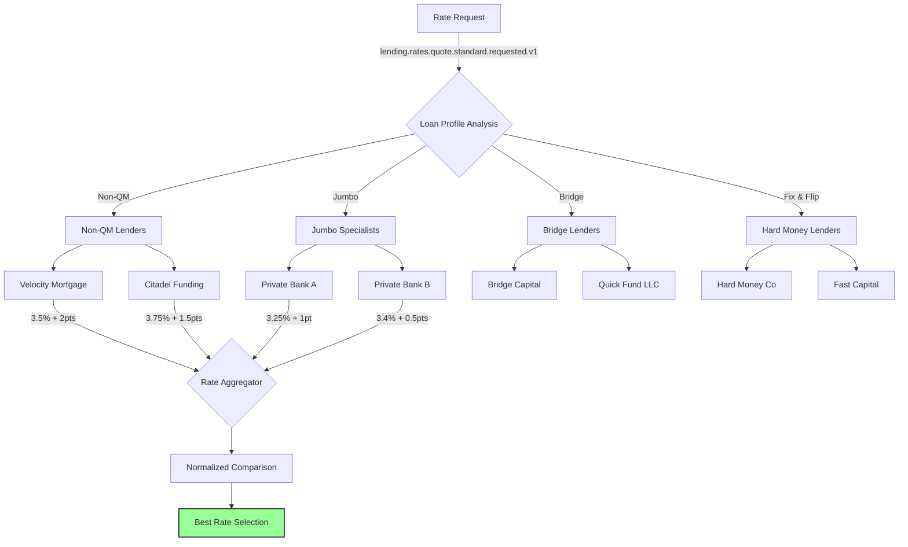

### Dynamic Pricing Workflow

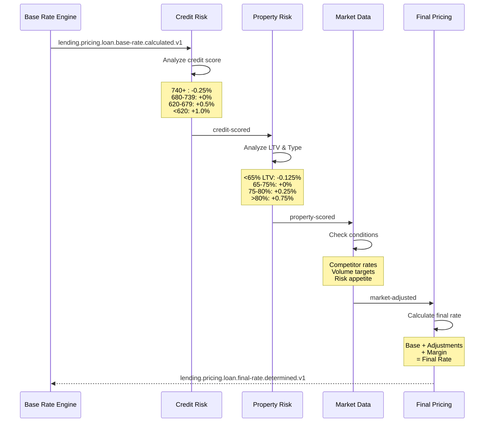

## Underwriting and Decisions

### Automated Underwriting Flow

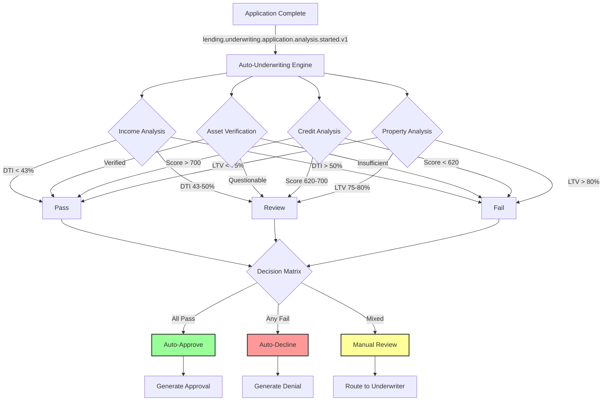

### Exception Handling Hierarchy

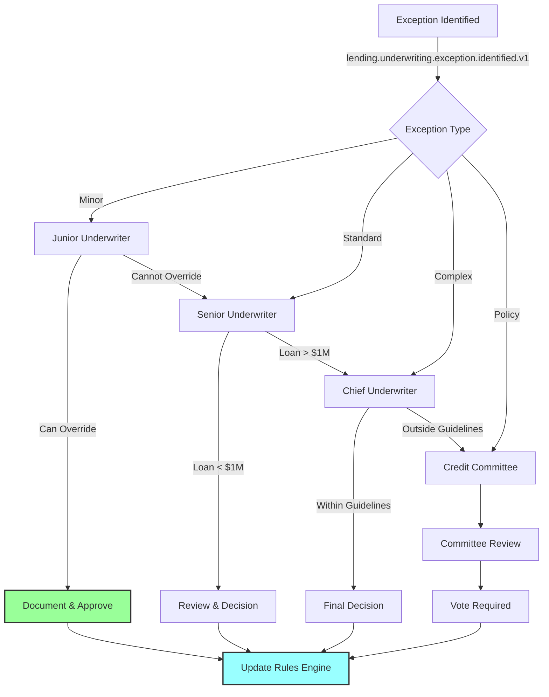

## Closing Coordination

### Closing Workflow Orchestration

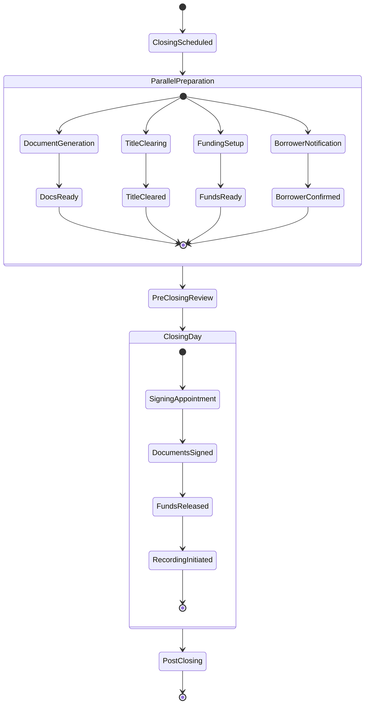

### Post-Closing Quality Control

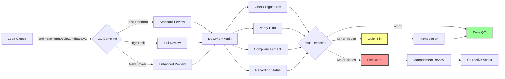

## Subject Pattern Examples

### Document Type Routing

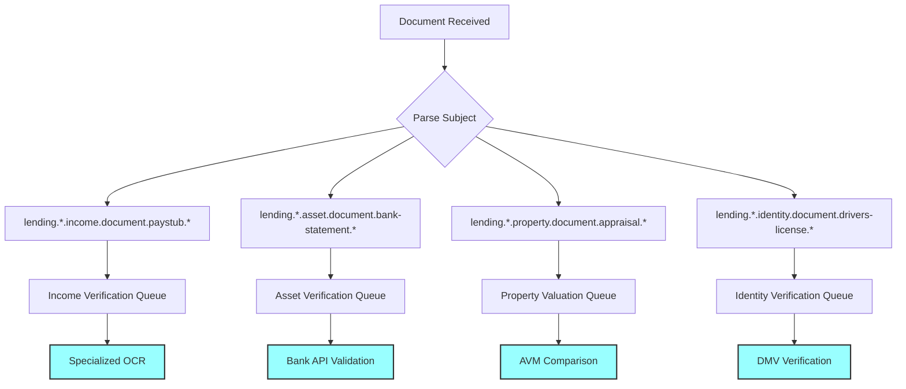

### Permission-Based Access Control

```mermaid
graph TD
    A[User Request] --> B{Permission Check}

    B --> C{Role Check}

    C -->|Broker| D[lending.{broker_id}.*.application.*]
    C -->|Underwriter| E[lending.*.*.underwriting.*]
    C -->|Processor| F[lending.*.*.processing.*]
    C -->|Admin| G[lending.*.*.*.>]

    D --> H{Attribute Check}
    E --> H
    F --> H
    G --> H

    H -->|broker_id matches| I[Allow]
    H -->|loan_amount < limit| I
    H -->|region authorized| I
    H -->|Otherwise| J[Deny]

    I --> K[Process Request]
    J --> L[Access Denied]

    style I fill:#9f9,stroke:#333,stroke-width:2px
    style J fill:#f99,stroke:#333,stroke-width:2px
```

## Summary

These diagrams illustrate how CIM Subject algebra enables sophisticated private mortgage lending workflows:

1. **Multi-Party Coordination** - Brokers, lenders, AMCs, title companies collaborate through subject routing
2. **Document Intelligence** - OCR, validation, and automated processing through workflow composition
3. **Risk-Based Routing** - Loans route based on characteristics and risk profiles
4. **Regulatory Compliance** - State-specific rules and audit trails maintained
5. **Automated Decisions** - Complex underwriting logic with human oversight when needed

The visual representations demonstrate how subject-based routing creates a flexible, compliant, and efficient mortgage lending platform.
