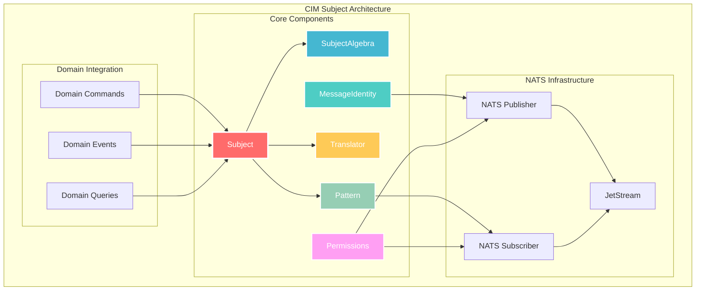
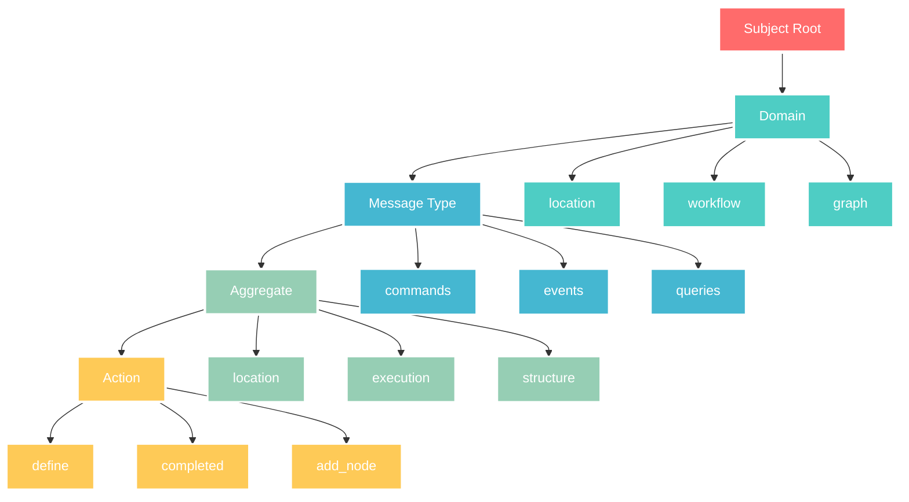
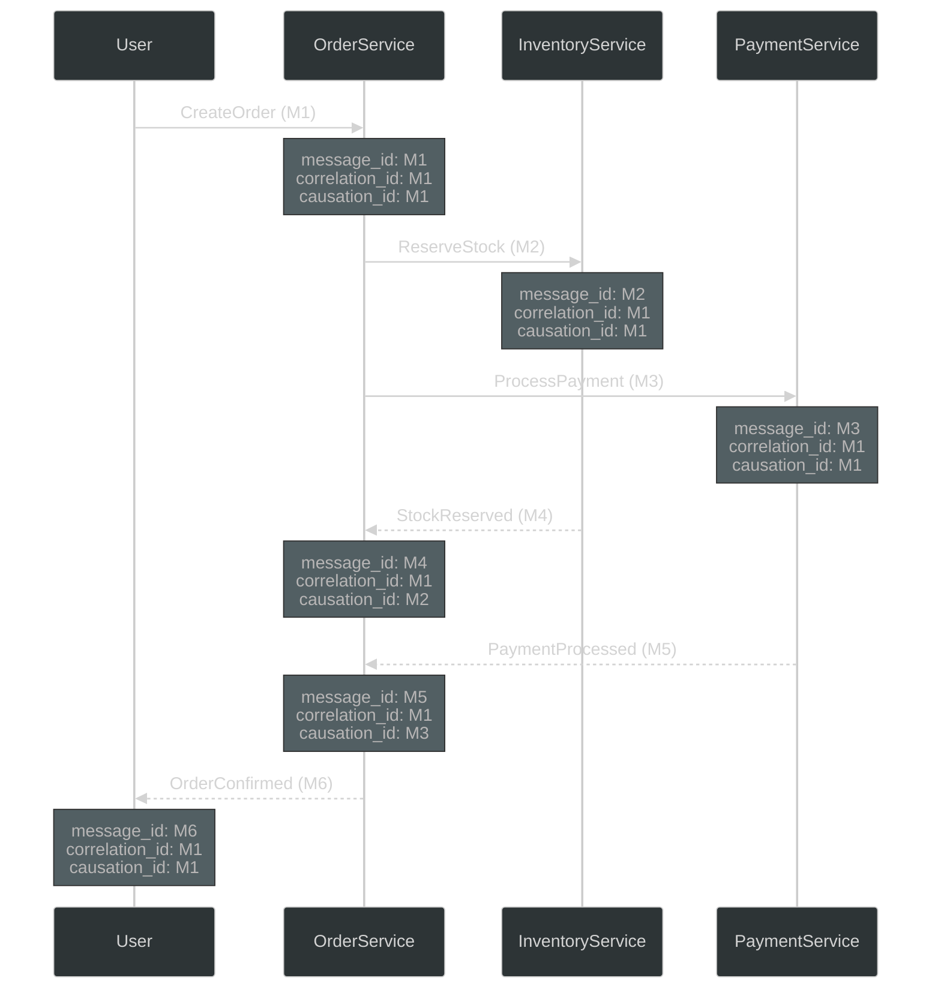
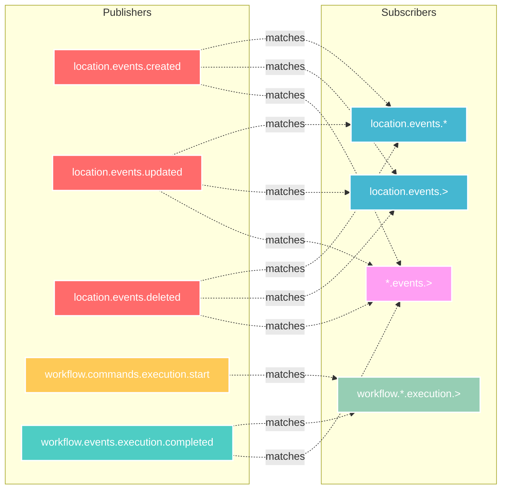

<!-- Copyright (c) 2025 Cowboy AI, LLC. -->

# CIM-Subject

[](https://github.com/TheCowboyAI/cim-subject/actions/workflows/ci.yml)
[](https://github.com/TheCowboyAI/cim-subject/actions/workflows/coverage.yml)
[](https://github.com/TheCowboyAI/cim-subject/releases)
[](LICENSE)

A foundational module within the CIM Domain framework that provides subject-based message routing, correlation tracking, and algebraic operations for NATS messaging in distributed domain-driven systems.

## Overview

The `cim-subject` module is a critical infrastructure component that enables:

- **Subject-based routing** for NATS messages using hierarchical naming conventions
- **Correlation and causation tracking** for distributed message flows
- **Algebraic operations** on subjects for flexible routing patterns
- **Domain-Driven Design (DDD)** support through message identity and envelope patterns



## Quick Start

```bash
# Using Nix (recommended)
nix develop
cargo build

# Using Cargo
cargo build
cargo test
cargo run --example basic_routing
```

For detailed build instructions, see [BUILD.md](BUILD.md). For module architecture, see [MODULE.md](MODULE.md).

## Core Concepts

### 1. Subject Hierarchy

CIM-Subject uses a hierarchical naming convention for message routing:

```
{domain}.{message_type}.{aggregate}.{action}
```

Examples:
- `location.commands.location.define`
- `location.events.location.defined`
- `workflow.events.execution.completed`
- `graph.commands.structure.add_node`



### 2. Message Identity

Every message in the system carries a `MessageIdentity` that tracks its lineage:

```rust
pub struct MessageIdentity {
    pub message_id: IdType,        // Unique identifier for this message
    pub correlation_id: CorrelationId,  // Groups related messages in a workflow
    pub causation_id: CausationId,      // Identifies which message caused this one
}
```

### 3. Correlation and Causation Rules

The module enforces these rules for message tracking:

- **Root Messages**: When initiating a new workflow
  - `message_id = correlation_id = causation_id` (self-correlation)
  
- **Derived Messages**: When a message causes another
  - New message inherits `correlation_id` from parent
  - New message's `causation_id = parent.message_id`
  
This creates a complete audit trail of message flows through the system.



## DDD Implementation

### Command Handling

Commands are wrapped in envelopes that include identity information:

```rust
pub struct CommandEnvelope<T> {
    pub id: CommandId,
    pub identity: MessageIdentity,
    pub command: T,
    pub issued_by: String,
}
```

Example usage in a domain handler:

```rust
impl CommandHandler<DefineLocation> for LocationCommandHandler {
    fn handle(&mut self, envelope: CommandEnvelope<DefineLocation>) -> CommandAcknowledgment {
        // Process command...
        
        // Publish resulting events with correlation
        self.event_publisher.publish_events(
            vec![LocationDefined { ... }],
            envelope.identity.correlation_id.clone()
        )
    }
}
```

### Event Publishing

Events maintain the correlation chain:

```rust
pub trait EventPublisher {
    fn publish_events(
        &self,
        events: Vec<DomainEvent>,
        correlation_id: CorrelationId,
    ) -> Result<(), String>;
}
```

## Subject Algebra

The module provides algebraic operations for subject manipulation:

### 1. Sequential Composition (→)
Represents ordered message flows:
```
A → B: Message A must complete before B starts
```

### 2. Parallel Composition (⊗)
Represents concurrent operations:
```
A ⊗ B: Messages A and B can execute simultaneously
```

### 3. Choice Composition (⊕)
Represents alternative paths:
```
A ⊕ B: Either A or B will execute (exclusive choice)
```

### 4. Lattice Operations
The subject hierarchy forms a lattice structure supporting:
- **Join (⊔)**: Find the least common ancestor of subjects
- **Meet (⊓)**: Find the greatest common descendant

```mermaid
graph TB
    subgraph "Algebraic Operations"
        A1[Sequential: A → B → C]
        A2[Parallel: A ⊗ B ⊗ C]
        A3[Choice: A ⊕ B ⊕ C]
        A4[Lattice: A ⊔ B, A ⊓ B]
    end
    
    subgraph "Sequential Example"
        S1[Validate Order] --> S2[Reserve Inventory]
        S2 --> S3[Process Payment]
        S3 --> S4[Ship Order]
    end
    
    subgraph "Parallel Example"
        P0[Order Received]
        P0 --> P1[Check Inventory]
        P0 --> P2[Validate Customer]
        P0 --> P3[Calculate Pricing]
        P1 --> P4[All Complete]
        P2 --> P4
        P3 --> P4
    end
    
    subgraph "Choice Example"
        C1[Payment Method?]
        C1 -->|Credit Card| C2[Process Card]
        C1 -->|PayPal| C3[Process PayPal]
        C1 -->|Bank Transfer| C4[Process Transfer]
        C2 --> C5[Payment Complete]
        C3 --> C5
        C4 --> C5
    end
    
    style A1 fill:#ff6b6b,stroke:#fff,stroke-width:3px,color:#fff
    style A2 fill:#4ecdc4,stroke:#fff,stroke-width:3px,color:#fff
    style A3 fill:#feca57,stroke:#fff,stroke-width:3px,color:#fff
    style A4 fill:#ff9ff3,stroke:#fff,stroke-width:3px,color:#fff
    
    style S1 fill:#45b7d1,stroke:#fff,stroke-width:2px,color:#fff
    style S2 fill:#45b7d1,stroke:#fff,stroke-width:2px,color:#fff
    style S3 fill:#45b7d1,stroke:#fff,stroke-width:2px,color:#fff
    style S4 fill:#45b7d1,stroke:#fff,stroke-width:2px,color:#fff
    
    style P0 fill:#96ceb4,stroke:#fff,stroke-width:2px,color:#fff
    style P1 fill:#96ceb4,stroke:#fff,stroke-width:2px,color:#fff
    style P2 fill:#96ceb4,stroke:#fff,stroke-width:2px,color:#fff
    style P3 fill:#96ceb4,stroke:#fff,stroke-width:2px,color:#fff
    style P4 fill:#96ceb4,stroke:#fff,stroke-width:2px,color:#fff
    
    style C1 fill:#dfe6e9,stroke:#2d3436,stroke-width:2px,color:#2d3436
    style C2 fill:#fd79a8,stroke:#fff,stroke-width:2px,color:#fff
    style C3 fill:#fdcb6e,stroke:#fff,stroke-width:2px,color:#fff
    style C4 fill:#6c5ce7,stroke:#fff,stroke-width:2px,color:#fff
    style C5 fill:#00b894,stroke:#fff,stroke-width:2px,color:#fff
```



## Message Routing Patterns

### Pattern Matching

Supports NATS-style wildcards for flexible routing:

- `*` - Matches exactly one token
- `>` - Matches one or more tokens

Examples:
```
location.events.* - Matches all location event types
workflow.*.execution.> - Matches all execution-related messages across workflow types
```



### Subject Translation

The module provides translation capabilities for:

1. **Environment Mapping**
   ```
   dev.location.events.* → prod.location.events.*
   ```

2. **API Version Migration**
   ```
   v1.workflow.commands.* → v2.workflow.commands.*
   ```

3. **Context Bridging**
   ```
   internal.graph.events.* → external.graph.notifications.*
   ```

## Integration with NATS

Messages are published with correlation headers:

```
Headers:
  X-Message-ID: {unique_message_id}
  X-Correlation-ID: {workflow_correlation_id}  
  X-Causation-ID: {parent_message_id}
```

This enables:
- Distributed tracing across services
- Event replay in correct causal order
- Complete audit trails for compliance
- Dynamic routing based on correlation patterns

## Usage Examples

### 1. Creating a Root Command

```rust
use cim_subject::{MessageIdentity, IdType, CorrelationId, CausationId};
use cim_domain::{CommandEnvelope, CommandId};

let command_id = CommandId::new();
let id_uuid = *command_id.as_uuid();

let envelope = CommandEnvelope {
    id: command_id,
    identity: MessageIdentity {
        message_id: IdType::Uuid(id_uuid),
        correlation_id: CorrelationId(IdType::Uuid(id_uuid)),
        causation_id: CausationId(IdType::Uuid(id_uuid)),
    },
    command: DefineLocation { ... },
    issued_by: "user@example.com".to_string(),
};
```

### 2. Creating a Derived Event

```rust
// When handling a command and creating resulting events
let derived_event_id = Uuid::new_v4();

let event_identity = MessageIdentity {
    message_id: IdType::Uuid(derived_event_id),
    correlation_id: command_envelope.identity.correlation_id.clone(),
    causation_id: CausationId(command_envelope.identity.message_id.clone()),
};
```

### 3. Subject Pattern Matching

```rust
// Match all graph structure events
if subject.matches("graph.events.structure.*") {
    // Handle structure change events
}

// Match all persistence operations
if subject.matches("persistence.>") {
    // Handle any persistence-related message
}
```

## Benefits

1. **Traceable Message Flows**: Complete audit trail through correlation/causation chains
2. **Flexible Routing**: Algebraic operations enable complex routing patterns
3. **Domain Isolation**: Clear subject hierarchies maintain bounded contexts
4. **Event Sourcing Support**: Correlation IDs enable proper event replay
5. **Distributed Debugging**: Trace requests across multiple services
6. **Scalable Architecture**: NATS subject patterns support horizontal scaling

## Integration with CIM Domains

Each CIM domain module leverages cim-subject for:

- **Command/Event routing** within bounded contexts
- **Cross-domain communication** through well-defined subjects
- **Saga orchestration** using correlation IDs
- **Event sourcing** with proper causation tracking

Examples:
- `cim-domain-location`: Routes location commands and events
- `cim-domain-workflow`: Manages workflow execution messages
- `cim-domain-graph`: Handles graph structure modifications
- `cim-domain-identity`: Manages identity and authentication events

## Future Enhancements

- **Subject Templates**: Predefined patterns for common use cases
- **Routing Policies**: Declarative routing rules based on message content
- **Subject Versioning**: Built-in support for API evolution
- **Performance Optimization**: Caching for frequently used subject patterns
- **Monitoring Integration**: Metrics and tracing for subject usage patterns

## Test Results

<!-- Include test results from last run -->
### Summary
- **Total Tests**: 76
- **Passed**: 76
- **Failed**: 0

### Test Suites
```
test result: ok. 41 passed; 0 failed; 0 ignored; 0 measured; 0 filtered out; finished in 0.00s
test result: ok. 11 passed; 0 failed; 0 ignored; 0 measured; 0 filtered out; finished in 0.00s
test result: ok. 13 passed; 0 failed; 0 ignored; 0 measured; 0 filtered out; finished in 0.00s
test result: ok. 9 passed; 0 failed; 0 ignored; 0 measured; 0 filtered out; finished in 0.00s
test result: ok. 2 passed; 0 failed; 0 ignored; 0 measured; 0 filtered out; finished in 0.35s
```

*Last run: 2025-07-22 21:22:24 UTC*

To update test results:
```bash
./scripts/test-and-save.sh
```

## Documentation

- **[BUILD.md](BUILD.md)** - Comprehensive build instructions
- **[MODULE.md](MODULE.md)** - Module architecture and API reference
- **[CHANGELOG.md](CHANGELOG.md)** - Version history and changes
- **[CONTRIBUTING.md](CONTRIBUTING.md)** - How to contribute
- **[User Stories](doc/design/USER_STORIES.md)** - Real-world usage scenarios
- **[Examples](examples/)** - Runnable example applications
- **[API Documentation](https://docs.rs/cim-subject)** - Generated API docs

## License

This project is licensed under the MIT License - see the [LICENSE](LICENSE) file for details.

Copyright (c) 2025 Cowboy AI, LLC.